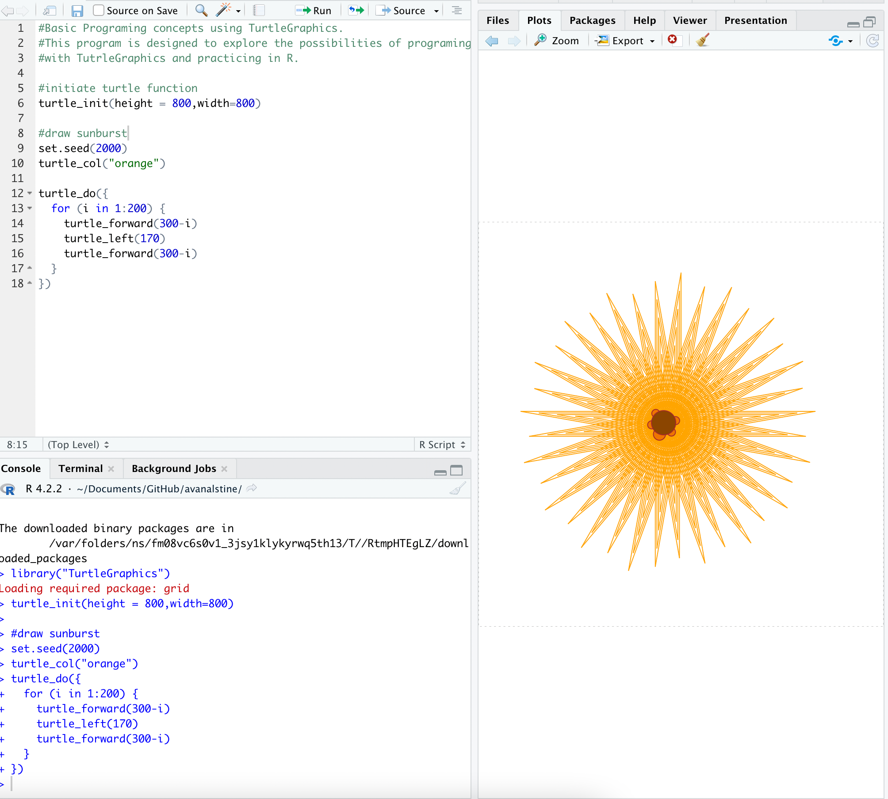

```{r setup, include=FALSE}
## Global options
knitr::opts_chunk$set(cache = TRUE)
```

# Turtles??

The way I intuitively learned loops was through the LOGO turtle (a real one that we could move around the classroom!  

<https://roamerrobot.tumblr.com/post/23079345849/the-history-of-turtle-robots>

LOGO is a language.  Just like in crash course you use conditionals like if and loops to move the turtle around.  You can go from drawing basic shapes, to 3D printing incredibly complex things. 


# Coding Turtles

-   In it's own language!  <https://turtleacademy.com/lessons/1>
-   3D turtle games! <https://turtlespaces.org/>

# Turtles in Python

Download the class lab script: <https://colab.research.google.com/drive/1auuZwueWLZD9BybKnboUdhYP-OfFc2OK?usp=sharing>

-   Documentation: <https://github.com/mathriddle/ColabTurtlePlus>

-   <https://larryriddle.agnesscott.org/ColabTurtlePlus/documentation2.html>

-   Examples: <https://github.com/mathriddle/ColabTurtlePlus/tree/main/examples/files>

# Art examples in R logo




