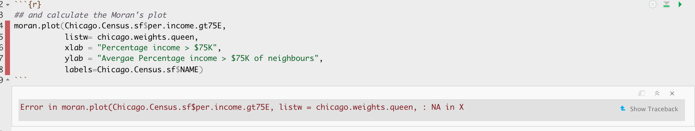

---
output:
  html_document:
    toc: false
    number_sections: false
    df_print: paged
    css: projectlab.css
    highlight: pygments
---


<style>
p.comment {
background-color: #DBDBDB;
padding: 10px;
border: 1px solid black;
margin-left: 0px;
border-radius: 5px;
font-style: normal;
}

h1.title {
  font-weight: bold;
  font-family: Arial;  
}

h2.title {
  font-family: Arial;  
}

</style>


<style type="text/css">
#TOC {
  font-size: 11px;
  font-family: Arial;
}
</style>


```{r, include=FALSE}


library(corrplot)
library(ggplot2)
library(ggthemes)
library(kableExtra)
library(olsrr)
library(plotly)
library(raster)
library(RColorBrewer)
library(readxl)
library(rnaturalearth)
library(rmapshaper)
library(sf)
library(sp)
library(skimr)
library(spatialreg)
library(spatialEco)
library(spatstat)
library(spdep)
library(sfdep)
library(terra)
library(tidyverse)
library(tidycensus)
library(tigris)
library(tmap)
library(units)
library(viridis)
library(VIM)
library(dplyr)
knitr::opts_chunk$set(echo = TRUE, warning=FALSE, message = FALSE)

# Download Illinois ACS data at census tract level for my chosen variables, using tidycensus
IL.Census.sf <- get_acs(geography = "tract", 
                year = 2017,
                variables = c(total_pop   = "B05012_001", # total population
                              income.gt75 = "B06010_011"), # number of people making > 75000 USD
                state = "IL",
                survey = "acs5",
                geometry = TRUE,
                output="wide",
                cache_table = TRUE)

# Change the map projection to Albers equal projection, 
# then remove empty polygons (lakes etc) and fix any broken geometry
IL.Census.sf <- IL.Census.sf %>%
                st_transform(26916) %>%
                st_make_valid()

# Remove and rename error columns 
IL.Census.sf <- IL.Census.sf %>%
  dplyr::select(
    GEOID, 
    NAME,
    total_pop    = total_popE, 
    income.gt75  = income.gt75E, 
    geometry )

# Find the areas in each county & change the units from metres squared to km squared
IL.Census.sf$Area  <- st_area(IL.Census.sf)
IL.Census.sf$Area  <- as.numeric(set_units(IL.Census.sf$Area,"km^2"))


# Divide the total population & housing by the area to give the population/housing density
IL.Census.sf$pop.density_km2  <- IL.Census.sf$total_pop   / IL.Census.sf$Area

# Divide the total population & housing by the area to give the population/housing density
IL.Census.sf$percent.income.gt75  <- IL.Census.sf$income.gt75   / IL.Census.sf$total_pop


# fix for summary
IL.Census.tmp <- IL.Census.sf
# Download Illinois ACS data at census tract level for my chosen variables, using tidycensus
IL.Census.sf <- get_acs(geography = "tract", 
                year = 2017,
                variables = c(total_pop   = "B05012_001", # total population
                              income.gt75 = "B06010_011"), # number of people making > 75000 USD
                state = "IL",
                survey = "acs5",
                geometry = TRUE,
                output="wide",
                cache_table = TRUE)


```


# TUTORIAL Local Spatial Autocorrelation

In this tutorial, I will to assess the relationship between the number of people who earn over $75000 dollars and population density in Chicago. We will practice two new techniques, LISA (local auto-regression) to see if each variable is auto-correlated with itself, then actual regression - to understand the relationship between the two.

WORK THROUGH THIS TUTORIAL, then the actual lab uses a different dataset.

<br>

# STEP 1 Getting the data

## Libraries needed for this tutorial.

Make sure all of these libraries are at the top of your lab script in a code chunk, and run the code chunk! If you run the code chunk and it says a package is missing, either click "install" if the little yellow bar appears at the top, or go to the Packages tab, and click Install to go to the package 'app store'.

::: {#boxgreen}
Remember to set the code chunk options to message=FALSE and warning=FALSE! <br>
E.g. switch to Source mode and make the top of the code chunk to `{r,message=FALSE, warning=FALSE}`
:::


```{r,message=FALSE, warning=FALSE}

library(corrplot)
library(ggplot2)
library(ggthemes)
library(kableExtra)
library(olsrr)
library(plotly)
library(raster)
library(RColorBrewer)
library(readxl)
library(rnaturalearth)
library(rmapshaper)
library(sf)
library(sp)
library(skimr)
library(spatialreg)
library(spatialEco)
library(spatstat)
library(spdep)
library(sfdep)
library(terra)
library(tidyverse)
library(tidycensus)
library(tigris)
library(tmap)
library(units)
library(viridis)
library(VIM)
library(dplyr)

```


Run the code chunk a few times and check there are no errors.

<br><br>

## Download the example data for Chicago.

First, I downloaded American Community Survey data for Illinois at a [**census tract spatial scale**]{.ul}. A census tract is similar to a zip code, a much finer spatial scale than a county.  The way to do this is similar to Lab 5. 

<br>


<details>

<summary>**Code to load the example data**</summary>

<br>

We can load your data from the census and tidy up, before plotting


```{r, eval=FALSE}
# THIS WILL NOT WORK IF YOU DIDN'T RUN YOUR API KEY CODE & RESTART R-STUDIO LAST LAB

# Download Illinois ACS data at census tract level for my chosen variables, using tidycensus
IL.Census.sf <- get_acs(geography = "tract", 
                year = 2017,
                variables = c(total_pop   = "B05012_001", # total population
                              income.gt75 = "B06010_011"), # number of people making > 75000 USD
                state = "IL",
                survey = "acs5",
                geometry = TRUE,
                output="wide",
                cache_table = TRUE)

```
<br>

We also need to change the map projection. As we're focusing on a single city, lets us a local UTM projection, 26916. To find one for your area, see

 - https://mangomap.com/robertyoung/maps/69585/what-utm-zone-am-i-in-

There's also a great tutorial here on choosing the best one  https://source.opennews.org/articles/choosing-right-map-projection/


```{r, eval=FALSE}
# Change the map projection to Albers equal projection, 
# then remove empty polygons (lakes etc) and fix any broken geometry
IL.Census.sf <- IL.Census.sf %>%
                st_transform(26916) %>%
                st_make_valid()
```

<br>

You can see the data summarized here.  Each column ending in E means the *estimate* of the value in each census tract and the column ending in M means the *margin of error*. 


```{r}
head(IL.Census.sf)
```

For more advanced work we probably want to keep the error columns.  But here let's remove them.


```{r, eval=FALSE}
# Remove and rename error columns 
IL.Census.sf <- IL.Census.sf %>%
  dplyr::select(
    GEOID, 
    NAME,
    total_pop    = total_popE, 
    income.gt75  = income.gt75E, 
    geometry )
```


<br>

Rather than looking at the total population, it makes sense to scale by the size of each tract, so that bigger tracts don't skew our results.  We want:


 - the population density (e.g. total_pop / Area)<br>
 - the percentage of people earning over $75K (e.g. income.gt75 / total_pop)<br>

<br>


```{r, eval=FALSE}
# Find the areas in each county & change the units from metres squared to km squared
IL.Census.sf$Area  <- st_area(IL.Census.sf)
IL.Census.sf$Area  <- as.numeric(set_units(IL.Census.sf$Area,"km^2"))


# Divide the total population & housing by the area to give the population/housing density
IL.Census.sf$pop.density_km2  <- IL.Census.sf$total_pop   / IL.Census.sf$Area

# Divide the total population & housing by the area to give the population/housing density
IL.Census.sf$percent.income.gt75  <- IL.Census.sf$income.gt75   / IL.Census.sf$total_pop
```

Here is the summary of the data I downloaded with the new columns added in.  You can see that there are 3123 census tracts in Illinois and that the data is clearly marked, with 8 columns of data. 

```{r, include=FALSE}
IL.Census.sf <- IL.Census.tmp

```


```{r}
head(IL.Census.sf)
```


</details>

::: small-gap
:::

<br>
<br>


## Data wrangling


<br>


### Dealing with empty polygons

One quirk of R is that it **hates* empty polygons so it's good to check for them.  IF YOU GET ERRORS PLOTTING, I BET THIS IS WHAT IS HAPPENING.

In our case, empty polygons means empty census tracts. These might be census tracts where no-one lives, or more likely, a quirk of the data collection process.  Let's take a look at them.

<br>

We can check this with the `st_is_empty()` command:

<br>

```{r}
# filter to just the empty tracts.
filter(IL.Census.sf,
       st_is_empty(IL.Census.sf))

```

<br>

OK so it's tracts 9900 in Cook county and lake county Illinois.  Let's google that... and the results suddenly make sense!

<br>

```{r, L7Fig3, echo=FALSE, fig.cap="*https://censusreporter.org/profiles/14000US17031990000-census-tract-9900-cook-il/*"}
knitr::include_graphics('./index_images/pg_364Lab7_Regression_2021_fig3.png')
```

<br>

It's the lake! I feel satisfied that removing these polygons won't mess up my study. So I'm going to go ahead and remove them and overwrite the results.  E.g. I apply the filter command to IL.Census.sf, asking it to only choose rows where which_tracts_empty is FALSE, then save the result to IL.Census.sf.

<br>

```{r}

  IL.Census.sf <- IL.Census.sf %>% 
                  filter(!st_is_empty(geometry)) 

```

<br>

Now.. let's try again.  Yep, we have removed the empty fields.

<br>

```{r}
# filter to just the empty tracts.
filter(IL.Census.sf,
       st_is_empty(IL.Census.sf))

```

### Quick check


I then had a quick look at the data in tmap to make sure it looked good, using the code from previous labs.

<br>

```{r, message=FALSE, warning=FALSE}
# create map 1
map1 <- tm_shape(IL.Census.sf, unit = "km") +
  tm_polygons(
    fill = "income.gt75",
    lwd = 0,
    fill.scale = tm_scale_intervals(
      style = "pretty",
      values = "brewer.yl_gn_bu",
    )
  ) +
  tm_title("Number of people making $75K per census tract", size = 0.75) +
  tm_layout(
    legend.outside = TRUE,
    frame = FALSE
  )


map2 <- tm_shape(IL.Census.sf, unit = "km") +
  tm_polygons(
    fill = "percent.income.gt75",
    lwd = 0,
    fill.scale = tm_scale_intervals(
      style = "quantile",
      values = "brewer.reds",
    )
  ) +
  tm_scalebar(breaks = c(0, 10, 20)) +
  tm_compass(type = "4star", position = c("left", "bottom")) +
  tm_title("Percentage of people making $75K per census tract", size = 0.75) +
  tm_layout(
    legend.outside = TRUE,
    frame = FALSE
  )

tmap_mode("plot")
suppressMessages(tmap_arrange(map1,map2))

```

<br>


and population density


<br>

```{r, echo=FALSE}
# create map 3
map3 <- tm_shape(IL.Census.sf, unit = "km") +
  tm_polygons(
    fill = "total_pop",
    lwd = 0,
    fill.scale = tm_scale_intervals(
      style = "pretty",
      values = "brewer.yl_or_rd",
    )
  ) +
  tm_scalebar(breaks = c(0, 10, 20)) +
  tm_title("Total Population", size = 0.95) +
  tm_layout(
    legend.outside = TRUE,
    frame = FALSE
  )

#and
map4 <- tm_shape(IL.Census.sf, unit = "km") +
  tm_polygons(
    fill = "pop.density_km2",
    lwd = 0,
    fill.scale = tm_scale_intervals(
      style = "quantile",
      values = "brewer.purples",
    )
  ) +
  tm_scalebar(breaks = c(0, 10, 20)) +
  tm_compass(type = "4star", position = c("left", "bottom")) +
  tm_title("Population density", size = 0.95) +
  tm_layout(
    legend.outside = TRUE,
    frame = FALSE
  )

# and print
suppressMessages(tmap_arrange(map3,map4))
```


<br>
<br>

### Cropping to Chicago

<br>

This map looks at all of Illinois.  But we want to look at the area just around Chicago. 
Let's crop to the city's administrative boundaries.  We can download these using the **Tigris package**.

<br>

Tigris has *thousands* of boundary data-sets that you can explore.  For a tutorial, see here [https://crd150.github.io/lab4.html#tigris_package] and here [https://github.com/walkerke/tigris]

<br>

For now, lets download the Chicago metropolitan area data then select Chicago


::: {#boxgreen}
FOR THIS CODE CHUNK, set results=FALSE as a codechunk option, or it will swamp your knit: <br> `{r, results=FALSE}`
:::


```{r, results=FALSE}

cb.sf            <- core_based_statistical_areas(cb = TRUE, year=2017)
Chicago.city.sf  <- filter(cb.sf, grepl("Chicago", NAME))

# and set the projection to be identical to the census data
Chicago.city.sf  <- Chicago.city.sf %>%
                    st_transform(26916) %>%
                    st_make_valid()


```

<br>


<br>

and, just so you can see what I have done..

```{r,results=FALSE}

tmap_mode("view")
map.city <- qtm(st_geometry(Chicago.city.sf),fill = NULL,border="red")

map.city

```

<br>
<br>

We can now crop our census data to this specific area using the `ms_clip` function. 

```{r}
# subset the Illinois census data with the Chicago city limits

Chicago.Census.sf <- ms_clip(target = IL.Census.sf, 
                             clip = Chicago.city.sf, 
                             remove_slivers = TRUE)
```

Let's remake that map, remember to play with the style option if your color scale isn't useful

<br>

```{r, warnings=FALSE, message=FALSE}
# create map 1
tmap_mode("plot")

map2 <- tm_shape(Chicago.Census.sf, unit = "km") +
  tm_polygons(
    fill = "percent.income.gt75",
    lwd = 0,
    fill.scale = tm_scale_intervals(
      style = "quantile",
      values = "brewer.reds",
    )
  ) +
  tm_shape(st_geometry(Chicago.city.sf), unit = "km") +
  tm_borders()+
  tm_scalebar(breaks = c(0, 10, 20)) +
  tm_compass(type = "4star", position = c("left", "bottom")) +
  tm_title("Percentage of people making $75K per census tract", size = 0.75) +
  tm_layout(
    legend.outside = TRUE,
    frame = FALSE
  )


#and
map4 <- tm_shape(Chicago.Census.sf, unit = "km") +
  tm_polygons(
    fill = "pop.density_km2",
    lwd = 0,
    fill.scale = tm_scale_intervals(
      style = "quantile",
      values = "brewer.purples",
    )) +
     tm_shape(st_geometry(Chicago.city.sf), unit = "km") +
  tm_borders()+
  tm_scalebar(breaks = c(0, 10, 20)) +
  tm_compass(type = "4star", position = c("left", "bottom")) +
  tm_title("Population density", size = 0.95) +
  tm_layout(
    legend.outside = TRUE,
    frame = FALSE
  )


# and print
suppressMessages(tmap_arrange(map2,map4))
```

<br>
<br>

# STEP 2 Global Autocorrelation 

Here we are going to look BOTH at global Moran's I and its local equivalent, LISA.  Because it builds directly on your previous lab, I'm going to refer to the tutorial but hide my code.

## Dealing with issues

It turns out that subsetting to the city borders put our empty lake tracts back in! Let's remove and tidy

```{r}
Chicago.Census.sf <- Chicago.Census.sf %>%
                     st_transform(26916) %>%
                     filter(!st_is_empty(geometry)) %>%
                     st_make_valid()
```


## Spatial weights

This tutorial shows you how to calculate a spatial weights matrix for your data. https://psu-spatial.github.io/Geog364-2025/Tutorial_SpatWeights.html.

Remember to change the variable from ACS_country.geometry to whatever you are using. I am using Chicago.city.sf.

Using the tutorial, I calculated a QUEENS 1ST ORDER weights matrix

```{r,echo=FALSE, warning=FALSE, message=FALSE, plot.results=TRUE}

# First get the geometry/coords 
Chicago.city.geometry <- st_geometry(Chicago.Census.sf)

# Then the central point in each polygon
Chicago_county.centroid <- st_centroid(Chicago.city.geometry)

# Finally, extract the Queens neigbours
neighbor.queens <- st_contiguity(Chicago.city.geometry, queen=TRUE)

# and get the spatial weights matrix
weights.queens <- st_weights(neighbor.queens)


```

Because I had so many polygons, here's how I plotted them:

```{r}


# And plot
par(mar=c(1,1,1,1))# big plot area

plot(Chicago.city.geometry, 
     border='darkcyan',
     lwd=.5)

plot(neighbor.queens, st_coordinates(Chicago_county.centroid), 
     col=rgb(0,0,0,.4), # transparent black
     lwd=.5,          # thin lines
     pch=16, cex=.1, # tiny dots
     add=TRUE)


```


## Moran's I rerun

I'm now going to see if one of my variables is auto-correlated - the percentage of people earning over $75K.

To do this, I used the code in <https://psu-spatial.github.io/Geog364-2025/Tutorial_Moran.html> adjusting for my location and my variable name (percent.income.gt75)

```{r}
names(Chicago.Census.sf)
```

<br>

But I get an error! (note this is old code USE THE CODE IN THE TUTORIAL)  It says I have missing values in "x" AKA in my percentage income column. 

```{r, L7Fig5, echo=FALSE, fig.cap="*There are missing values in your column of choice*"}

```

<br>


Let me check:

```{r}
summary(Chicago.Census.sf$percent.income.gt75)
```

Yes - three polygons didn't calculate properly. Let's take a look:

```{r}
Chicago.Census.sf[is.na(Chicago.Census.sf$percent.income.gt75)==TRUE,]
```

<br>

It turns out there are OTHER census tracts which don't have data (or zero population). lets remove those and try again. I'm going to remove ones with zero population density.  Which means I need to recreate my spatial weights matrix...

```{r}
# remove missing data
Chicago.Census.sf <- Chicago.Census.sf[Chicago.Census.sf$pop.density_km2 >  0 , ]

# recalculate spatial weight

Chicago.city.geometry <- st_geometry(Chicago.Census.sf)
neighbor.queens <- st_contiguity(Chicago.city.geometry, queen=TRUE)
weights.queens <- st_weights(neighbor.queens)


```


Now, my moran's plot works.  As we have a lot of data, I also adjusted the plotting to make the points smaller. This allows us to clearly see any outliers.


```{r, echo=FALSE}

# make weights
weights.queens.sp <- spdep::nb2listw(neighbor.queens)

# and plot , the first line adjusts the margins to make it neater.
par(mar=c(5,6,1,1))   

moran.plot(Chicago.Census.sf$percent.income.gt75, 
           weights.queens.sp, 
           xlab  = "Percent ppl making > 75K (USD) per tract",
           ylab  = "Percent ppl making > 75K \n in neighbouring tracts (Queens 1st)",
           labels=NULL,
           cex=.8, col=rgb(0,0,0,.5),
           zero.policy = T)
```


It looks very clustered.. (which agrees with the map I made). Let's do a test.  I'll let you interpret it based on your lecture notes (and see the most recent discussion)

```{r}
moran.test(Chicago.Census.sf$percent.income.gt75, 
           weights.queens.sp ,
            zero.policy = T)    
```


