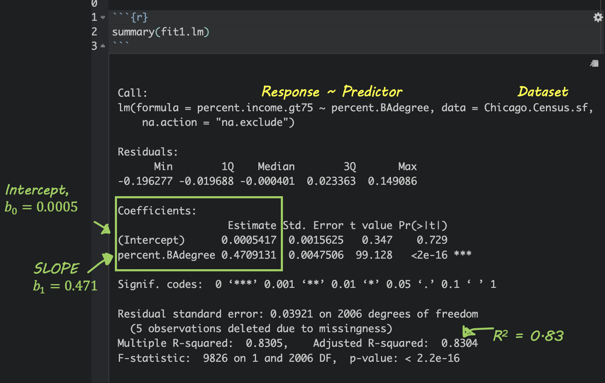
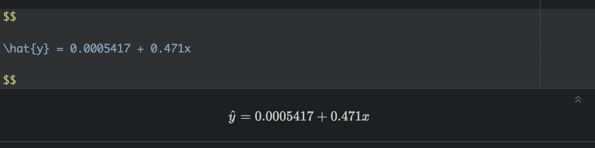

---
output:
  html_document:
    toc: true
    toc_depth: 1
    number_sections: false
    df_print: paged
    css: projectlab.css
    highlight: pygments
editor_options: 
  markdown: 
    wrap: 72
---

```{=html}
<style>
p.comment {
background-color: #DBDBDB;
padding: 10px;
border: 1px solid black;
margin-left: 0px;
border-radius: 5px;
font-style: normal;
}

h1.title {
  font-weight: bold;
  font-family: Arial;  
}

h2.title {
  font-family: Arial;  
}

</style>
```

```{=html}
<style type="text/css">
#TOC {
  font-size: 11px;
  font-family: Arial;
}
</style>
```

```{r, include=FALSE}


library(corrplot)
library(ggplot2)
library(ggthemes)
library(kableExtra)
library(olsrr)
library(plotly)
library(raster)
library(RColorBrewer)
library(readxl)
library(rnaturalearth)
library(rmapshaper)
library(sf)
library(sp)
library(skimr)
library(spatialreg)
library(spatialEco)
library(spatstat)
library(spdep)
library(sfdep)
library(terra)
library(tidyverse)
library(tidycensus)
library(tigris)
library(tmap)
library(units)
library(viridis)
library(VIM)
library(dplyr)
knitr::opts_chunk$set(echo = TRUE, warning=FALSE, message = FALSE)

# Download Illinois ACS data at census tract level for my chosen variables, using tidycensus
IL.Census.sf <- get_acs(
   geography = "tract",
   year = 2017,
   variables = c(
      total_pop        = "B05012_001", # total population
      total_house      = "B25001_001", #total housing units
      income.gt75      = "B06010_011",# number of people making > 75000 USD
      med.income       = "B19013_001", #median income
      total.foreignppl = "B05012_003", #number of foreign born people
      total.BAdegree   = "B15012_001" , #total with at least a bachelors degree
      total.workhome   = "B08101_049", #number who work from home#total housing units
      house.mean_age   = "B25035_001", #average house age
      house.mean_beds  = "B25041_001", #total homes number of beds in the house
      housetotal.owneroccupied = "B25003_002", #total homes owner occupied
      housetotal.broadband  = "B28002_004"), #total homes with broadband access
   state = "IL",
   survey = "acs5",
   geometry = TRUE,
   output = "wide",
   cache_table = TRUE)

# Change the map projection to Albers equal projection, 
# then remove empty polygons (lakes etc) and fix any broken geometry
IL.Census.sf <- IL.Census.sf %>%
                st_transform(26916) %>%
                st_make_valid()


# Remove and rename error columns 
IL.Census.sf <- IL.Census.sf %>%
   dplyr::select(
      GEOID, 
      NAME,
      total_pop        = total_popE, 
      total_house      = total_houseE,
      income.gt75      = income.gt75E,
      med.income       = med.incomeE, 
      total.foreignppl = total.foreignpplE,
      total.BAdegree   = total.BAdegreeE,             
      total.workhome   = total.workhomeE,
      house.mean_age   = house.mean_ageE,
      house.mean_beds  = house.mean_bedsE,
      housetotal.owneroccupied = housetotal.owneroccupiedE,
      housetotal.broadband     = housetotal.broadbandE,
      geometry )


# Find the areas in each county & change the units from metres squared to km squared
IL.Census.sf$Area  <- st_area(IL.Census.sf)
IL.Census.sf$Area  <- as.numeric(set_units(IL.Census.sf$Area,"km^2"))


# Now work out percentage ppl and homes rather than totals

IL.Census.sf <- IL.Census.sf %>% 
  mutate(
    pop.density_km2    = total_pop   / Area,
    house.density_km2  = total_house / Area,
    percent.income.gt75 = income.gt75 / total_pop,
    percent.foreignppl = total.foreignppl / total_pop,
    percent.BAdegree   = total.BAdegree   / total_pop,
    percent.workhome   = total.workhome   / total_pop,
    housepercent.owneroccupied = housetotal.owneroccupied / total_house,
    housepercent.broadband     = housetotal.broadband     / total_house  )


# Finally select the final columns we want
IL.Census.sf <- IL.Census.sf %>%
   dplyr::select(
      GEOID, NAME, Area, 
      total_pop, pop.density_km2, 
      total_house, house.density_km2,
      income.gt75, percent.income.gt75,
      med.income, house.mean_age, 
      percent.foreignppl, percent.BAdegree, 
      percent.workhome, housepercent.broadband,
      housepercent.owneroccupied)
      


# fix for summary
IL.Census.tmp <- IL.Census.sf


# Download Illinois ACS data at census tract level for my chosen variables, using tidycensus
IL.Census.sf <- get_acs(
   geography = "tract",
   year = 2017,
   variables = c(
      total_pop        = "B05012_001", # total population
      total_house      = "B25001_001", #total housing units
      income.gt75      = "B06010_011",# number of people making > 75000 USD
      med.income       = "B19013_001", #median income
      total.foreignppl = "B05012_003", #number of foreign born people
      total.BAdegree   = "B15012_001" , #total with at least a bachelors degree
      total.workhome   = "B08101_049", #number who work from home#total housing units
      house.mean_age   = "B25035_001", #average house age
      house.mean_beds  = "B25041_001", #total homes number of beds in the house
      housetotal.owneroccupied = "B25003_002", #total homes owner occupied
      housetotal.broadband  = "B28002_004"), #total homes with broadband access
   state = "IL",
   survey = "acs5",
   geometry = TRUE,
   output = "wide",
   cache_table = TRUE)


```


# TUTORIAL Regression

In this tutorial, we are going to look at regression models to assess what causes census tracts to contain more people who make over \$75000. We are also going to assess if the residuals (what is left over) from our models have spatial autocorrelation (bad).

### Getting the data

This tutorial builds on the example from the LISA tutorial. So IF YOU ARE DOING LAB 6 YOU HAVE ALREADY DONE THIS AND MOVE ONTO "BASICS"

<br>

<details>

<summary>**Code to load the example data**</summary>

<br>

We can load your data from the census and tidy up, before plotting

FOR THIS CODE CHUNK, set results='hide' as a code-chunk option, or it
will swamp your knit: {r, results='hide'}

```{r, eval=FALSE, results="hide", message=FALSE,warning-FALSE}
# THIS WILL NOT WORK IF YOU DIDN'T RUN YOUR API KEY CODE & RESTART R-STUDIO LAST LAB


# Download Illinois ACS data at census tract level for my chosen variables, using tidycensus
IL.Census.sf <- get_acs(
   geography = "tract",
   year = 2017,
   variables = c(
      total_pop        = "B05012_001", # total population
      total_house      = "B25001_001", #total housing units
      income.gt75      = "B06010_011",# number of people making > 75000 USD
      med.income       = "B19013_001", #median income
      total.foreignppl = "B05012_003", #number of foreign born people
      total.BAdegree   = "B15012_001" , #total with at least a bachelors degree
      total.workhome   = "B08101_049", #number who work from home#total housing units
      house.mean_age   = "B25035_001", #average house age
      house.mean_beds  = "B25041_001", #total homes number of beds in the house
      housetotal.owneroccupied = "B25003_002", #total homes owner occupied
      housetotal.broadband  = "B28002_004"), #total homes with broadband access
   state = "IL",
   survey = "acs5",
   geometry = TRUE,
   output = "wide",
   cache_table = TRUE)
```

<br>

We also need to change the map projection. As we're focusing on a single
city, lets use a local UTM projection, which has EPSG code 26916.

To find one for your area, FIRST find your city's UTM zone, then google which EPSG code you need for it. (the EPSG code is the shortcut number to tell R what projection we are using) 

-   <https://mangomap.com/robertyoung/maps/69585/what-utm-zone-am-i-in->
-   There's also a great tutorial here on choosing the best map projection
<https://source.opennews.org/articles/choosing-right-map-projection/>

```{r, eval=FALSE}
# Change the map projection to Albers equal projection, 
# then remove empty polygons (lakes etc) and fix any broken geometry
IL.Census.sf <- IL.Census.sf %>%
                st_transform(26916) %>%
                st_make_valid()
```

<br>

You can see the data summarized here. Each column ending in E means the
*estimate* of the value in each census tract and the column ending in M
means the *margin of error*.

```{r}
head(IL.Census.sf)
```

For more advanced work we probably want to keep the error columns. But
here let's remove them.

```{r, eval=FALSE}
# Remove and rename error columns 
IL.Census.sf <- IL.Census.sf %>%
   dplyr::select(
      GEOID, 
      NAME,
      total_pop        = total_popE, 
      total_house      = total_houseE,
      income.gt75      = income.gt75E,
      med.income       = med.incomeE, 
      total.foreignppl = total.foreignpplE,
      total.BAdegree   = total.BAdegreeE,             
      total.workhome   = total.workhomeE,
      house.mean_age   = house.mean_ageE,
      house.mean_beds  = house.mean_bedsE,
      housetotal.owneroccupied = housetotal.owneroccupiedE,
      housetotal.broadband     = housetotal.broadbandE,geometry )
```

<br>

Rather than looking at the total population, it makes sense to scale by
the size of each tract, so that bigger tracts don't skew our results. We
want:

-   the population density (e.g. total_pop / Area)<br>
-   the percentage of people earning over \$75K (e.g. income.gt75 /
    total_pop)<br>

<br>

```{r, eval=FALSE}

# Find the areas in each county & change the units from metres squared to km squared
IL.Census.sf$Area  <- st_area(IL.Census.sf)
IL.Census.sf$Area  <- as.numeric(set_units(IL.Census.sf$Area,"km^2"))


# Now work out percentage ppl and homes rather than totals

IL.Census.sf <- IL.Census.sf %>% 
  mutate(
    pop.density_km2    = total_pop   / Area,
    house.density_km2  = total_house / Area,
    percent.income.gt75 = income.gt75 / total_pop,
    percent.foreignppl = total.foreignppl / total_pop,
    percent.BAdegree   = total.BAdegree   / total_pop,
    percent.workhome   = total.workhome   / total_pop,
    housepercent.owneroccupied = housetotal.owneroccupied / total_house,
    housepercent.broadband     = housetotal.broadband     / total_house)


# Finally select the final columns we want
IL.Census.sf <- IL.Census.sf %>%
   dplyr::select(
      GEOID, NAME, Area, 
      total_pop, pop.density_km2, 
      total_house, house.density_km2,
      income.gt75, percent.income.gt75,
      med.income, house.mean_age, 
      percent.foreignppl, percent.BAdegree, 
      percent.workhome, housepercent.broadband,
      housepercent.owneroccupied)
      

```

<br>

```{r, include=FALSE}
IL.Census.sf <- IL.Census.tmp

```

Now let's crop to the Chicago metropolitan area

```{r, results="hide", message=FALSE, warning=FALSE}

# Get the Chicago city limits
cb.sf            <- core_based_statistical_areas(cb = TRUE, year=2017)
Chicago.city.sf  <- filter(cb.sf, grepl("Chicago", NAME))


# and set the projection to be identical to the census data
Chicago.city.sf  <- Chicago.city.sf %>%
                    st_transform(26916) %>%
                    st_make_valid()


# subset the Illinois census data with the Chicago city limits
Chicago.Census.sf <- ms_clip(target = IL.Census.sf, 
                             clip = Chicago.city.sf, 
                             remove_slivers = TRUE)

```


Finally,  let's remove any empty fields

```{r}
# remove missing data and/or census tracts with no ppl in
Chicago.Census.sf <- Chicago.Census.sf %>% 
                     filter(pop.density_km2 > 0) %>% 
                     filter(!st_is_empty(geometry)) %>% 
                     st_make_valid()

```


and we're up to date!

</details>

::: small-gap
:::


<br><br>

# STEP 1 Regression Basics

## Theory Refresh (don't skip!)

If none of the summary below makes sense, this is a great overview

-   <https://towardsdatascience.com/linear-regression-explained-1b36f97b7572/>

<br><

Regression helps us understand how one variable changes in relation to
another. A simple regression line shows the general trend between two
variables (the "line of best fit"), and gives us a way to describe that
trend using an equation:

$$
\hat{y} = b_0 + b_1 x
$$

<br>

Here,

-   $\hat{y}$ is the predicted value of our *response variable, y* for
    any given value of our *predictor variable, x*. The little hat on
    top means "predicted/estimated"

-   $b_0$ is the intercept - the value of the line when it crosses x=0.

-   $b_1$ refers to the slope or gradient of the line. e.g. how much
    does y increase for a given x.

Finally, we know that value of y for every object in our study isn't
going to end up *exactly* on the line. So the value of y for an
individual object (called i) can be written as the predicted value plus
the [residual]{.underline} (the amount left over), $\varepsilon_i$ :

$$
y_i = \hat{y_i} + \varepsilon_i
$$

<br>


<br><br>

## Simple Linear Regression Example - Model Setup


Building on the LISA tutorial, suppose we want to understand what influences the
percentage of people earning more than \$75,000 in each census tract in
Chicago.


-   **Object of analysis**: A single census tract

-   **'Strict' population:** All census tracts within Chicago city
    limits during the year 2020.

-   **'Inferrable' population**: Depends on context, but probably
    anywhere in a US metropolitan area in the last decade or so?

-   **Response variable, y (the thing we are trying to predict) :**
    Percentage of people earning more than \$75000 in each census tract.

<br><br>

### The ecological Fallacy

[***Note***]{.underline} *- I really want to explore whether people who
make over \$75000 are more likely to live in places with higher
population density (say "downtown").*

*But we don't have data for individual people!* 

*ALL WE CAN TEST IS: Why do CENSUS TRACTS have a higher percentage of households earning more than $75,000?*

Mixing these two object-of-analyses up is called the **ecological fallacy**. The ecological fallacy happens when we take a pattern seen in groups and assume it must also hold for the individuals inside those groups.

For example, if neighbourhoods with high population density also have a higher percentage of households earning more than $75,000, that does not mean any particular high-income person prefers dense neighbourhoods. Group averages can hide a lot of variation, and individuals often behave very differently from the overall pattern.

The key point:
Relationships measured at the group level do not automatically apply to individuals.


<br><br>


## Tidy your data

This will stop you going insane. 

First, let's tidy our table to get rid of any columns we DEFINITELY don't need. I'm removing most of the "total" columns because they will be dependent on census tract size. I'm also putting my response variable at the start so I don't go insane.


```{r}
# Finally select the final columns we want
Chicago.Census.sf  <- Chicago.Census.sf  %>%
   dplyr::select(
      GEOID, NAME, 
      percent.income.gt75, 
      Area, 
      total_pop, 
      pop.density_km2, 
      total_house, 
      med.income, 
      house.mean_age, 
      percent.foreignppl, 
      percent.BAdegree, 
      percent.workhome, 
      housepercent.broadband,
      housepercent.owneroccupied)

```

<br><br>


## Choosing a predictor variable

   
Lets say I didnt care specically about population density. We want to understand what variables influence our response variable.  


We have many potential predictor columns! One quick check is to look at the *correlation coefficient*. 


```{r}

# Filter to a new data frame with only numeric columns
# Remove all rows with NA (cheat for the lab)
Chicago.Census.numeric <- Chicago.Census.sf |>
  st_drop_geometry() |>
  select(where(is.numeric)) |>
  na.omit()


# calculate all the correlation coefficients against the "percent.income.gt75" column
cor_vector <- cor(Chicago.Census.numeric)["percent.income.gt75", , drop = FALSE]


# and make an initial plot
corrplot(cor_vector, method = "number",
         addshade="all", cl.pos="n",
         is.corr = TRUE, number.cex =.7)


```

<br>

This plot shows the correlation coefficient between the percent.income > 75K and every other variable and gives us an initial feel for which variables predict our response.  
   

<br><br>


### Initial Scatterplots

First, let's have a look at the scatterplot. We can make a basic
scatterplot using the plot command. But just as easily, we can make an
interactive plot using ggplot and plotly.

If you want some tutorials on customising these plots see here

-   <http://www.sthda.com/english/wiki/ggplot2-colors-how-to-change-colors-automatically-and-manually>

<br>

For example here is the scatterplot for population density.


```{r}

p <- Chicago.Census.sf %>% 
  ggplot(aes(
    x = pop.density_km2, 
    y = percent.income.gt75, 
    label = NAME
  )) +
  geom_point(size = 1, alpha = 0.5) +
  labs(
    x = "Census tract population density (per km²)",
    y = "% households per tract with income > $75k USD"
  ) +
  theme_bw(base_size = 10)

ggplotly(p)
```

We have a problem!  This is why it's good to plot the data!!


<br><br>

### Deal with the outlier (you might not need this)

Our results are dominated by one *huge* outlier.. Click on it and you
will see that it's census tract 307.02! (mouse over it). The easiest way
I could think to find it was to just look at any row where the
population density was over 150000 ppl per km2.

```{r}
Chicago.Census.sf[Chicago.Census.sf$pop.density_km2 > 150000,]
```

<br>

OK so the issue is with Census Tract 307.02 in Cook County.

I then googled this census tract name, which took me here
<https://censusreporter.org/profiles/14000US17031030702-census-tract-30702-cook-il/>

It looks like some apartments?? So I googled the location and looked at
streetview to find this:

[](https://maps.app.goo.gl/8La5EVVRjMskJmZ88)

<br>

The entire census tract is one set of high-rise apartments, so *of
course* this census tract has a ridiculously high population density,
there are thousands of people living in a tiny area.

In that case, the next question is what do we do? We could:

-   Remove it and say it's "bad data".

-   Remove it and treat it as a special case

-   Leave it in.

The first option is inappropriate because there's nothing wrong with the
data. However, I think it would be reasonable to remove this census
tract and study it separately as a special case. My reasoning is because
it's unlikely the data is independent. It's only one or two buildings,
and they're likely to be full of apartments that are all likely to be
tailored to the same financial demographic of people.

So I shall remove it

```{r}
# I want to keep everything LESS than 150000
Chicago.Census.sf <- Chicago.Census.sf[Chicago.Census.sf$pop.density_km2  < 150000,] 
```

<br><br>

This gives some improvement, but not much!

```{r}
# Make an interactive plot
p <- Chicago.Census.sf %>% 
  ggplot(aes(
    x = pop.density_km2, 
    y = percent.income.gt75, 
    label = NAME
  )) +
  geom_point(size = 1, alpha = 0.5) +
  labs(
    x = "Census tract population density (per km²)",
    y = "% households per tract with income > $75k USD"
  ) +
  theme_bw(base_size = 10)

ggplotly(p)

```

We should also recalculate the correlation coefficients


```{r}

# Filter to a new data frame with only numeric columns
# Remove all rows with NA (cheat for the lab)
Chicago.Census.numeric <- Chicago.Census.sf |>
  st_drop_geometry() |>
  select(where(is.numeric)) |>
  na.omit()


# calculate all the correlation coefficients against the "percent.income.gt75" column
cor_vector <- cor(Chicago.Census.numeric)["percent.income.gt75", , drop = FALSE]


# and make an initial plot
corrplot(cor_vector, method = "number",
         addshade="all", cl.pos="n",
         is.corr = TRUE, number.cex =.7)


```

So in this case, removing that one outlier did change some values but not by much. Things like the percentage of people in the census tract with a bachelors degree were MUCH more influential


```{r}
# Make an interactive plot
p <- Chicago.Census.sf %>% 
  ggplot(aes(
    x = percent.BAdegree, 
    y = percent.income.gt75, 
    label = NAME
  )) +
  geom_point(size = 1, alpha = 0.5) +
  labs(
    x = "% households per tract with degree",
    y = "% households per tract with income > $75k USD"
  ) +
  theme_bw(base_size = 10)

ggplotly(p)

```


<br>

I keep plotting the data and predictors until I am happy, remembering to provide evidence in the text for my choices. 

<br><br>

# STEP 2 REGRESSION MODELLING


## Model 1

Here is my final choice of variables for model 1. 

-   **Object of analysis**: A single census tract

-   **'Strict' population:** All census tracts within Chicago city
    limits during the year 2020.

-   **Response variable, y (the thing we are trying to predict) :**
    Percentage of people earning more than \$75000 in each census tract.

-   **Predictor variable, x : percent.BAdegree**
    Percentage of people with a degree in each census tract.
    

### Fit the model

We can fit a line of best fit /  linear model using the `lm` command. Inside the command type 

-   y \~ x where y and x are the COLUMN NAMES of your response and predictor variables. The ~ means "can be explained by" e.g. percent.income.gt75 can be explained by percent.BAdegree. <br>
-   For data, add the name of your dataset.
-   `na.exclude` means ignore any missing values.


```{r,echo=FALSE}

# lm( y ~ x, data=tablename, na.action="na.exclude")

fit1.lm <- lm(percent.income.gt75 ~ percent.BAdegree, 
              data = Chicago.Census.sf,
              na.action="na.exclude")

```

<br>

### Model summary

If you type summary(modelname) then you'll see a load of statistics. Don't worry about most of them, but you can see here how to find the slope and intercept.





### Write out the equation

You can use these numbers to write out your model equation.  R understands latex equations using double dollar signs.  So IN THE TEXT PART OF YOUR REPORT, try this but adjust the numbers for your model




or


Where both are unitless percentages.

<br><br>

### Interpret the equation

So in my case, 

 - Intercept For census tracts where ZERO ppl have a degree, we expect only about 0.00054% of people to make over $75K.  (these census tracts exist, see the plot)
 
  - Slope/gradient. For each percentage increase in people with a degree, we expect the percentage of people making over $75K to increase by 0.47%.  
  
<br><br>

### Update the plot

```{r}
# Make an interactive plot
p <- Chicago.Census.sf %>% 
  ggplot(aes(
    x = percent.BAdegree, 
    y = percent.income.gt75
  )) +
  geom_point(aes(label = NAME), size = 1, alpha = 0.5) +
  geom_smooth(method = lm, se = FALSE) + # NEW LINE OF BEST FIT
  labs(
    x = "% households per tract with degree",
    y = "% households per tract with income > $75k USD"
  ) +
  theme_bw(base_size = 10)

ggplotly(p)

```
  
 
  
<br><br>


## STEP 3. Mapping model 1

TO COME REFRESH THE PAGE


<br><br>


