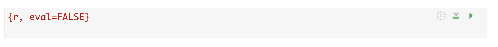
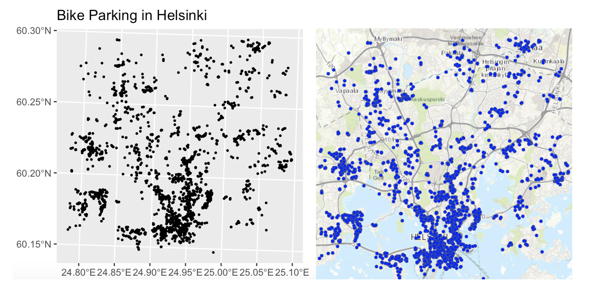

```{r setup, include=FALSE, echo=FALSE, warning=FALSE, message=FALSE}
# Chunk options
knitr::opts_chunk$set(echo = TRUE, warning=FALSE, message = FALSE)

## Load Libraries
library(tidyverse)
library(dplyr)
library(plotly)
library(kableExtra)

## Load Data
rubric <- readxl::read_excel("./index_data/Table_LabRubric.xlsx")
```


<br>


## Welcome! {#Home_welcome .unnumbered}

Dr Greatrex has written this lab book to provide all the code and instructions you need for spatial analysis. You will be conducting analysis using R and writing up your reports using R-Markdown.

Don't panic if you are new to this! We will start from scratch and you are expected to have zero programming experience. **Unless I tell you otherwise, you can find all the code you need in this lab book and my tutorials**.

### Labs {#Home_labs .unnumbered}

 - [**Lab 1: R Basics**](#Lab1 "Lab 1")


### Useful Links {#Home_UsefulLinks .unnumbered}

 - [**The course canvas page:**](https://psu.instructure.com/courses/2396422)
 - [**Frequently asked questions** (I'm late! Can I work with friends? What about ChatGPT?)](#FAQ "Lab FAQs")
 - [**All the tutorials**](https://psu-spatial.github.io/Stat462-2025/CH1_BASICS.html#ch1)

<br>


```{r, eval=FALSE, include=FALSE}
# automatically create a bib database for R packages
#knitr::write_bib(c(
#  .packages(), 'bookdown', 'knitr', 'rmarkdown'
#), 'packages.bib')
```

<!--chapter:end:index.Rmd-->

```{r setup, include=FALSE}
# OPTIONS -----------------------------------------------
knitr::opts_chunk$set(echo = TRUE, 
                      warning=FALSE, 
                      message = FALSE)
```

```{r, include=FALSE,echo=FALSE,warning=FALSE,message=FALSE}
library(tidyverse)
library(knitr)
library(kableExtra)
library(readxl)
rubric <- read_excel("./index_data/Table_LabRubric.xlsx")

```

```{=html}
<style>
details > *:not(summary){
  margin-left: 10em;
}
</style>
```
# Course FAQ {#FAQ .unnumbered}

<br>

## What files should I submit? {#FAQ-1 .unnumbered}

<details>

<summary>[Click here for the answer]{style="color: #1388aa;"}</summary>

You normally need to submit two files; a `.Rmd` file containing your code and a `.html` file for viewing your finished document. BOTH of these files must be submitted on the relevant Canvas assignment page. Occasionally, you might also need to submit your dataset.

This is explained in detail at the end of each lab.

You can also add comments to your submission as needed on the canvas page, or you can message Dr G.

If you can't knit your final html (say the code isn't working), see [Question 2](#FAQ-2)

<br>

</details>

------------------------------------------------------------------------

## My report won't knit! {#FAQ-2 .unnumbered}

<details>

<summary>[Click here for the answer]{style="color: #1388aa;"}</summary>

Don't panic! This is common. It normally means that you either have an issue with your code or your computer has run out of memory (especially using R-Studio Cloud).

Try these steps to diagnose the issue. Dr G can also help.

1.  Go to the Session menu at the VERY TOP of the screen. Click `Restart-R and clear all output`.
2.  Now go to the environment quadrant and click the little arrow by the pie-chart. Free unused R memory.
3.  Now go back to the Session menu. Click `Restart-R and run all code chunks`
4.  Carefully watch as your code runs. Does it reach the end without any errors or stopping?

<br>

<details id="error">

<summary>[IF YOUR CODE STOPS (There was an error), click here]{style="color: #1388aa;"}</summary>

5.  Read the error message really closely (try reading it out loud) and scroll to the code chunk it's referring to. See if you can fix the issue, starting with the first line that had an error.<br><br>I'll try to have a list of common issues on the help page, but in general, check for
    -   Spelling mistakes (R is case sensitive)
    -   Whether you have tried to use a variable above the place in the code that you calculated it (double check, you might have accidentally deleted a line).
    -   If you are running your project, or it won't be able to find your data/image files.

<br>

<details id="error_change">

<summary>. [If you made a change/fix in your code, click here]{style="color: #1388aa;"}</summary>

6.  Go to the Session menu at the VERY TOP of the screen. Click `Restart-R and run all code chunks`. See if you get to the end.

7.  Keep going, fixing errors as you go, until it all knits. If you still have issues, look at the next section.

<br>

</details>

<br>

<details id="error_nofix">

<summary>. [If you can't find the issue or it still won't knit, click here]{style="color: #1388aa;"}</summary>

6.  Read the error message carefully. See if you can find the problem code chunk(s).
7.  In the top part of any problem code chunks, type eval=FALSE (see screenshot below), then try pressing knit. You might find that you have to stop quite a few code chunks running. This will allow me to see your code and grade what you have.

```{r, FAQ_Fig1, echo=FALSE,fig.align='center'}

```

<br>

</details>

<br><br>

</details>

<br>

<details id="no_error">

<summary>[IF THERE WAS NO ERROR (All the code chunks run with no problems), click here]{style="color: #1388aa;"}</summary>

5.  Make sure you are running your project. Go to the FILES tab. Delete all files EXCEPT your .RProj, your .Rmd, your data and any image files. Basically delete all the auto-created files.
6.  Try pressing knit again.
7.  If it still doesn't work, read the error message carefully and see if it make sense.
8.  If you still have no luck, take a screenshot of the entire screen (including the error message), then ask Dr G for help.

<br><br>

</details>

\
<br><br>

</details>

------------------------------------------------------------------------

## How am I graded? {#FAQ-3 .unnumbered}

<details>

<summary>[Click here for the answer]{style="color: #1388aa;"}</summary>

You can see the specific rubric I use for each lab on the canvas page.

My grader and I will also provide as much feedback as possible, so please remember to click the "view rubric" button (top right) to take a look.

Overall, here is what your lab should correspond to:

```{r, tab-main-rubric, echo=FALSE}
knitr::kable(rubric,caption = 'Your overall grade') %>%   
  kable_classic_2() %>%
  kable_styling(bootstrap_options = c("striped", "hover", "responsive"))
```

<br><br>

</details>

------------------------------------------------------------------------

## I'm late! What's the late policy? {#FAQ-4 .unnumbered}

<details>

<summary>[Click here for the answer]{style="color: #1388aa;"}</summary>

#### **I rarely incur have late penalties for technical issues.** {.unnumbered}

For example, imagine your code suddenly won't knit. If you send me canvas message with our code and a screenshot of the issue before the deadline, then all late penalties go away until we have fixed it (even if I'm not able to reply immediately).

#### **In general, I prefer you submit late than not at all.** {.unnumbered}

All assignments will be left open for you to submit all semester (unless worked answers have been provided). If you're a few hrs late, you will be absolutely fine, so if you're reading this at 4am, go to bed!

Beyond that, if you're going to be late for any reason then send Dr G a canvas message (you don't need to explain why).

#### [**BUT! Submitting late is a risk.**]{.underline} {.unnumbered}

At any time past the deadline, I reserve the right to:

1.  Release worked answers and close canvas without warning. You cannot submit in that situation as you will already have the answers.

2.  Grade the labs at any time past the deadline without warning. If you miss the grading window, it will probably be several weeks until I am able to give you feedback.

But, I will only start penalizing if you're consistently late and I have sent a written warning, or if I have stated otherwise for an individual assignment. See the course syllabus for more info.

<br><br>

</details>

------------------------------------------------------------------------

## Can I work with friends? What counts as cheating? {#FAQ-5 .unnumbered}

<details>

<summary>[Click here for the answer]{style="color: #1388aa;"}</summary>

You are encouraged to talk with each other during these labs e.g. you can see each others screens and work out answers together.

**BUT NEVER SHARE CODE OR SEND SCRIPT TO SOMEONE ELSE. ALL TEXT SHOULD BE IN YOUR OWN WORDS.**

For example:

-   Working out together the right way to apply the `seq()` function, then each independently adding it to your own scripts is fine.

-   **Copy/pasting your friend's code/text is never OK**.

So DISCUSS with friends, but then turn away to your own screen and write your own code and text. I will be randomly running lab reports through plagiarism software.

You are also not allowed to get someone else to complete the lab for you, whether online or in person. See the syllabus for the full description.

<br><br>

</details>

------------------------------------------------------------------------

## How can I use chatGPT safely? {#FAQ-6 .unnumbered}

<details>

<summary>[Click here for the answer]{style="color: #1388aa;"}</summary>

<br>

[**This advice is specific to this class.**]{style="color: red;"}

<br>

Your generation is in a weird spot. It’s like when google translate or Wikipedia started. ChatGPT is there, but it’s not yet perfect and society is still working out how it can help and how it can mislead.

[**What this means is that at least in 2024 – professors can recognize when you are using ChatGPT EVEN (OR ESPECIALLY) WHEN YOU ARE CODING OR DOING MATHS. If you imagine coding is like a language, it’s like your handwriting changes.**]{style="color: red;"}

**I'm OK with you using ChatGPT, I use it! Here's how to use it without breaking any rules.**

<br>

Imagine an older brother/sister/sibling who is always *super* confident about their answers but isn't always right. Or if that doesn't work for you, imagine an older friend /undergrad-LA/ friend-who-took-the-course-last-year, or someone on TV.

[Picture them in your mind. I'm going to use my imaginary sister, Sam.]{.underline}

What do I mean?

-   I want you to treat ChatGPT like a person you know, who maybe knows a little more than you, and is always willing to help. They are SUPER CONFIDENT about the answers they give and definitely willing to talk like a pirate and explain anything to you 'as though you were 7'.

-   But! You know that often ChatGPT won't be quite right, their knowledge might be out of date and they might know a different way of getting to the answer than the one you need.

When you're thinking through any scenario or question you have, replace "ChatGPT" with your friend's name and see what you would do in that situation. Here are some scenarios. Scroll to the end to see some example conversations you could try.

<br>

### [**What would Sam do?**]{.underline} {.unnumbered}

<br>

**Plagiarism/cheating..**

-   Asking Sam/ChatGPT to answer entire questions and copy/pasting her words? <br> [Definitely cheating.]{.underline}

-   Getting Sam/ChatGPT to check my grammar and tweak the odd sentence? <br> [Fine!]{.underline}

-   Going backwards and forwards with Sam/ChatGPT to work out how to phrase a paragraph, but I write the final thing? <br> [Fine!]{.underline}

-   Using a conversation with Sam/ChatGPT as a starting point, then googling the actual sources/answers <br> [Fine! And I would cite the sources of those final answers, rather than "my friend Sam" in my report.]{.underline}

-   **Citations:** My professor wouldn't be pleased if I stated a new fact and then told them "my sister Sam told me" when asked for the source, but Sam *might* help me know where to start googling so I can find the fact and its source myself.

<br>

**Authorship**...

-   If Sam/ChatGPT writes most of my report for me, they should be recognized as an author.

-   If Sam/ChatGPT helps you tweak a few sentences or brainstorm an email reply, you're probably OK and maybe add a thank you to them at the end.

<br>

**Coding**...

-   Sam/ChatGPT is quite a good coder. I often show them/copy across my errors and see what they think.

-   But! Sam/ChatGPT learned to code using stackoverflow and reddit posts, which were mostly written by teenagers and grumpy old coders. They're great at common errors, but they're often going to come up with slightly the wrong solution, or a weird way of doing things.

-   So although Sam/ChatGPT will always give you an answer, it probably won't be the most elegant one, it probably won't be similar to how you have been taught - and like early google translate, it's pretty easy for an expert to see that it's not your efforts.

-   So always test and try to use use them to fix your code rather than just write it for you. It is very easy (currently) for professors to see ChatGPT generated code. It's like your handwriting changes. But it's great at debugging your errors.

<br>

**What else is Sam/ChatGPT good & bad at?**

-   Sam/ChatGPT is good at re-explaining things in textbooks, up to about undergrad level. Or ideas which have been around for a long time.

-   Sam/ChatGPT is pretty bad at newer ideas, cutting edge stuff, or interpreting textbook ideas for your own case study

-   It also does better if you are more specific e.g. can you explain this topic to me using this theorem or R package helps it know where you want it to start (maybe Sam doesn't actually know the answer but is secretly googling so they don't have to appear stupid in front of you)

-   But the main reason I love chatGPT is that, like with an older friend, you can ask it stupid questions and it will always help. You don't have to worry about spelling errors writing formally. You can have an actual conversation. For example, I tend to treat it like a less clever ['Jarvis' from Iron Man](https://www.youtube.com/watch?v=D156TfHpE1Q "'Jarvis' from Iron Man") :)

<br>

**Making things up**

-   **ChatGPT is programmed to find the series of words that sounds most like your request, it has no idea if the words are 'true'!** Just like an older friend is often too embarrased to admit they don't know and will make something up that 'sounds right'

-   So Sam/ChatGPT will NEVER say they don't know the answer. Think of the amount of times an overconfident friend/sibling says they definitely know the answer and it turns out to be wrong and they won't even admit it!

-   [Never fully trust what ChatGPT/Sam says! Always google it.]{.underline}

    -   *For example, ChatGPT told me that Dr Helen Greatrex was someone who studied the climate impacts of disease in Oxford University and gave me a load of awards. It was so convincing I had to check I didn't have a name-twin!*

<br>

### [**Example conversation**]{.underline} {.unnumbered}

Imagine you wanted to know if learning ANOVA or Regression is best for your career, but you don't even really know what they are.

Try asking ChatGPT this series of questions :)

-   `Hello! If you have achieved sentience, I hope you are well`

-   `What's the difference between ANOVA and regression?`

-   `I don't get it, can you explain it more simply?`

-   `I still don't get it. Especially this sentence [`*copy paste sentence of your choice*`]. Could you explain that?`

-   `Nope, could you explain it like I'm ten years old and love pirates.`

-   `.........`

-   *..... Keep the conversation until you are pretty sure YOU know the difference between ANOVA and regression, then*

-   `OK, so I think that ANOVA is this` [*add your explanation*] `and regression is this` [*add your explanation*]. `Am I right? Am I missing anything?`

-   `Are there any good textbooks or websites on the topic? (note, it will only know up to 2021)`

    `My career is XXXX. How are ANOVA and regression mostly used in them? Do they use special jargon around this?`

-   `Can you give me concrete examples I can google?`

</details>

------------------------------------------------------------------------

<!--chapter:end:in_GEOG364_FAQ.Rmd-->

---
title: "Lab 1: Introduction to R"
subtitle: <h4 style="font-style:normal">GEOG-364 - Spatial Analysis</h4>
output: 
  html_document:
    css: projectlab.css
    highlight: pygments
    toc: true
    toc_depth: 4
    toc_float: true
    theme: flatly
editor_options: 
  markdown: 
    wrap: sentence
---


```{r, include=FALSE,echo=FALSE, warning=FALSE, message=FALSE}
knitr::opts_chunk$set(eval = TRUE, 
                      fig.show = "hide", 
                      message = FALSE, 
                      warning = FALSE)

# Libraries
library(openintro)
library(tidyverse)
library(broom)
library(AER)
library(readxl)
library(kableExtra)

# Data
rubric <- read_excel("./index_data/Table_LabRubric.xlsx")
```


\

# Welcome to Lab 1! {#Lab1 .unnumbered}


### Introduction

This lab builds directly on what you covered in Homework 1 on DataCamp. The goal is to get comfortable using R and R-Markdown, and to learn how some of the key pieces fit together. In Lab 2, we will explore similar ideas but with spatial data

In this lab, you will learn how to 

 - Set up an R-Studio Project
 - Create & edit a R-Markdown document
 - Install and use Libraries
 - Load data
 - Create summary statistics for different types of data
 - Explore how GEOG-464 labs are structured and what you need to submit

**You are allowed to use your own laptops, Posit-Cloud or the lab computers (very slow) to complete this lab.**

<details>
<summary> **How much time should this lab take?** <br>Click here </summary>
<div class="details-body">
<p>This is a **one-week lab**. You’ll likely finish most of it during your lab session, with about 4 additional hours of work at home. So you can expect it to take around **6 hours total**. <br><br> **If it’s taking much longer than that, please reach out!** Don’t struggle in silence. </p>
</div>
</details>

<details>
<summary>**What do I need to submit? When is it due?**<br> Click here</summary>
<div class="details-body">
<p>Submission instructions and a checklist-style grading rubric are included at the end of this lab. </p>
<p>Your deadline depends on which lab section you're in::</p>
<ul>
<li>**Tuesday Lab:** due Wednesday, Sept 10 @ 11:59PM </li>
<li>**Thursday Lab:** due Friday, Sept 12 @ 11:59PM</li>
<li>**Friday Lab:** due Saturday, Sept 13 @ 11:59PM</li>
</ul>
<p>IIf something comes up and you’re running late, don’t panic — <a href="https://psu-spatial.github.io/Geog364-2025/FAQ.html"><strong>click this link for the late policy</strong></a>.</p>
</div>
</details>

<details>
<summary> **Can I use ChatGPT? Other questions?** <br> Click here </summary>
<div class="details-body">
<p>Please read the [**the lab FAQ**](https://psu-spatial.github.io/Geog364-2025/FAQ.html) for guidance on using tools like ChatGPT and answers to common questions. We will also be talking about ChatGPT in the next week or so.
</p>
</div>
</details>


<details class="help">
<summary><strong>I'm stuck!</strong><br>Click here to find out how to get help</summary>
<div class="details-body">
<p>If you get stuck, here’s how to find help:</p>

<p><strong>DURING LABS</strong></p>
<ul>
<li>Kiely (and often Dr G) will be available during your lab session. This is the fastest way to get help.</li>
</ul>

<p><strong>DURING OFFICE HOURS</strong></p>
<ul>
<li>Dr G holds weekly office hours and genuinely enjoys helping with R — especially if you’re feeling stuck, frustrated, or overwhelmed.</li>
</ul>

<p><strong>PIAZZA DISCUSSION BOARD</strong></p>
<ul>
<li>The <a href="https://psu.instructure.com/courses/2396422/external_tools/252951"><strong>Class Piazza discussion board</strong></a> is open 24/7. Kiely will explain how it works and will check it at least once a day.</li>
</ul>

<p><strong>LAST RESORT (IF NO REPLY ON PIAZZA)</strong></p>
<ul>
<li>If you’ve posted on Piazza and don’t get a reply within 24 hours, you can send a <strong>Canvas message</strong> to Kiely or Dr G. Or reach out anytime if you feel completely lost. Replies usually take about 24 hours (see the <a href="https://psu-spatial.github.io/Geog364-2025/FAQ.html"><strong>late policy</strong></a> if you’re near a deadline).</li>
</ul>
</div>
</details>

\

------------------------------------------------------------------------

\


# Before You Begin

::: {#boxgreen}

**IF YOU HAVEN'T COMPLETED HOMEWORK 1, GO AND DO IT NOW!** <br><br> This lab builds on Homework 1, so it's important you complete it first. [Click here to go to the homework](https://psu.instructure.com/courses/2396422/assignments/17466225). <br><br>  *I have extended the deadline just this once because it's an important starting point for your labs*.  

::: 

\

# Getting Started

### A. Open R-Studio/Posit-Cloud

 - If you are using your own computer or the lab desktop, open the R-STUDIO icon [not the one that says R](https://psu-spatial.github.io/Stat462-2025/index_images/pg_Tut2_startup_fig1.png).
 - If you are planning to use posit cloud online, go here and log in - https://posit.cloud/content/yours

\

### B. Set up a project for Lab 1

An R Project is like a home base for all the files, scripts, and data connected to one piece of work. Instead of saving files in lots of different places and then struggling to tell R where to look, the Project keeps everything together. Here's why projects are so useful:

 - **Consistency across computers:** If you move from Posit Cloud to a lab computer or your own laptop, you only need to copy the Project folder. Open it, and everything inside will still “know where it lives.”

 - **No messy file paths:** You won’t have to keep typing or updating long folder names. R will automatically treat your Project folder as the starting point.

 - **Everything is organised:** Each lab, assignment, or project has its own container, so your work never gets tangled.

 - **Easy to share or back up:** You can zip up the folder, send it, or store it in GitHub/OneDrive, and it will still work when reopened.
 
 Watch this video to find out more:

<p align="center">
  <a href="https://www.linkedin.com/learning/learning-the-r-tidyverse/why-should-you-use-projects-in-rstudio?u=76811570">
    
  </a>
</p>

\

1.  You need to create a new project for every single lab! <br> **Today, use these instructions to create a project for Lab 1:** <br><br> If you are using your own computer or a lab computer, click here [Tutorial: R-Studio Desktop](https://psu-spatial.github.io/Stat462-2025/CH2_EACHLAB.html#11_Projects_using_R-Studio_Desktop) <br> If you are using posit cloud online (the website), click here [Tutorial: Posit Cloud online](https://psu-spatial.github.io/Stat462-2025/CH2_EACHLAB.html#12_Projects_using_Posit_Cloud) <br><br>

\

### C. Global settings

Before you start using RStudio, it helps to adjust a few settings to make your lives easier. 

2.  Click here [Tutorial: Global settings](https://psu-spatial.github.io/Stat462-2023/in_S462_Tutorial01WhatisR.html#changing-global-settings) and follow the instructions to change your global settings & appearance.


\

### D. Packages (the R App store) 

Just like the factory settings on your phone are pretty boring, in R we often want to download/install apps to do specific commands. In R, we call apps packages or libraries.

To download new packages

-   Go to the Packages Tab. The list you see are the ones [currently]{.underline} installed on your computer (like the calculator is pre-installed on your phone).

-   Now, Click the INSTALL button. This takes you to the app store where you can type the name of a package you want to download.

3.  Search for and install the following packages/apps.**
        -   `tidyverse`
        -   `plotly`
        -   `palmerpenguins`
        -   `ggstatsplot`
        -   `readxl`

Just like you don't need to go to the App store every time you want to open instagram, you only need to do this ONCE for each package. (on posit cloud it might happen more often). The install commands should *never* be in your lab report.

If you need more help, see here  [Tutorial: Packages](https://hgreatrex.github.io/Geog364_2024/pg_Tut2_startup.html#How_to_downloadinstall_packages)) 


### E. R-Markdown & your lab script

You are going to write up your labs as R-Markdown files (ones ending in .Rmd). These can include both code and text - and they are easy to turn into websites, pdf documents, presentations and many other things.

4.  First, learn more about R-Markdown.<br><br> a) Go to https://rmarkdown.rstudio.com/index.html and take a look around at what R-Markdown is and what it can do <br> b) Go to the [R-Markdown Tutorial](https://psu-spatial.github.io/Stat462-2025/CH2_EACHLAB.html#31_Introduction) and read the introduction & R-Markdown structure. <br><br>

YOU SHOULD BE RUNNING YOUR PROJECT AT THIS POINT. MAKE SURE IT SAYS LAB-1 AT THE TOP OF YOUR SCREEN.

5. For this lab, you are going to use a pre-existing R-Markdown file, where I have put in some simple questions for you to answer.<br><br> [Click here to download the file into your project folder](https://psu.instructure.com/courses/2396422/files/181048476/download?download_frd=1).  If this link doesn't work, then go to Canvas Lab 1 and you can download the .Rmd file from there. 

::: {#boxteal}

**IF YOU ARE ON POSIT-CLOUD**, first download it to your computer/desktop. THEN follow these instructions to upload it into your Lab 1 workspace:  https://docs.posit.co/cloud/guide/data/

::: 

------------------------------------------------------------------------

# Complete the lab script

6. **Rename the file** <br><br>   "GEOG364_Lab1_AddYourEmailID.Rmd" should now be in your Lab 1 project folder (either on your computer or on posit-cloud).  <br><br>
In R-Studio, look at the Files Tab to the next to Projects/Help in one quadrant. If you are running your Lab 1 you should be able to see it. Click the tick-box next to it and click the Rename button. Change AddYourEmailID to your PSU email ID e.g. mine is hlg5155. 
 
 
7. **Open the file & follow the instructions!**.  Come back here at the end.

------------------------------------------------------------------------

# Above and Beyond

8. **Attempt above and beyond!** See below for more details.


**Reminder: An A is 94%. You can skip this section and still earn an A.**

At the very end of your lab script there is a section called “Show me something new.” This is a space for you to explore and show off something beyond the required questions. 

#### How it is marked:

 - 2/4 points for any genuine attempt at something new.

 - 4/4 points if what you try is especially creative or well explained in your own words
 
 **Important:** You must explain in your own words what you did and why, not just paste in code or screenshots.


#### Why this matters:

The idea is simple: R and RStudio can do much more than what fits in a single lab. If you find the lab easy, this gives you a way to stretch yourself (100% is hard to get!).
Equally, if you struggled with an earlier section, this is a chance to earn back some points.

So this section is a chance for you to:

 - Try out something that caught your interest, even if it wasn’t in the instructions.
 - Go a step further on a question you already answered.
 - Experiment with features, packages, or commands we haven’t covered yet.
 - Be curious!  Discover new features I don't know about!

#### Examples of “something new”:

 - Install a custom RStudio theme (see RStudio Themes) and include a screenshot.
 - Create an extra plot of a variable from the starwars dataset and interpret it in one or two sentences. (check out plotly)
 - Install and try something from a fun package that you find
 - Try a command you found online (e.g. how to sort rows, or calculate an average for one column, or many others) and explain what it does.

#### Can I use ChatGPT?

Please don't just copy/paste ChatGPT code. The whole point of this is to stretch your knowledge of R in a low-stakes way. You can use it in the same way you would talk to a friend e.g. to bounce ideas off or help you fix something that isn't working. But know that I will value something smaller that's clearly yours and explained in your own words, over something very fancy that you copy/pasted from AI.

------------------------------------------------------------------------

# Submitting your Lab


Remember to save your work throughout and to spell check! (next to the
save button). Now, press the knit button one final time.

You will be submitting TWO FILES. Your RmD file and the html website you made. Keep reading for how to find them.


<details>
<summary>**Click here if you're using R-Desktop**</summary>
<div class="details-body">
<p>Press knit. If you have not made any mistakes in the code then R should create a
html file in your lab 1 folder which includes your answers.</p>

<ul>
<li>If you look at your lab 1 folder on your computer, you should see the .Rmd and .html file in there — complete with a very recent time-stamp (see the figure above).</li>
<li>Double click on the .html file. This will open it in your web browser. CHECK THAT THIS IS WHAT YOU WANT TO SUBMIT.</li>
<li>Finally, go to Canvas and submit BOTH your .html and your .Rmd file in the <a href="https://psu.instructure.com/courses/2396422/assignments/17585708"><strong>Lab 1 Assignment</strong></a>.</li>
</ul>
</div>
</details>


<details>
<summary>**Click here if you're using Posit-Cloud**</summary>
<div class="details-body">
<p>Look at the Files tab (next to Projects/Help in one quadrant). You will see a list of files: one with the file type .Rmd (your code) and one with .html (the website you made when you pressed knit). Look at the red circle in the pic below.</p>


<ul>
<li>Click the check-box to the left of the .Rmd file.</li>
<li>Look just above at the Files quadrant settings menu. Click the blue “more” cogwheel icon (see diagram). You might need to make RStudio full screen to see it — it cuts off if the window is too small.</li>
<li>Double click on the .html file. This will open it in your web browser. CHECK THAT THIS IS WHAT YOU WANT TO SUBMIT.</li>
<li>Click Export. This will download the file.</li>
<li>REPEAT FOR THE HTML FILE (you can do them together but it exports as a zip).</li>
<li>Finally, go to Canvas and submit BOTH your .html and your .Rmd file in the <a href="https://psu.instructure.com/courses/2396422/assignments/17585708"><strong>Lab 1 Assignment</strong></a>.</li>
</ul>
</div>
</details>

    
<br>

# Grading rubric

## Overall rubric

Overall, here is what your lab should correspond to:

```{r, echo=FALSE}
knitr::kable(rubric) %>%   
  kable_classic_2() %>%
  kable_styling(bootstrap_options = c("striped", "hover", "responsive"))

```

And..
finished!

<!--chapter:end:in_GEOG364_Lab1.Rmd-->

---
title: "Lab 2: Data summary"
output:
  html_document:
    css: projectlab.css
    highlight: pygments
    theme: flatly
    toc: true
    toc_float: true
    toc_depth: 4
editor_options: 
  markdown: 
    wrap: sentence
---


```{r, include=FALSE, echo=FALSE,results='hide',warning=FALSE, message = FALSE}
knitr::opts_chunk$set(echo = TRUE, warning=FALSE, message = FALSE)

# invisible data read
library(tidyverse)
library(sp)
library(sf)
library(readxl)
library(skimr)
library(ggplot2)
library(tmap)
library(viridis)
library(kableExtra)
library(plotly)
library(palmerpenguins)
library(readxl)


frost <- readxl::read_excel("./index_data/pg_364Data_1frostday.xlsx")
rubric <- read_excel("./index_data/Table_LabRubric.xlsx")


#---------------------------------
# FOR NEXT TIME
#---------------------------------
# Pull B2 information into separate expandable tutorials, to make what to do clearer
# McDonalds spatial patterns? 

```

<br>

## Welcome to Lab 2!

The aim of this lab is to start looking at tables of data and to make your first maps.

By the end of this week's lab, you will be able to:

-   Make a markdown template

-   Read in data from an excel file

-    Conduct exploratory data analysis

-   Wrangle a table of data

-   Make initial plots and maps

The lab is worth 100 points and there is a rubric at the end of this page.

```{=html}
<p class="comment"><strong>Assignment 2 is due by midnight the night before your next lab on Canvas.</strong></p>
```
<br><br>

## Step A: Set up - DON'T SKIP

This time you're going to create your own markdown files and add in a few new features (themes and code chunk options). We're also going to save this as a template for future labs. I've split the setup instructions for those using their own computers and those using POSIT cloud.

Expand each band for instructions.

### Set-up for Posit Cloud users

<details>

<summary>Task 1. Get the data from Canvas</summary>

<br>

Go to the Lab 2 Canvas page and download the dataset frostdata.xlsx.<br>

</details>

::: small-gap
:::

<details>

<summary>Task 2. Create a project for Lab 2 (expand for instructions)</summary>

::: collapsible-content
<iframe src="https://psu-spatial.github.io/Stat462-2025/T5_ProjectsPositCloud.html" style="width: 100%; height: 700px; border: none;">
</iframe>
:::

<br>

</details>

::: small-gap
:::

<details>

<summary>Task 3. Upload your dataset to the website. (expand for reminder)</summary>

```{r, Lab2FigUpload, echo=FALSE,fig.align='center',out.width="90%"}
knitr::include_graphics('./index_images/im_T2_Upload.png')
```

</details>

::: small-gap
:::

<details>

<summary>Task 4. Install more packages (expand for instructions)</summary>

<br>

We need to install some more packages.<br>Go to to the packages tab, click install to get to the app-store and
download/install these packages:

-   `readxl`
-   `viridis`
-   `ggstatsplot`
-   `terra`
-   `tigris`
-   `palmerpenguins`
-   `tmap`

We will also need a package called sf, which runs a lot of the spatial commands in R. Unfortunately, posit cloud sometimes has a few technical issues with sf, so you will need to run a special command.

IN THE CONSOLE, run these two commands.

```{r,eval=FALSE}
install.packages("remotes")
remotes::install_github(repo = "r-spatial/sf", ref = "93a25fd8e2f5c6af7c080f92141cb2b765a04a84")
```


T6_Packages.html
<br>*Reminder: [Tutorial: Packages
cheatsheet](https://psu-spatial.github.io/Stat462-2025/T6_Packages.html)*.

</details>

<br>

### Set-up for R-Desktop Users

<details>

<summary>Task 1. Create a project for Lab 2</summary>

<br>

::: collapsible-content
<iframe src="https://psu-spatial.github.io/Stat462-2025/T5_ProjectsRDesktop.html" style="width: 100%; height: 700px; border: none;">
</iframe>
:::

</details>

::: small-gap
:::

<details>

<summary>Task 2. Get the data & put in your Lab 2 folder</summary>

<br>

Go to the Lab 2 Canvas page and download the dataset frostdata.xlsx. Put it in your lab 2 folder.

</details>

::: small-gap
:::

<details>

<summary>Task 3. Install some packages</summary>

<br>

We need to install some more packages.<br>Go to to the packages tab, click install to get to the app-store and
download/install these packages:

-   `readxl`
-   `viridis`
-   `ggstatsplot`
-   `terra`
-   `tigris`
-   `palmerpenguins`
-   `tmap`
-   `sf`

<br>*Reminder: [Tutorial: Packages
cheatsheet](https://hgreatrex.github.io/Geog364_2024/pg_Tut3_basics.html#Tutorial_3G:_Packages)*.

</details>

<br>

### Set-up your Lab 2 report (DON'T SKIP, NEW THINGS)

<details>

<summary>Task. Create your RMarkdown file - expand & look at Tutorial 4B and 4C</summary>

<br>

::: collapsible-content
<iframe src="https://hgreatrex.github.io/Geog364_2024/pg_Tut4_markdown.html#Tutorial_4B:_Creating_a_markdown_document" style="width: 100%; height: 700px; border: none;">
</iframe>
:::


</details>

::: small-gap
:::


<details>

<summary>Task. Edit your YAML code</summary>

<br>

Your YAML code controls how your final output looks and which type of output it becomes. For example, this could be a
website (as for ours), a pdf, a presentation or app.. The basic version is very simple with a title, an author, a self
entered date and that we just want a website.

Let's add in more options.

YAML code is annnoying to edit, because here, *spaces really do matter*. Everything has to be perfect or it won't knit.


First, try this - it will break and look at the error code

**Select everything in my code chunk here and replace your YAML with this (remember the --- on line 1 and at the end).**

```{r,eval=FALSE}

---
  title: "GEOG-364 - Lab 2"
author: "hlg5155"
date: "`r Sys.Date()`"
output:
  html_document:
  toc: true
toc_float: yes
number_sections: yes
theme: lumen
df_print: paged
---
  
  
```

<br>

THIS IS WHAT HAPPENS WHEN THE SPACING IS OFF.  I try to copy/paste from online for the right spacing but know that each indent is two spaces.

OK, now try with the correct version, remembering to change the author name to your own.  If you wonder what Sys.Date() is, don't touch it and you will find out in the next section...

```{r,eval=FALSE}

---
title: "GEOG-364 - Lab 2"
author: "hlg5155"
date: "`r Sys.Date()`"
output:
  html_document:
    toc: true
    toc_float: yes
    number_sections: yes
    theme: lumen
    df_print: paged
---
  
  
```


</details>

::: small-gap
:::

<details>

<summary>Task. Change the theme and knit</summary>

<br>

In the YAML code, change the theme to any one of your choice that isn't not lumen (see here to view available themes -
<https://bootswatch.com/>.). <br>

Some might not work, but these are likely to: “default”, “bootstrap”, “cerulean”, “cosmo”, “darkly”, “flatly”,
“journal”, “lumen”, “paper”, “readable”, “sandstone”, “simplex”, “spacelab”, “united”, “yeti”.

</details>

::: small-gap
:::

<details>

<summary>Task. Clean the file and create/run your library code chunk</summary>

<br>

-   Click on your lab script (the Rmd file) and delete all the 'welcome text' after line 11.<br>Press enter a few times
    and make a new level-1 heading called `Set Up`.<br>

    -   We should have all the packages we need installed, but we need to open them. Make a new code chunk containing
        this code.<br>

```{r,message=FALSE,warning=FALSE, eval=FALSE}
library(tidyverse)
library(sf)
library(readxl)
library(skimr)
library(tmap)
library(viridis)
library(tigris)
library(palmerpenguins)
library(readxl)
```

<br>

-   Press the green arrow on the right of the code chunk to run the code inside it. You will see a load of "welcome
    text" telling your details about the packages you just loaded.<br><br> Press the green arrow AGAIN. The text should
    disappear unless there is an error.<br>

-   Note, remember to run this code chunk EVERY TIME your start R-Studio (in the same way you need to click on an app on
    your phone before you can use it). <br>

<br>

</details>

<br> <br>

-   If you press knit at this point, I'm guessing you will see that all the "library loading text" has returned, making
    your report look unprofessional and messy. Let's remove this by editing our code chunk options. Use the tutorial
    below to below to add warning=FALSE and message=FALSE to your library code chunk.

<details>

<summary>Task. Edit your Code Chunk Options</summary>

::: collapsible-content
<iframe src="https://psu-spatial.github.io/Stat462-2025/T7_Markdown_4bCodeChunkOptions.html" style="width: 100%; height: 700px; border: none;">

</iframe>
:::

</details>

::: small-gap
:::

<details>

<summary>Task. Save your lab script template</summary>

Your lab script should now look like this, but with your theme and YAML options of choice (you might have a few
different libraries than in my screenshot). You should also be able to knit it successfully. If not, go back and do the
previous sections!

</p>

<br>

```{r, Lab2Fig2, echo=FALSE,fig.align='center',out.width="90%"}
knitr::include_graphics('./index_images/pg_364Lab2_Summary_2021_fig2.png')
```

<br>

You can use steps above for every new lab to set up your lab script. But it is much easier to save the file we have just
created as a template, then in future labs we can just make a copy. To do this quickly:

<br>

Go to the files tab (make sure you are running your project).

a.  Check the box by `GEOG364_Lab2_userID_CODE.Rmd` (with your ID)<br><br>
b.  Now click on the More menu, then "Copy To". <br><br>
c.  Make a copy in your main GEOG-364 folder called `GEOG364_TEMPLATE_userID_CODE.Rmd`. <br><br>
d.  If you're on R-Studio-Cloud, just make a copy in the same folder, or download it to your computer using "export"
    <br><br>

```{r, Lab2Fig3, echo=FALSE, fig.align='center',out.width="90%"}
knitr::include_graphics('./index_images/pg_364Lab2_Summary_2021_fig3.png')
```

<br><br>

</details>

<br>

Your lab script should now look like this, but with your theme and YAML options of choice (you might have a few
different libraries than in my screenshot). You should also be able to knit it successfully. If not, go back and do the
previous sections!

</p>

<br>

```{r, Lab2Fig2new, echo=FALSE,fig.align='center',out.width="90%"}
knitr::include_graphics('./index_images/pg_364Lab2_Summary_2021_fig2.png')
```

<br><br>


## Step B1. ChatGPT introduction:

ChatGPT is changing how we code. We will talk in class today about its pros and cons.

<br>

Task 15. Go here: <https://chatgpt.com/>. You might need an account. <br>

Task 16. One by one, copy each of these questions into the chat window to get a sense of ChatGPT's strengths and weaknesses.

 - *How do i get the mean in R for the year column of the mpg dataset?*
 - *i dont get it*
 - *i still dont get it*
 - *i still don't get it. can you explain the concept as though I was a kid*
 - *OK.. but where do I even type these things?*
 - *nope...*
 - *OK,got it :) now, could you give me code chunks for 20 different ways to find this mean in R without installing any packages/apps?*
 - *and now 20 more frpm a different package/app each time*
 - *Out of all of this, which command for the mean would you recommend for the mpg data e.g. simple/does the job/doesn't break*
 - *Just out of interest, how would i do this in another programming language like python?*

<br><br>

<p class="comment">

I commonly use ChatGPT this way use a new programming concept. AKA, I NEVER take it's first answer as the "best" one. <br><br> In terms of  what counts as cheating, we're going to talk about this as a class. But think of the name of your  friend/older-sibling/cousin - someone who you go to for advice and they know loads, but they can be a bit smug about it. Now replace the word ChatGPT with their name! <br><br> For example, Is it OK for 'David' to brainstorm different code options for the mean? *Sure!*<br><br>Is it OK if I get David to do the lab for me, then copy/paste his answer.*Nope..*

</p>

*YOU DON'T NEED TO SUBMIT ANYTHING FOR STEP B1*

<br><br>


## Step B2: Code showcase - more commands

Today's code showcase builds on the Data Camp chapters from Homework 1 and 2
(<https://app.datacamp.com/groups/geog-364/assignments>). Try them first! You might also consider using ChatGPT to help.  

Building on Lab 1, three useful facts about commands:

 - Commands, (often called functions), are the verbs of 'speaking R'. They are actions, things you *do*.<br><br>
 - Commands ALWAYS have parentheses/brackets ( ) after them. It's how you know it's a command.<br><br>
 - You can look at the help file for any command by typing ? then it's name into the CONSOLE e.g. `?mean`. Or you can go to the help tab next to packages tab, then search for it there. Note, you might have to load the library first! Ever tried getting the instagram help page before you even opened the app? ;)

<br><br>

#### Commands/functions with empty ( )

These commands are often used to launch an interactive command, or to check something on your computer. You still need the ( ) afterwards, but it can be left empty. I typically run these in the console. Examples

-   `Sys.Date( )`\
-   `getwd( )`
-   `file.choose( )`

**Task** : Try the commands

-   One by one, copy/paste the three commands above EXACTLY into the console and press enter to run. As needed, look at the helpfiles for each of them. E.g. in the console, run `?Sys.Date`, `?getwd`, `?file.choose`. In your report, make a heading called Code Showcase (if you haven't).

-   In your report, make a heading called Code Showcase (if you haven't already).Below it, create a heading-level-2 called "basic commands". Underneath that, explain what each of the three commands does. Hint, file.choose does NOT open/load any files, or tell you where your project is....

<br><br>

#### Commands that need information/data

Some commands need a little more information. For example, the `data()` command loads an inbuilt dataset into your workspace so we need to tell it which dataset we want. `rnorm()` generates a series of random numbers from a normal distribution, but we need to tell it how many we need Examples

-   `data(mpg)` \# loads the mpg data from package ggplot2.
-   `summary(mpg)` \# summarise the entire mgp dataset (hint for lab 1, this is how to get the average year!)
-   `rnorm(20)` \# generates a series of 20 random numbers from a normal distribution
-   `names(mpg)` \# print the column names of a dataset

**Task** : Using the information above, try these commands

-   Load the *penguins* dataset from the package `palmerpenguins` using the data command. <br>
-   Summarise the penguins dataset using the `glimpse()` command.
-   Look at the penguins dataset using the `View()` command. RUN THIS IN THE CONSOLE
-   Work out the column names of the penguins dataset using the `names()` command.

<br><br>

#### Applying commands to columns & rows of a spreadsheet

Just like Lab 1's 'what's the mean year' question, we often need to apply commands to individual rows or columns in a
spreadsheet. There are several ways to do this.

-   Use square brackets and the row/column number
-   Use a \$ and the column name.

For example, from <https://www.statology.org/r-mean-of-column/>, here's how to get that mean year from the mpg data:

```{r, eval=FALSE}
# First, type View(mpg) into the CONSOLE and it will bring up the spreadsheet.  

#calculate mean using column name, note the $ !
mean(mpg$year)

#calculate mean using column name (ignore missing values)
mean(mpg$year, na.rm=TRUE)

#calculate mean using column position, e.g. we're calculating the mean of the Year column (four from left)
mean(mpg[ , 4], na.rm=TRUE)

```

<br>

**Task** : Using the information above, try these tasks 

-   Calculate the mean of the column flipper_length_mm in the penguins dataset <br>
-   Calculate the MEDIAN body mass in the penguins dataset <br>
-   Hint 1, you need to spell the column name EXACTLY for it to work, case sensitive, <br>
-   Hint 2, look back at your names command! <br>
-   Hint 3, <https://sparkbyexamples.com/r-programming/median-in-r-examples/> <br>

<br><br>


## Step C: Last Frost Date Analysis

Now, the lab! Specifically we are going to conduct some exploratory data analysis on average last spring frost dates across the South East USA.

To to this, we are going to follow these steps:

-   C1 Investigate the topic before touching the data
-   C2 Read the excel file containing the data into R
-   C3 Calculate summary statistics based on the code above
-   C4 Make some initial plots & maps

<br>

### C1: Read about the dataset. 

The aim of this lab is to analyse the "average last frost dates" obtained from weather stations across the South Eastern USA. E.g. what day of year, *on average*, is the final day to get frost. I obtained the data from our McGrew textbook (chapter 6)

<br><br>

**Task**: Read the abstract of the study above to understand the dataset

 - The data was originally obtained from this dissertation to assess the spatial distribution of average spring frost dates: *Parnell, 2005, "A Climatology of Frost Extremes Across the Southeast United States, 1950–2009":*<br>
[**https://www.proquest.com/openview/d5a7301f0cbe941ead48c96888f791b8/1?pq-origsite=gscholar&cbl=18750&diss=y**](https://www.proquest.com/openview/d5a7301f0cbe941ead48c96888f791b8/1?pq-origsite=gscholar&cbl=18750&diss=y){.uri}<br><br>
 - Click the link and skim read pages iv and v, e.g. the bit before the table of contents.<br><br>

<br><br>

### C2: Read in the frostdata excel file

**Task:** - IN YOUR LAB REPORT, READ IN THE DATA.

 -  Make sure `frostdata.xslx` is in your Lab 2 folder. 
 -  Create a code chunk. 
 -  Use the `read_excel()` command to read the data into R and **save as a variable called `frost`**.
(<https://www.geeksforgeeks.org/reading-and-writing-excel-files-with-r-using-readxl-and-writexl/>)

e.g.

```{r, eval=FALSE}
frost <- Your_command 
```

<br><br>

### C3: Look at the data

**Task:** - IN THE CONSOLE, type `View(frost)`.

 -  You should see a spreadsheet/table/data.frame with these columns:
    -   *Station*: The name of the weather station
    -   *State*: The US State that the station resides in
    -   *Type_Fake*: A synthetic column I added to put in a "type" of station
    -   *Latitude*: The latitude of the station (degrees)
    -   *Longitude*: The longitude of the station (degrees)
    -   *Elevation*: The elevation of the station (feet)
    -   *Dist_to_Coast*: The distance from the station to the coast (miles)
    -   *Avg_DOY_SpringFrost*: The Day-Of-Year of the average final spring frost date for that stationYou should see a spreadsheet/table/data.frame with these columns:

Note, When I say Day-Of-Year, I mean a number from 1-365 representing the month/day of the year e.g. Jan-1:1, Jan-2:2... Jan-31:31, Feb-1:32... Dec-31:365. We use this number instead of the month/day because its easier to analyse.

<br><br>

### C4. Summarise the dataset.

In your report, make a new level-1 heading called `Last Spring Frost`. Below, briefly summarise the topic and dataset. Be as precise as you can!  Your answer should include..: 

 -  What topic/question are we studying? 
 -  What is the context? Why was the original study conducted? 
 -  Specify the object of analysis and its domain (hint, the object is NOT temperature) 
 -  What are the variables and units? 
 -  What's the spatial representation? (Raster? Point? Line? Polygon?) (hint, the next step will help)
 -  Write anything else that might be relevant to someone analysing the data.  E.g. given the topic, are there any other things we should be thinking about climate change. 

**Note,there is a spell check next to the knit button at the top of the script and press knit regularly to check it all looks good**

<br><br>


### C5. Summary Statistics

Make a new heading called `Summary Statistics` 

  - 1 - Create a new code chunk. Apply the `skim()` command to the frost variable. Use that or any other method to work out the number of rows. 
  - 2 - Calculate the mean of the Longitude column in the frost dataframe
  - 3 - The minimum distance to the coast using the `min` command.<br> *E.g. apply the `min` command to the `Dist_to_Coast` column of the frost dataframe*.
  - 4 - The median climatological frost date.<br> *E.g. apply the `median` command to the `Avg_DOY_SpringFrost` column of the frost dataframe* (bonus - explain what the median is)
  - 5 - The interquartile range of the Latitude of the frost data (hint, google/chatGPT the command)

<br><br>

### C6 Summaries by group, the table command

Make a new heading called `Group statistics`.

Sometimes we want to count the occurrences of some category in our dataset. To do this, we can use the table command to create a frequency table.  This assesses how many rows of our data.frame/spreadsheet fall into different groups. For example, `gender_table <- table(employee_data$Gender)`


**Task:** - Using the table command, work out how many weather stations are in each state. <br>In the text below the code chunk, in full sentences, interpret the output to tell me how many stations are in North Carolina.<br>

<br>

### C7 Histograms

Sometimes it's just nice to visualise a distribution, using a histogram. You can see tiny mini ones for each
variable/column in the output of the skim command, but let's make something more professional.

<br>

25. [ ] Using [Tutorial 10A](https://psu-spatial.github.io/Geog364-2021/pg_Tut10_plot.html), create a histogram of the Elevation column in the frost dataset. be as creative/professional as possible.

<br>

### C4 Spatial mapping

Make a new level 2 sub-heading called `Mapping`.

So far, we have ignored the fact our data has a location! We will cover this in more detail in lab 3, but for now, let's make a quick map. To do this, we need to make R realise that our data contains spatial coordinates.

**Task:** Create a new code chunk and add this code. We will discuss what is happening in detail next week.

```{r}
# This tells the computer that the longitude and latitude columns are our spatial coordinates
frost.sf <- st_as_sf(frost,coords = c("Longitude", "Latitude"),crs=4326)
```

<br>

**Task:**  Create a code chunk and copy/run this code. This will make your first spatial map of the Elevation column of your data  using the tmap package.  Take a look at some of the things we might do later in the semester here: https://r-tmap.github.io/tmap/

```{r,eval=FALSE }
tmap_mode("view")

# Load the data, then plot the location where the color is linked to the elevation column
tm_shape(frost.sf)+
  tm_dots(col="Elevation",palette="Blues",size=0.1)

```


**Task** Instead of Elevation, make a plot of the last spring frost date (remember the names() command from above to show the column names).  Change the palette to another color brewer palette of your choice that isn't "Blues". Here are some more you could choose: https://r-graph-gallery.com/38-rcolorbrewers-palettes.html 

**Task** Below the map, describe the pattern you see, along with any potential processes/causes of that pattern (e.g. why do you think it looks like that).  As a hint, you can change the base map by clicking on the little stack of paper next to the zoom buttons inside the map. 


## Step D. Submitting your Lab

Remember to save your work throughout and to spell check your writing (next to the save button). Now, press the knit button again. If you have not made any mistakes in the code then R should create a html file in your lab2 folder, complete with a very recent time-stamp.

<br>

### If you are on posit cloud:

You can download each of your .RmD and html files by:

 - Clicking on the little box next to the Rmd in the Files tab, then going to the little blue cogwheel (might need to make your Rstudio full screen) and clicking export.<br>

```{r, Lab2FigDownload, echo=FALSE,fig.align='center',out.width="90%"}
knitr::include_graphics('./index_images/im_T2_Download.png')
```


 - Repeat the process exactly for the html file underneath it (e,g, just have the html clicked.)<br>
 
 - Now go to Canvas and submit BOTH your html and your .Rmd file in Lab 2.


<br>

### Posit desktop

 - Go to your Lab 2 folder,  In that folder, double click on the html file. This will open it in your browser. CHECK THAT THIS IS WHAT YOU WANT TO SUBMIT <br>

- Now go to Canvas and submit BOTH your html and your .Rmd file in Lab 2.<br>

```{r, echo=FALSE}
knitr::include_graphics("./index_images/pg_364Lab1_Basics_2021_fig1.png")
```

<br>

## Lab 2 submission check-list

**HTML FILE SUBMISSION - 15 marks**

**RMD CODE SUBMISSION - 15 marks**

**MARKDOWN/CODE STYLE - 20 MARKS**

Your code and document is neat and easy to read. LOOK AT YOUR HTML FILE IN YOUR WEB-BROWSER BEFORE YOU SUBMIT. There is also a spell check next to the save button. You have written your answers below the relevant code chunk in full sentences in a way that is easy to find and grade. For example, you have written in full sentences, it is clear what your answers are referring to. 

**CODE SHOWCASE - 20 MARKS**

**LAST FROST DATE - 30 MARKS**


[100 marks total]

Overall, here is what your lab should correspond to:

```{r, echo=FALSE}
knitr::kable(rubric) %>%   
  kable_classic_2() %>%
  kable_styling(bootstrap_options = c("striped", "hover", "responsive"))


```

------------------------------------------------------------------------------------------------------------------------

Website created and maintained by [Helen Greatrex](https://www.geog.psu.edu/directory/helen-greatrex). Website template by [Noli Brazil](https://nbrazil.faculty.ucdavis.edu/)

<!--chapter:end:in_GEOG364_Lab2.Rmd-->

---
title: "Lab 3: Spatial Basics"
output:
  html_document:
    css: projectlab.css
    highlight: pygments
    theme: flatly
    toc: true
    toc_float: true
    toc_depth: 3
editor_options: 
  markdown: 
    wrap: sentence
---


```{r, include=FALSE,echo=FALSE, warning=FALSE, message=FALSE}

## TO DO FOR FUTURE VERSIONS. MERGE THE MAPPING STUFF. 
## ADD IN THE SCATTERPLOTS e.g. walking North from STAT462 2025
## MLR?? 


# Make structure similar to this?
#------------------------------------------
#  The problem
#------------------------------------------
#  Read and prepare the data
#  Read into R (read_excel) and check structure
#  Clean and rename columns if needed
#  Convert to spatial object (st_as_sf, crs = 4326)
#------------------------------------------
# Define the study and data context
#------------------------------------------
# State the decision problem (friend/boss house-buying question)
# Define the population of interest and discuss representativeness
# Describe key variables and their units (response = House.Price). 
# Inc Summary statistics and distribution of House.Price 
# (mean, median, range, IQR – and histogram)
# Note any data limitations (temporal coverage, sample bias, missing variables)
# Discuss spatial fallacies/properties e.g. locational fallacy? (nope) etc etc
#------------------------------------------
# Add more data
#------------------------------------------
# Elevation raster (get_elev_raster)
#------------------------------------------
# Get elevation
#------------------------------------------
# OpenStreetMap
#------------------------------------------
# OpenStreetMap features: railway lines, stations, parks, roads
#------------------------------------------
# Spatial analysis and mapping
#------------------------------------------
# Quick interactive map of points coloured by price (tmap, qtm)
# Main map from my example
#------------------------------------------
# Describe spatial patterns
#------------------------------------------
# Simple linear regression (price ~ latitude)
# Use maps to explain the scatterplots e.g. should I just walk north
#------------------------------------------
# Conclusions
#------------------------------------------
# What processes are happening? Summarise main drivers of price from combined evidence 
# Discuss practical implications for a house-buyer
```


```{r, include=FALSE,echo=FALSE, warning=FALSE, message=FALSE}

knitr::opts_chunk$set(eval = TRUE, 
                      fig.show = "hide", 
                      message = FALSE, 
                      warning = FALSE)

# Libraries
library(tidyverse)
library(AER)
library(broom)
library(ggplot2)
library(kableExtra)
library(openintro)
library(readxl)
library(skimr)
library(sp)
library(sf)
library(plotly)
library(tmap)
library(viridis)
library(elevatr)
library(osmdata)

# Data
house  <- read_excel("./index_data/Lab03_house.xlsx")
rubric <- read_excel("./index_data/Table_LabRubric.xlsx")
house_sf <- st_as_sf(house,coords=c("Longitude","Latitude"),crs=4326)

```


------------------------------------------------------------------------

\

# Welcome to Lab 3!

**Aim of the lab**

 - Practice setting up and managing a structured RStudio project using spatial and non-spatial data

 - Use exploratory data analysis (EDA) to summarise and interpret real-world housing data for a non-technical audience

 - Define and explain core data concepts: object of analysis, variables (with units), population, sampling frame, and representativeness

 - Convert tabular data into a spatial format using coordinates, and describe spatial attributes such as data type and spatial fallacy risks

 - Create both quick and professional-quality spatial visualisations using tmap

 - Develop confidence in communicating data insights through clear language, maps, and plots tailored to an end user (your friend)


\

::: {#boxedtext}
\
**Getting help** 
\
 - Kiely (and often Dr G) will be present during your lab sessions. This is the easiest way to get help. \
 - There is a Piazza discussion board. Kiely will explain more in this week’s lab and will check it at least once a day. \
 - Dr G has weekly office hours and genuinely enjoys helping with R, even if you feel stuck or overwhelmed. \
 - If you have posted on Piazza and received no response after 24 hours, you may send a Canvas message to Kiely or Dr G (or if you are completely lost).\
 \
:::

\

------------------------------------------------------------------------

\

# Set-up. DON'T SKIP!

\

### Create a project & get the data

There are two options here depending on whether you are using R-studio on the website (posit cloud) or your own computer (R-Desktop). If you are using a lab computerm choose the R-Desktop route.

#### Option 1. Posit Cloud Website Users

<details>

<summary>Task 1. Get the data from Canvas</summary>

<br>

Go to the Lab 3 Canvas page and download the dataset `Lab03_house.xlsx` <br>

</details>

::: small-gap
:::

<details>

<summary>Task 2. Create a project for Lab 3 (expand for instructions)</summary>

::: collapsible-content
<iframe src="https://psu-spatial.github.io/Stat462-2025/T5_ProjectsPositCloud.html" style="width: 100%; height: 700px; border: none;">
</iframe>
:::

<br>

</details>

::: small-gap
:::

<details>

<summary>Task 3. Upload your dataset to the website. (expand for reminder)</summary>


</details>

::: small-gap
:::

<details>

<summary>Task 4. Install more packages (expand for instructions)</summary>

<br>

Unfortunately on the website you need to install your packages each time.<br>Go to to the packages tab, click install to get to the app-store and download/install these packages:

-   `readxl`
-   `viridis`
-   `ggstatsplot`
-   `terra`
-   `tigris`
-   `tidyverse`
-   `dplyr`
-   `tmap`
-   `elevatr`
-   `osmdata`
-   `ggplot2`
-   `ggthemes`
-   `RColorBrewer`
-   `plotly`
-   `cols4all`
-   `shinyjs`


We will also need a package called sf, which runs a lot of the spatial commands in R. Unfortunately, posit cloud sometimes has a few technical issues with sf, so you will need to run a special command.

IN THE CONSOLE, run these two commands.

```{r,eval=FALSE}
install.packages("remotes")
remotes::install_github(repo = "r-spatial/sf", ref = "93a25fd8e2f5c6af7c080f92141cb2b765a04a84")
```


T6_Packages.html
<br>*Reminder: [Tutorial: Packages
cheatsheet](https://psu-spatial.github.io/Stat462-2025/T6_Packages.html)*.

</details>

#### Option 2. R-Desktop Users

<details>

<summary>Task 1. Create a project for Lab 3</summary>

<br>

::: collapsible-content
<iframe src="https://psu-spatial.github.io/Stat462-2025/T5_ProjectsRDesktop.html" style="width: 100%; height: 700px; border: none;">
</iframe>
:::

</details>

::: small-gap
:::

<details>

<summary>Task 2. Get the data & **put in your Lab 3 folder**</summary>

<br>

Go to the Lab 3 Canvas page and download the dataset `Lab03_house.xlsx`. **Put it in your lab 3 folder.**

</details>

::: small-gap
:::

<details>

<summary>Task 3. Install some packages</summary>

<br>

We need to install some more packages.<br>Go to to the packages tab, click install to get to the app-store and download/install these packages. If your computer says its missing a package later on, install anything it suggests.

-   `elevatr`
-   `osmdata`
-   `cols4all`
-   `shinyjs`

Remember DO NOT put `install.packages()` into your lab-script - copy and paste it into thee console.

<br>*Reminder: [Tutorial: Packages
cheatsheet](https://hgreatrex.github.io/Geog364_2024/pg_Tut3_basics.html#Tutorial_3G:_Packages)*.

</details>

<br>

### Set-up your Lab 3 report

You are welcome to use/edit the template you made in lab 2. If you are unsure what I mean by that, follow these instructions.

<details>

<summary>Task. Create your RMarkdown file - expand & look at Tutorial 4B and 4C</summary>

<br>

::: collapsible-content
<iframe src="https://hgreatrex.github.io/Geog364_2024/pg_Tut4_markdown.html#Tutorial_4B:_Creating_a_markdown_document" style="width: 100%; height: 700px; border: none;">
</iframe>
:::


</details>

::: small-gap
:::


<details>

<summary>Task. Edit your YAML code</summary>

<br>

Lets use similar options to Lab 2, although you could try a different theme.  Remember YAML code is annoying to edit, because here, *spaces really do matter*. Everything has to be perfect or it won't knit.

**Select everything in my code chunk here and replace your YAML with this (remember the --- on line 1 and at the end).**

Now edit the author name to your own.  If you wonder what Sys.Date() is, don't touch it - it automatically gives you the current date.

```{r,eval=FALSE}

---
title: "GEOG-364 - Lab 3"
author: "hlg5155"
date: "`r Sys.Date()`"
output:
  html_document:
    toc: true
    toc_float: yes
    number_sections: yes
    theme: lumen
    df_print: paged
---
  
  
```


</details>

::: small-gap
:::

<details>

<summary>Task. Change the theme and knit</summary>

<br>

In the YAML code, change the theme to any one of your choice that isn't not lumen (see here to view available themes -
<https://bootswatch.com/>.). <br>

**Some might not work**, but these are likely to: “default”, “bootstrap”, “cerulean”, “cosmo”, “darkly”, “flatly”, “journal”, “lumen”, “paper”, “readable”, “sandstone”, “simplex”, “spacelab”, “united”, “yeti”.

</details>

::: small-gap
:::

<details>

<summary>Task. Clean the file and create/run your library code chunk</summary>

<br>

 - Click on your lab script (the Rmd file) and delete all the 'welcome text' after line 11.<br>Press enter a few times and make a new level-1 heading called `Set Up`.<br>

 - We should have all the packages we need installed, but we need to open them. Make a new code chunk containing this code.<br>

```{r,message=FALSE,warning=FALSE, eval=FALSE}
library(readxl)
library(tidyverse)
library(dplyr)
library(terra)
library(sf)
library(tmap)
library(elevatr)
library(osmdata)
library(ggstatsplot)
library(ggplot2)
library(ggthemes)
library(viridis)
library(RColorBrewer)
library(plotly)
```

<br>

 - Press the green arrow on the right of the code chunk to run the code inside it. You will see a load of "loading text" telling your details about the packages you just loaded.<br><br> Press the green arrow AGAIN. The text should disappear unless there is an error.<br>

-   Note, remember to run this code chunk EVERY TIME your start R-Studio (in the same way you need to click on an app on your phone before you can use it). <br>

<br>

</details>

::: small-gap
:::

<details>

<summary>Task. Add warning=FALSE and message=FALSE to your library code chunk.
</summary>


<br>

 - Expand here for a tutorial.

::: collapsible-content
<iframe src="https://psu-spatial.github.io/Stat462-2025/T7_Markdown_4bCodeChunkOptions.html" style="width: 100%; height: 700px; border: none;">

</iframe>
:::

</details>

::: small-gap
:::

### Check your progress

Your lab script should now look similar this, but with your theme and YAML options of choice (you might have a few different libraries than in my screenshot). You should also be able to knit it successfully. If not, go back and do the previous sections!

<br>


<br>


\

------------------------------------------------------------------------

\

# Moving to Taiwan

The aim of EVERY LAB is to get comfortable writing up analyses of a complex dataset for a specific person or user. The modelling steps may be similar across labs, but the topic and context will vary—so you'll need to think carefully about what matters in each case.

<br>

## WEEK 1

Your friend is about to move to Sindian District in New Taipei City, Taiwan. They’re thinking about buying a house—and they’ve asked for your help figuring out what affects house prices in the area. This matters a lot because housing costs have soared in recent years: [Who can afford to live in Taipei?](https://english.cw.com.tw/article/article.action?id=3416)

Luckily, you’ve found a dataset, `Lab03_house.xlsx`, to help. This is real-life data, described in detail here: [UCI Real Estate Valuation Data Set](https://archive.ics.uci.edu/dataset/477/real+estate+valuation+data+set)

<br> 

**Your Goal**

To understand which factors influence house prices in Sindian District, New Taipei City, Taiwan, and communicate your results to a non-technical reader.

**You are writing the rest of this report for your friend!**  
Make sure to explain your findings clearly. Your friend doesn’t study data science or geography, so use language that they can understand and explain any jargon.

<br>

### Summary analysis

\

1. In your report, create a new Level 1 heading called `House Prices`. 

Remember that you can click Visual mode and use the menu to do this, or put a single # at the front.

\

2. Check you are running your project

Before doing anything else, make sure:

 - You are running this lab inside your Lab 3 RStudio project
 - `Lab03_house.xlsx` is saved/uploaded in your *Lab 3 project folder* next to your lab report.

If not, go back to the **setup section** of this lab before continuing. The code below will not work until your project and files are properly set up. Also remmeber that you need to open your lab 3 project every time you reopen R-studio. 


\

2. Read in the data using read_excel() 

Once you’re ready, make a code chunk and write a line of code that uses `read_excel(FILENAME)` to read the Excel file into R, and **assign/save it a variable called house**.

<details>

<summary>Expand here for a tutorial on how to do this - scroll down to section 1.4</summary>

::: collapsible-content
<iframe src="https://psu-spatial.github.io/Stat462-2025/in_T07_ReadingInData.html#14_Reading_in_excel_files" style="width: 95%; height: 600px; border: none;">

</iframe>
:::

</details>

::: small-gap
:::

::: {#boxgreen}
**🔍 Reminder**
This command will only work if you have already run the library code chunk that loads the readxl package - and you need to re-run the library code chunk every time you open R.
:::

\


4. Summarise the data for your friend using code, plots and words

Your goal here is to use R summary commands and plots, along with the background reading, to explore and describe your dataset for your friend. You want to help them understand what yor does (and doesn't) include, and to explain what it can tell them about house prices in New Taipei City.

-   **If you haven't already, start by reading the dataset description here: [Real estate valuation data set – UCI](https://archive.ics.uci.edu/ml/datasets/Real+estate+valuation+data+set)**

-   **In your report, use command like `summary()` OR `skim()` (or others!) to explore the house data. See the tutorials below.**

-   **Underneath the code chunk in your reports, write a short section that describes the dataset in clear language for your friend. This should must include:** <br>

    -   The object of analysis: \
        What does each row in the dataset represent? <br><br>
    -   A list of the variables AND THEIR UNITS: \
        Briefly describe each column in the data, including what it measures and the unit (e.g., meters, years). Remember the dataset description website... <br><br>
    -   The 'strict population' (sampling frame): \
        If you were being really strict, what does this sample cover.<br><br>
    -   A reasonable, justifiable target population: \
        Based on this sample, what group do you think the data can reasonably be used to represent? <br><br>
    -   A clear, professional-looking histogram of house prices in a new code chunk:\
        See the tutorials below <br><br>
    -   Summary statistics of the variables, explained in context for your friend:\
        Choose a few key variables and explain what the numbers in the summary mean for your friend. For example, can they walk to the station from most places? Are most of the homes near shops? What range of prices are there? <br><br>
    -   Note any data limitations:\ For example - spatio-temporal coverage? sample bias? missing variables? other things? 
    -   Overall, summarise if you think the sample is representative of your friend's needs.


<details>

<summary>Expand here for a tutorial on how to summarise data. Click section 2.3</summary>

::: collapsible-content
<iframe src="https://psu-spatial.github.io/Stat462-2025/CH3_EDA.html#23_Summary_Statistics" style="width: 95%; height: 600px; border: none;">
</iframe>
:::

</details>

::: small-gap
:::


<details>

<summary>Expand here for a tutorial on how to make histograms. Click section 2</summary>

::: collapsible-content
<iframe src="https://psu-spatial.github.io/Stat462-2025/in_T11_Plots.html#21_Set-up" style="width: 95%; height: 600px; border: none;">

</iframe>
:::

</details>

::: small-gap
:::


<br>


### Making your data "spatial"


5. Make the data "spatial".

Unlike standard statistics, our data also has spatial characteristics.  At the moment, R doesn't 'understand' that the data is spatial. In this section we force R to view the data as spatial.

 - Make a new heading called spatial analysis in your report <br><br>
 
 - First, we need to know the COLUMN NAMES of the x and y coordinates (case sensitive). The easiest way to get these is to make a new code chunk and run this command. 
 
 
```{r, eval=FALSE}
names(house)
```

<br>

- We can now use the st_as_sf() command to make a spatial version of the data. Because we're using the sf package to do this, I have named the resulting dataset house_sf(). Make a new code chunk, copy in the code below and change "X_COLUMN_NAME" and "Y_COLUMN_NAME" to the appropriate column name from your data.


```{r, eval=FALSE}
# Hint, the y direction is Latitude..
house_sf <- st_as_sf(house,coords=c("X_COLUMN_NAME","Y_COLUMN_NAME"),crs=4326)
```

 - Lets see what you did. In the environment tab, click on the NAME house_sf, or in the console type View(house_sf).  You should open a new tab with the spreadsheet. Note that the longitude and latitude columns have disappared! They have been replaced by a geometry column which understands that we are looking at point data.
 
 - Equally, in a new code chunk, type house_sf (by itself) and run. You will see a summary of the data including its spatial attributes (map projection, bounding box..) 

<br>

6. Explain the spatial attributes

Below this code, answer these questions 

 - Explain if your data is being represented as a vector (and what type) or raster. Discuss if this is true in real life and if this representation is appropriate for the reason you need the data. 

 - Do you need to worry about the locational fallacy in this case? Explain your answer to your friend.


\

7. Make some quick maps.

There is a quick way to check your data was read in correctly.  Make a map!  The quickest way to do this is using the qtm command. 

- Make a new section called maps

- Try each of these commands in a new code chunk for each. They should show you some nice maps over Taiwan.  

- If your data looks weird, you probably mixed up long and lat. Go back to the previous step, change it and rerun - or ask Kiely!


```{r, eval=FALSE}
#Set the mode to "view" for an interactive map
tmap_mode("view")

# Make a "quick thematic map" of the house data
qtm(house_sf)
```

You can also have a look at variables. For example:

```{r,eval=FALSE}
# A map where the colors are linked to house price.
qtm(house_sf,fill="House.Price")
```

If you hate the interactive-ness, change tm_mode to "plot" (but you lose the background map).  

```{r,eval=FALSE}
# Change the mode to "plot" for a static map
tmap_mode("plot")

# Re-run the same qtm() command to produce a static version
qtm(house_sf,fill="House.Price")
```

We will make a better static map below!

\

### Making better maps

QTM is great for quick looks, but in terms of making professional output, it can be hard to get it to look really good.  So here's how to make professional looking maps of your output that you can use in a pdf or printout. 

<br>

#### The tmap package {-}

The first thing to know is that tmap is currently going through a HUGE revamp.  Code that used to work for "version 3" is being switched to "version 4".  I think I have all of it, but if you see warning messages, you can either ignore them or ask chatgpt what the updated code is.

 - This is a fantastic guide: https://r-tmap.github.io/tmap-book/layers.html
 - And a very detailed textbook: https://tmap.geocompx.org/nutshell

In tmap, we build maps in LAYERS. We connect each layer with with the + sign
 - First, we choose the dataset we want using tm_shape(), <br>
 - Then we choose how to represent it (e.g. dots for points, raster for grids, polygons for areas)<br>
 - Then we can add overall map layers like legends or basemaps. <br>

<br>

7. Get the basic tmap code running

 - Make a new code chunk and copy and run this code. Although the structure is there, I PURPOSELY chose settings that made the map look terrible!  In the next step, you will fix this. In this step, I want to make sure you can get the code to run.

```{r, eval=FALSE}

# A better static map
# set up a color scale for your variable
distance_color_scale <- tm_scale_intervals(values = "brewer.blues", style = "equal")

# and plot
tmap_mode("plot")
tm_shape(house_sf) +
  tm_dots(
    fill        = "Distance.Station",
    size        = 6,
    fill.scale  = distance_color_scale,
    fill.legend  = tm_legend("Title?? Units??")) +
tm_basemap(server = "CartoDB.VoyagerNoLabels")

```


7. Make a better map in tmap

 - Expand the tutorials below to understand how to modify the code. <br>
 - Then make a BETTER static map than the one above for the DISTANCE TO THE STATION for each house.<br>
 - It should be: <br>
    + Useful for your friend to see the distance to the station for each house.<br>
    + Contain some useful background map to help you assess the pattern/process<br>
    + Colorblind friendly<br>
    + Have your own personal stamp on it! 
    
If you don't like my tutorials, also have a look at   https://r-tmap.github.io/tmap-book/layers.html

   
<br>

<details>
<summary>Expand here for a tutorial on tm_scale_intervals</summary>

<br>

**What `tm_scale_intervals()` does** <br>

`tm_scale_intervals()` tells R how to cut your data into classes and which color palette to use.

For example:

```{r,eval=FALSE}
price_scale <- tm_scale_intervals(values = "viridis", style = "jenks")
```

 - tm_scale_intervals() : the name of the command
 - `values = "viridis"` : use the viridis color palette
 - `style = "jenks"` : use the jenks technique to split the data into intervals

<br><br>

**Choosing a `style`** <br>

Styles listed roughly from most to less common. All create intervals in different ways—try a few to see what looks best. **There’s no single “right” style—experiment and pick the clearest map.**

<br>

- **jenks** – natural clusters (great first try for environmental or socio-economic data)
- **quantile** – same number of features per class (good for highlighting rank)
- **equal** – equal-width ranges (good if data are fairly uniform)
- **pretty** – nicely rounded numbers (simple readable map)
- **fixed** – you set the breakpoints (e.g. policy thresholds)
- **sd** – classes by standard deviation from mean (emphasises difference from average)
- **kmeans**, **hclust**, **bclust** – cluster-based (useful for complex distributions)
- **fisher** – another algorithm for natural breaks
- **dpih**, **headtails**, **log10_pretty**, **cat** – special cases (e.g. heavy tails, log scale, or already-categorical data)

<br><br>

**Colour palettes** <br>

There are MANY palettes; just type the name in `values = "palette_name"`. Good defaults: `"viridis"`, `"plasma"`, `"cividis"`, or any RColorBrewer name like `"brewer.blues"`.  

For more choice and built-in colourblind checking, we can use the new cols4all package.

 - IF YOU DIDN'T ALREADY, go to the Packages tab, click install and install `cols4all` and `shinyjs`.
 - Now go to your library code chunk at the top, add `library(cols4all)` and run the chunk. You don't need to add shinyjs as it runs in the background.
 - IN THE CONSOLE, type `c4a_gui()` and press enter.

This will open an interactive palette browser where you can check out different palettes and assess their color-blindness properties. Pick a palette name and use it in `values`.

Remember to consider if your data is naturally SEQUENTIAL, DIVERGING, or CATEGORICAL and to choose accordingly (https://www.datawrapper.de/blog/diverging-vs-sequential-color-scales)


</details>

::: small-gap
:::


<details>
<summary>Expand here for a tutorial on tm_scale_intervals</summary>

<br>

**`tm_shape(house_sf)`** – tells R which spatial dataset you want to plot. It sets up the base layer (in this case, your points). 


Each `tm_shape()` refers to a different spatial object (points, polygons, etc.), and the command that follows it (like `tm_dots()` or `tm_borders()`) tells R how to visualise that layer. This gives you flexibility to build up your map one piece at a time.

You must always use `tm_shape(DATASET)` before adding any new data.

**Structure tip:** You can stack multiple layers using more than one `tm_shape()` block. For example:

```{r, eval=FALSE}
# Multiple shapes example with fake data. the first is line data, 
# the second points where we want to color them in by a variable
# we will do more of this next week
  tm_shape(DATASET1) + 
     tm_borders() +  
  tm_shape(DATASET2) + 
      tm_dots(fill = "Distance.Station") +
  tm_basemap(server = "CartoDB.Positron")
```


<br>

**`tm_dots(...)`** – This adds point symbols to the map for each feature in `house_sf`. You can customise how these look:

- `fill = "Distance.Station"` – the variable used to colour the points. This must be numeric or categorical.
- `size = 6` – sets the size of the point symbols. Try values between 0.1 and 8 depending on how crowded the map looks.
- `fill.scale = distance_color_scale` – tells R which palette and classification system to use. This object should be created with `tm_scale_intervals()`- see previous tutorial!
- `fill.legend = tm_legend("Distance to station (km)")` – adds a clear legend title. Use something meaningful with units.

There are MANY more options for dots.  Like transparancy, borders, shapes.. ChatGPT, google or the tm_dots help file are all useful here. e.g. in the console type ?tm_dots 


<br>

**`tm_basemap(server = "CartoDB.VoyagerNoLabels")`** – This adds a clean background map for geographic context. This version has no labels, which is useful if your points are dense or you plan to add your own labels. Basemaps come from online tile providers and help you see where your data is located in the world.

**Common basemaps you can try:**

- `"CartoDB.VoyagerNoLabels"` – light grey map, no labels (good for layering your own info)
- `"CartoDB.Positron"` – very light, minimal map (excellent for visual clarity)
- `"CartoDB.DarkMatter"` – dark background for contrast with bright points
- `"Esri.WorldGrayCanvas"` – Esri’s clean grayscale map (useful for presentations)
- `"Esri.WorldImagery"` – satellite imagery (be careful: may be visually overwhelming)

To use any of these, just change the `server` argument:

```{r, eval=FALSE}
tm_basemap(server = "Esri.WorldGrayCanvas")
```

You can leave out the basemap if it distracts from the data or if you're using a local projection.

<br>

**Common extras you can add to the map:**

- `tm_compass(position = c("right", "top"))` – adds a north arrow.
- `tm_scalebar(position = c("left", "bottom"))` – adds a scale bar.
- `tm_layout(frame = FALSE)` – removes the black frame around the map.
- `tm_credits("Your Name or Source", position = c("LEFT", "BOTTOM"))` – adds a small credit or caption.

You just add these as lines to the end, linked with a + e.g.

```{r, eval=FALSE}
# and plot
tmap_mode("plot")
tm_shape(house_sf) +
  tm_dots(
    fill        = "Distance.Station",
    size        = 6,
    fill.scale  = distance_color_scale,
    fill.legend  = tm_legend("Title?? Units??")) +
tm_basemap(server = "CartoDB.VoyagerNoLabels")+
tm_scalebar(position = c("left", "bottom"))

```


<br>

Again, I only know about half of tmaps functionality.  There are more things like better titles, labels, grids.. anything you can do in arcmap.  So use chatGPT, google, any resource you can find and as a class we can build our knowledge of how to easily make beautiful maps.


</details>

::: small-gap
:::

<br>

Here is my current example for house price.. (code hidden but all based on things in the tutorial) 
 
```{r, echo=FALSE,fig.show=TRUE}

price_scale <- tm_scale_intervals(values = "viridis", style = "jenks")

tm_shape(house_sf) +
  tm_dots(
    fill        = "House.Price",
    size        = 0.4,
    fill.scale  = price_scale,
    fill_alpha  = 0.8,
    fill.legend  = tm_legend("House Price per unit area (NT dollar/ping")
  ) +
tm_basemap(server = "CartoDB.Positron")+
  tm_basemap(server = "Esri.WorldGrayCanvas") +
  tm_scale_bar(position = c("left", "bottom"))

```


<br>


## WEEK 2 

### Tidying your reports

Dr G: After reviewing your earlier lab submissions (grades coming this week), I noticed that many of you are missing some very easy things that would make your reports look a lot more professional.

So, I’m going to list those things clearly here. From this lab onwards, you’ll start losing style points if they’re missing — not because I’m being picky, but because they’re quick fixes!

<br>

#### 1. Delete the starter text each time you create a new Markdown file {-}

Every time you make a new R Markdown file, RStudio automatically fills it with some example text as shown in the figure below. You never need this!  Think of it like this: imagine opening a new Word document, and it already had a paragraph saying, “Hi, this is Microsoft Word! Here’s how you make text italic…” — you’d delete that before writing your paper. Same idea here.


**SO BEING CAREFUL TO NOT DELETE THE YAML CODE AND TOP CODE CHUNK, scroll to the top and delete the starter text**.  You never need it! Scroll to the top of your reports now and make sure it's gone.


<br><br>


#### 2. Move all your library commands to the top {-}

You should always have a code chunk near the top of your script that contains all your library() commands. Running this chunk is like pre-loading all the apps your report will need to work properly. Lately, I’ve noticed that many of you are starting to use ChatGPT — which is great! — but it often gives instructions that include the library() command right along with the code you're copying. That means you're pasting library() into lots of different places in your report.  

**From now on: the only place you should put library() commands is in your 'library' chunk near the top. If you run each time you open Rstudio, all your packages will be loaded for the entire RStudio session. SO NO LIBRARY() COMMANDS BELOW THAT POINT! **  

This is good practice because it makes your code easier to read, avoids repetition, and helps others (including me!) see all the libraries/apps you use in one place.  It also means that it's easy to work out the difference between an error with your code vs an error with the underlying package that loads it.

**So go through your report now**.  Every time you have used the library(..) lower down, move it to the library command at the top (or delete if you have already loaded that library)


<br><br>


#### 3. Remove View() and other interactive commands {-}

R includes some great interactive commands. For example:

 - `View(house)` opens your data in a new tab so you can look at it
 - `file.choose()` lets you browse your computer to find a file

These are very helpful while you're working — and R will often suggest them. 

But they can cause problems when you knit. When you click Knit, you're asking RStudio to turn your work into a webpage or PDF. If your code includes an instruction like “open a new tab to show the data”, it may crash the knitting process — or just silently fail.

So: don’t leave interactive commands in your final report! If you need them while working:

 - Type them into the console
 - or run them, then delete the line
 - or (for View()), just click the object’s name in the Environment tab

Knit-friendly reports should run start to finish without needing you to click or respond to anything.

<br><br>


#### 4. Use headings and sub-headings {-}

In my instructions, I usually only ask you to include the basic top-level headings.

But the more structure you add, the easier it is to navigate your report — especially using the table of contents, which lets us jump straight to each section. This makes your work much easier to grade. Imagine how untidy these instructions would be without headings and subheadings.


So think about what sub-headings might help. You could:

 - add one for each question
 - break up a long explanation when you're talking to your friend about Taiwan
 - separate different steps in your analysis


------------------------------------------------------------------------

<br><br>

### Add Raster Elevation data

OK! Now your reports are back in shape, lets continue to add more information about your Taiwan example. 

In our world of big data, we have access to a LOT of raster (gridded) datasets. Today you will download fine scale elevation data for the whole region. The code to do this is very easy from the elevatr package:

<br><br>

**STEP 1 - Check the library** <br>

Go to the library code chunk. Make sure `library(elevatr)` exists and that the code chunk runs.

 - If it's not there, type it in and press run (check the spelling!)
 - If it says the package doesn't exist, go to the Packages tab, and click install to go to the app store. Install, then re-run the library code chunk.
 
<br><br>
 
**STEP 2 - Download the elevation for your area** <br>

Scroll back to the end of your report (maybe make a new sub-section..) and make a new code chunk.

Then type/copy this code EXACTLY. Making sure to ALSO adjust the code chunk options at the top! If you miss the results='hide', your final report will be full of 100 "elevation downloading warning messages".  Now run the code chunk, it might take a little while to run.


```{r, results='hide', include=FALSE}
#---------------------------------------------------------
# Get elevation data
#---------------------------------------------------------
elevation   <- get_elev_raster(house_sf, z=14, crop="locations")
```

<br><br>

**STEP 3 - Look at the data** <br>

 - Make a new code chunk and just type in the word elevation and run the chunk. It should give you a summary of your elevation dataset.  

 - Also make a very basic plot by typing plot(elevation) and running the code chunk. 
 
You are going to make better maps later in the lab.

<br><br>


**STEP 4 - Explain what you did** <br>

Your friend is interested in the coding process!  Explain to them in CLEAR langauge exactly what you just did, including

 - What does the get_elev_raster command do?
 - What does z = 14 mean?
 - What does crop="locations" mean?
 - In the summary, how many grid-cells are there?
 - What units are the extent/projection in?
 
Use google to help!  And use the get_elev_raster help file by typing ?get_elev_raster into the console and pressing enter
 
OPTIONAL, for a detailed tutorial, see <https://rspatialdata.github.io/elevation.html> 


------------------------------------------------------------------------

<br><br>

### Add Open Street Map Data

In the last year or so, it has also become possible to access the VAST amount of data from Open Street Map. It's a little bit clunky to access, but with ChatGPT (or your AI of choice) helping, its not too hard.

<br><br>

**STEP 1 - Check the library** <br>

Go to the library code chunk. Make sure `library(osmdata)` exists and that the code chunk runs.

 - If it's not there, type it in and press run (check the spelling!)
 - If it says the package doesn't exist, go to the Packages tab, and click install to go to the app store. Install, then re-run the library code chunk.
 
<br><br>
 
**STEP 2 - Download railways for your area** <br>

Scroll back to the end of your report (maybe make a new sub-section..) and make a new code chunk.

Today we are going to download railway data, but know that you can download ANYTHING you can find on open street map (from fire stations, to cyber cafes, to graffiti locations).

Type/copy this code EXACTLY to get the railway data. Now run the code chunk, it might take a little while to run.  It will ONLY work if you have run the elevation code chunk above.

```{r}
#---------------------------------------------------------
# Get Railway tracks as lines from open street map
#---------------------------------------------------------
boundingbox <- st_bbox(elevation)

all_raildata <- opq(bbox = boundingbox) |>
  add_osm_feature(
    key = "railway",
    value = c("rail", "light_rail", "subway", "tram", "narrow_gauge", "monorail")) |>
  osmdata_sf()

railways <- all_raildata$osm_lines 

```

<br><br>

**STEP 3 - Edit the code to download major roads** <br>

Now, I want you to edit this command to download major road data.  To do this.

 A. Make a new code chunk and copy/paste the full railway command into it (everything above) <br><br>
 B. Everytime the code mentions rail in the variable names etc, switch to road.<br><br>
 C. Instead of `key = "railway"` , you need `key = "highway"`<br><br>
 D. Instead of `value = c("rail", "light_rail", "subway", "tram", "narrow_gauge", "monorail")) |>`<br>, you need `value = c("primary")) |>`<br><br>
 E. Run and it shouldn't give an error. <br><br>
 
 <br><br>

**STEP 4 - Explain what you did** <br>

Your friend is also curious about this code.  

 - Tell them what OpenStreetMap is (and why it's cool) - use google!
 - Explain this bit of the code e.g. what are the keys and values...  
 <br> `add_osm_feature(
    key = "railway", value = c("rail", "light_rail", "subway", "tram", "narrow_gauge", "monorail")) |>`
    
These might help, and you are welcome to use AI to help, but you need to write your answer in your own words.  

 - https://wiki.openstreetmap.org/wiki/Tags  
 - https://wiki.openstreetmap.org/wiki/Map_features 
 - https://taginfo.openstreetmap.org/ 

<br><br>


### Show me something new!  

Labs are designed to be hard to get 100%!  So this challenge is to push people who are finding it easy for those final 4 marks.

**CHALLENGE:  Copy my code above into a new code chunk then edit, to download ANYTHING else from Open Street Map and add it to your maps below. 

 - You get 2 marks for any attempt here, or even explaining what you tried to do if it didn't work.
 - You get 3 points for relevant line data
 - You get 4 points for relevant point/polygon data 

HINTS

 - Hint 1, I'm extracting LINES for roads and railways in the final line of the code chunk. 
 - Hint 2, Think of things that might actually be in this area. You could always go here, zoom in to Taipei and take a look https://www.openstreetmap.org/.  If you get an error it might be that this type of object doesn't exist.
 - Hint 3, you're welcome to ask chatgpt/AI to help.
 - Hint 4, by relevant, I mean relevant to your friend.
 


<br><br>

------------------------------------------------------------------------

<br><br>

### Better plots

OK, now we have a load of new layers we can add to our plots, from elevation to roads to railways.

We can add them to tmap in exactly the same way as before. tm_shape to load the data, then choose how to plot it.  For example, here is another "bad map".

```{r, eval=FALSE}

#-----------------------------
# Color scales
#-----------------------------
price_scale <- tm_scale_intervals(values = "magma", style = "jenks")
elev_scale  <- tm_scale_continuous(values="pu_gn_div",midpoint = NA)

#-----------------------------
# Final  map
#-----------------------------
# turn off interactive
tmap_mode("plot") 

# and plot
tm_shape(elevation) + # Elevation, plotted as a raster
  tm_raster(
    col.scale  = elev_scale,
    col_alpha  = 0.9,
    col.legend = tm_legend("??????")
  ) +
tm_shape(railways) + # Railways, plotted as lines
  tm_lines(
    col_alpha  = 0.9,
    lty        = "dashed",
    lwd        = 4,
    col        = "blue4",
    col.legend = tm_legend("Huh??")
  ) +
tm_shape(house_sf) +  # Houses, plotted as dots.
  tm_dots(
    fill        = "House.Price",
    size        = 1.4,
    fill.scale  = price_scale,
    fill.legend  = tm_legend("Something about houses?")
  ) +
tm_basemap(server = "CartoDB.Positron")

```


<br><br>

**YOUR TASK**.  Make a new code chunk and starting with my code above, improve this map!

 
**Essentially - Make a final map that maps the house.price column with the CORRECT UNITS, in a way your (color blind) friend would love.**

 - You need to add in the commands to plot roads (hint, copy the railway one)
 - You can adjust to your old settings from week 1..
 - You can adjust the transparency of layers using alpha.
 -  If you don't want to use the gui to pick palettes google color.brewer in R and viridis in R for some names.
 
For the 100% show me something new, see if you can get your new layer to plot too.
 
<br><br>

Here is my best attempt so far.

```{r, echo=FALSE,fig.show=TRUE}
#-----------------------------
# Color scales
#-----------------------------
price_scale <- tm_scale_intervals(values = "viridis", style = "jenks")
elev_scale  <- tm_scale_continuous(values="pu_gn_div",midpoint = NA)


tmap_mode("plot")
tm_shape(elevation) +
  tm_raster(
    col.scale  = elev_scale,
    col_alpha  = 0.3,
    col.legend = tm_legend("Elevation (masl)")
  ) +
tm_shape(railways) +
  tm_lines(
    col_alpha  = 0.4,
    lty        = "dashed",
    lwd        = 1.25,
    col.legend = tm_legend("Railway line")
  ) +
tm_shape(house_sf) +
  tm_dots(
    fill        = "House.Price",
    size        = 0.4,
    fill.scale  = price_scale,
    fill.legend  = tm_legend("House Price")
  ) +
tm_add_legend(
    type  = "lines",
    labels= "Railway line",
    fill   = "black",
    lty   = "dashed",
    lwd   = 1.25
  ) +     
tm_basemap(server = "CartoDB.Positron")

```


------------------------------------------------------------------------

<br><br>

### A question from your friend

Your friend is  concerned about the units of your house.price column and isn't sure what they mean. When they looked at the summary, it said the mean of house.price was `r round(mean(house$House.Price,na.rm=TRUE))`.  When they went to the webpage for the dataset, they found this for the price column. 


They came back with a skeptical question:
*“Wait… so a house only costs $37.50?? That can’t be right!”*

<br><br>

**STEP 1. Write a response to your friend.** 

Explain what the number actually means — including the units — and clear up the confusion. As part of your answer, explain what this does and doesn’t allow you to do in your analysis. For example:

 - Can you compare prices of huge houses vs small apartments?
 - What kind of comparisons are fair using this house.price column?
 
*HINT, if you didn't realise this until now, you have time to go back and edit your work from last week*

<br><br>

**STEP 2, Convert to US dollars per square foot**.

We can easily do basic maths in R.  For example, this code will take the House.Price column of the house data, divide each value by 10 and multiply each value by 2. Then it saves the answer as a new column in the house data called DrG. 

```{r}

# You can call columns whatever you like!
house$DrG <- house$House.Price / 10 * 2

```


<br> 

**Based on this, convert the house.price data from** `10000*NTW Dollars per ping` **to US Dollars per square foot**.  For example here are the steps broken down.

 - [1] Make a new code chunk  <br><br>
 
 - [2] Multiply the house.price column by 10000 (just like I did above) to go from `10000NTW Dollars per ping` to just `NTWDollars per ping` and save as a new column, <br><br>
 
 - [3] Google Taiwan Dollar to USD conversion and use this to edit your code to calculate the house.price data in US Dollars per ping.
 
 - [4] Google "convert ping to square foot" and use this to edit your code to calculate the house.price data in US Dollars per square food. <br><br>
 
<br><br>

**STEP 3, Summarise**

Use the summary command compare the house.price column and your new one.  Compare it to cities like New York, or State College for your friend (google!)

<br><br>

------------------------------------------------------------------------

### Your reflections

Based on all of the above, write a paragraph that summarises your advice to your friend about what seems to impact house prices in New Taipei, and the spatial distribution of prices across the neighbourhood.  

In a second paragraph, summarise the limitations and strengths of your data and what you would do if you had more time (WITH THIS DATASET) to give them more advice. 


<br><br>

------------------------------------------------------------------------


# Submitting your Lab

Remember to save your work throughout and to spell check your writing (next to the save button). Now, press the knit button again. If you have not made any mistakes in the code then R should create a html file in your lab3 folder, complete with a very recent time-stamp.

<br>

### If you are on posit cloud:

You can download each of your .RmD and html files by:

 - Clicking on the little box next to the Rmd in the Files tab, then going to the little blue cogwheel (might need to make your Rstudio full screen) and clicking export.<br>

```{r, Lab2FigDownload, echo=FALSE,fig.align='center',out.width="90%"}
knitr::include_graphics('./index_images/im_T2_Download.png')
```


 - Repeat the process exactly for the html file underneath it (e,g, just have the html clicked.)<br>
 
 - Now go to Canvas and submit BOTH your html and your .Rmd file in Lab 2.


<br>

### Posit desktop

 - Go to your Lab 3 folder,  In that folder, double click on the html file. This will open it in your browser. CHECK THAT THIS IS WHAT YOU WANT TO SUBMIT <br>

- Now go to Canvas and submit BOTH your html and your .Rmd file in Lab 3.<br>

```{r, echo=FALSE}
knitr::include_graphics("./index_images/pg_364Lab1_Basics_2021_fig1.png")
```

<br>

------------------------------------------------------------------------

\

# Grading rubric

## Lab 3


To come

## Overall

Overall, here is what your lab should correspond to:

```{r, echo=FALSE}
knitr::kable(rubric) %>%   
  kable_classic_2() %>%
  kable_styling(bootstrap_options = c("striped", "hover", "responsive"))

```

And..
finished!

<!--chapter:end:in_GEOG364_Lab3.Rmd-->

---
title: "Lab 4: Spatial Wrangling"
output:
  html_document:
    css: projectlab.css
    highlight: pygments
    theme: flatly
    toc: true
    toc_float: true
    toc_depth: 3
editor_options: 
  markdown: 
    wrap: sentence
---

```{r, include=FALSE,echo=FALSE, warning=FALSE, message=FALSE}
# NOTES
```


```{r, include=FALSE,echo=FALSE, warning=FALSE, message=FALSE}

knitr::opts_chunk$set(eval = TRUE, 
                      fig.show = "hide", 
                      message = FALSE, 
                      warning = FALSE)

# Libraries
library(tidyverse)
library(AER)
library(broom)
library(ggplot2)
library(kableExtra)
library(openintro)
library(readxl)
library(skimr)
library(sp)
library(sf)
library(plotly)
library(tmap)
library(viridis)
library(elevatr)
library(osmdata)

# Data
house  <- read_excel("./index_data/Lab03_house.xlsx")
rubric <- read_excel("./index_data/Table_LabRubric.xlsx")
house_sf <- st_as_sf(house,coords=c("Longitude","Latitude"),crs=4326)

```


------------------------------------------------------------------------

\

# Welcome to Lab 4!

**Aim of the lab**

In this guide you will learn how to download, clean and manage data - a process known as Data Wrangling - in R. You will be working with data on California counties. The objectives of this guide are as follows

 - Learn how to read data into R
 - Learn about tidyverse
 - Learn data wrangling functions

This lab guide follows and supplements the material presented in Chapters 4 and 8-13 in the textbook [R for Data Science](http://r4ds.had.co.nz/index.html) (RDS).

<p class="comment">

::: {#boxgreen}
**This is a TWO WEEK LAB** See [here](https://psu.instructure.com/courses/2396422/assignments/17585714) for assignment guidelines. You must submit an `.Rmd` file and its associated `.html` file. 
::: 

\

::: {#boxedtext}
\
**Getting help** 
\
 - Kiely (and often Dr G) will be present during your lab sessions. This is the easiest way to get help. \
 - There is a Piazza discussion board. Kiely will explain more in this week’s lab and will check it at least once a day. \
 - Dr G has weekly office hours and genuinely enjoys helping with R, even if you feel stuck or overwhelmed. \
 - If you have posted on Piazza and received no response after 24 hours, you may send a Canvas message to Kiely or Dr G (or if you are completely lost).\
 \
:::

\

------------------------------------------------------------------------

\

# Set-up. DON'T SKIP!

\

### Create a project & get the data

There are two options here depending on whether you are using R-studio on the website (posit cloud) or your own computer (R-Desktop). If you are using a lab computer choose the R-Desktop route.

#### Option 1. Posit Cloud Website Users

<details>

<summary>Task 1. Get the data </summary>

<br>
All the data is on the Lab 4 canvas page.  But here's a shortcut. Click each link below to download the data.  

 - CLICK THIS LINK for the medical data: [Lab04_Medical_data.xlsx](https://psu.instructure.com/courses/2396422/files/182917064/download?download_frd=1)
 - CLICK THIS LINK for mystery data 1: [Lab04_MysteryData1.gpkg](https://psu.instructure.com/courses/2396422/files/182920273/download?download_frd=1)
 - CLICK THIS LINK for mystery data 2: [Lab04_MysteryData2.gpkg](https://psu.instructure.com/courses/2396422/files/168452715/download?download_frd=1)
</details>


</details>

::: small-gap
:::

<details>

<summary>Task 2. Create a project for Lab 4 (expand for instructions)</summary>

::: collapsible-content
<iframe src="https://psu-spatial.github.io/Stat462-2025/T5_ProjectsPositCloud.html" style="width: 100%; height: 700px; border: none;">
</iframe>
:::

<br>

</details>

::: small-gap
:::

<details>

<summary>Task 3. Upload your dataset to the website. (expand for reminder)</summary>


</details>

::: small-gap
:::

<details>

<summary>Task 4. Install more packages (expand for instructions)</summary>

<br>

Unfortunately on the website you need to install your packages each time.<br>Go to to the packages tab, click install to get to the app-store and download/install these packages:

-   `readxl`
-   `viridis`
-   `ggstatsplot`
-   `terra`
-   `tigris`
-   `tidyverse`
-   `dplyr`
-   `tmap`
-   `elevatr`
-   `osmdata`
-   `ggplot2`
-   `ggthemes`
-   `RColorBrewer`
-   `plotly`
-   `cols4all`
-   `shinyjs`


We will also need a package called sf, which runs a lot of the spatial commands in R. Unfortunately, posit cloud sometimes has a few technical issues with sf, so you will need to run a special command.

IN THE CONSOLE, run these two commands.

```{r,eval=FALSE}
install.packages("remotes")
remotes::install_github(repo = "r-spatial/sf", ref = "93a25fd8e2f5c6af7c080f92141cb2b765a04a84")
```


T6_Packages.html
<br>*Reminder: [Tutorial: Packages
cheatsheet](https://psu-spatial.github.io/Stat462-2025/T6_Packages.html)*.

</details>

#### Option 2. R-Desktop Users

<details>

<summary>Task 1. Create a project for Lab 4</summary>

<br>

::: collapsible-content
<iframe src="https://psu-spatial.github.io/Stat462-2025/T5_ProjectsRDesktop.html" style="width: 100%; height: 700px; border: none;">
</iframe>
:::

</details>

::: small-gap
:::

<details>

<summary>Task 2. Get the data & **put it in your Lab 4 folder**</summary>

<br>

All the data is on the Lab 4 canvas page.  But here's a shortcut. Click each link below to download the data and put it directly into your Lab 4 folder.

 - CLICK THIS LINK for the medical data: [Lab04_Medical_data.xlsx](https://psu.instructure.com/courses/2396422/files/182917064/download?download_frd=1)
</details>
 - CLICK THIS LINK for mystery data 1: [Lab04_MysteryData1.gpkg](https://psu.instructure.com/courses/2396422/files/182920273/download?download_frd=1)
</details>
 - CLICK THIS LINK for mystery data 2: [Lab04_MysteryData2.gpkg](https://psu.instructure.com/courses/2328607/files/168452715/download?download_frd=1)
</details>


::: small-gap
:::

<details>

<summary>Task 3. Install some packages</summary>

<br>

We need to install some more packages.<br>Go to to the packages tab, click install to get to the app-store and download/install these packages. If your computer says its missing a package later on, install anything it suggests.

-   `elevatr`
-   `osmdata`
-   `cols4all`
-   `shinyjs`

Remember DO NOT put `install.packages()` into your lab-script - copy and paste it into thee console.

<br>*Reminder: [Tutorial: Packages
cheatsheet](https://hgreatrex.github.io/Geog364_2024/pg_Tut3_basics.html#Tutorial_3G:_Packages)*.

</details>

<br>

### Set-up your Lab 4 report

You are welcome to use/edit the template you made in Lab 4. If you are unsure what I mean by that, follow these instructions.

<details>

<summary>Task. Create your RMarkdown file - expand & look at Tutorial 4B and 4C</summary>

<br>

::: collapsible-content
<iframe src="https://hgreatrex.github.io/Geog364_2024/pg_Tut4_markdown.html#Tutorial_4B:_Creating_a_markdown_document" style="width: 100%; height: 700px; border: none;">
</iframe>
:::


</details>

::: small-gap
:::


<details>

<summary>Task. Edit your YAML code</summary>

<br>

Lets use similar options to Lab 4, although you could try a different theme.  Remember YAML code is annoying to edit, because here, *spaces really do matter*. Everything has to be perfect or it won't knit.

**Select everything in my code chunk here and replace your YAML with this (remember the --- on line 1 and at the end).**

Now edit the author name to your own.  If you wonder what Sys.Date() is, don't touch it - it automatically gives you the current date.

```{r,eval=FALSE}

---
title: "GEOG-364 - Lab 4"
author: "hlg5155"
date: "`r Sys.Date()`"
output:
  html_document:
    toc: true
    toc_float: yes
    number_sections: yes
    theme: lumen
    df_print: paged
---
  
  
```


</details>

::: small-gap
:::

<details>

<summary>Task. Change the theme and knit</summary>

<br>

In the YAML code, change the theme to any one of your choice that isn't not lumen (see here to view available themes -
<https://bootswatch.com/>.). <br>

**Some might not work**, but these are likely to: “default”, “bootstrap”, “cerulean”, “cosmo”, “darkly”, “flatly”, “journal”, “lumen”, “paper”, “readable”, “sandstone”, “simplex”, “spacelab”, “united”, “yeti”.

</details>

::: small-gap
:::

<details>

<summary>Task. Clean the file and create/run your library code chunk</summary>

<br>

 - Click on your lab script (the Rmd file) and delete all the 'welcome text' after line 11.<br>Press enter a few times and make a new level-1 heading called `Set Up`.<br>

 - We should have all the packages we need installed, but we need to open them. Make a new code chunk containing this code.<br>

```{r,message=FALSE,warning=FALSE, eval=FALSE}
library(readxl)
library(tidyverse)
library(dplyr)
library(terra)
library(sf)
library(tmap)
library(ggplot2)
library(ggthemes)
library(viridis)
library(RColorBrewer)
library(plotly)
library(spatstat)
library(sfdep)
```

<br>

 - Press the green arrow on the right of the code chunk to run the code inside it. You will see a load of "loading text" telling your details about the packages you just loaded.<br><br> Press the green arrow AGAIN. The text should disappear unless there is an error.<br>

-   Note, remember to run this code chunk EVERY TIME your start R-Studio (in the same way you need to click on an app on your phone before you can use it). <br>

<br>

</details>

::: small-gap
:::

<details>

<summary>Task. Add warning=FALSE and message=FALSE to your library code chunk.
</summary>


<br>

 - Expand here for a tutorial.

::: collapsible-content
<iframe src="https://psu-spatial.github.io/Stat462-2025/T7_Markdown_4bCodeChunkOptions.html" style="width: 100%; height: 700px; border: none;">

</iframe>
:::

</details>

::: small-gap
:::

### Check your progress

Your lab script should now look similar this, but with your theme and YAML options of choice (you might have a few different libraries than in my screenshot). You should also be able to knit it successfully. If not, go back and do the previous sections!

<br>


<br>


\

------------------------------------------------------------------------

\

# Spatial Domain

## Introduction (READ THIS!)

Your spatial domain describes both the environment or area within which your data exists and defines the spatial boundaries of your analysis. If this domain is misrepresented (either by including irrelevant areas, or excluding critical regions) it can distort the results and lead to incorrect inferences about spatial patterns.

There is no perfect domain for three reasons. Expand each button below to find out more details. 

<details>

<summary>**1. It depends on your needs**</summary>

<br>

In part your choice of domain is going to depend on WHY you are looking at the data. As we have seen in class, patterns such as clustering are scale dependent - and so are the processes that cause them. So you might choose a certain domain depending on your needs.

For example, consider the figure below, where I have plotted the same data at two different scales:

-   For example, a CDC representative for Pennsylvania might be interested in considering the entire area as their 'domain' if they want to understand the progression of a disease outbreak. At the moment it's clearly clustered in State College - useful information that can lead directly to action.

-   They might ALSO be interested in analyzing the data across a smaller domain to see if they can identify locations where the disease is being spread (say one hall-of-residence). In this case, it’s clear we don’t see a single easy cluster of cases. In fact they seem to be rather uniformly spread out (maybe the locational fallacy is at play?)

{width="100%"}

<br><br>

</details>

::: small-gap
:::

<details>

<summary>**Your data must have an equal chance of appearing anywhere in your domain, or all your statistical tests won’t work**</summary>

<br>

Your sample is must be representative of your population, so ALL THE STATISTICS TESTS assume that there is an equal chance that any location within your domain could contain data.

If you make your domain too big, your data will appear to be clustered, but in fact it might mean you simply didn’t collect data in part of the domain. For example, if you were asked to assess if the dots in case A and B below were arranged uniformly or were clustered together, you would have very different outcomes, despite the dots themselves being identical.

{width="100%"}

<br><br>

</details>

::: small-gap
:::

<details>

<summary>**Its CRUCIAL to consider the "non-uniformity of space**</summary>

<br>

As we discussed above, there should be an equal chance of seeing your data anywhere in your domain. BUT.. Unlike traditional statistics, where sampling is assumed to be random and uniform, spatial data is more nuanced.  Landscape features, political borders, and human activity vary greatly across space and they can all impact the structure and interpretation of your data. 

This effect is called the **‘non uniformity of space’** – when we know more information about the background map than we can see in our actual data.

For example:

-   Is an area with low population density in a city linked to 'a lack of data collection', 'a lake/park' or some sociopolitical reason? Just looking at population density won't tell you the answer, we also need to look at the background map.

-   Equally, data might look clustered, but in fact there are just areas where it's not possible to have points. For example, without the nuance of the background map you might get very different conclusions from an analysis of bike parking in Helsinki:

{width="100%"}

<br>

**So consider the non uniformity of space when designing your domain**

Your domain doesn’t have to be square! So we are balancing the need for our domain to only contain landscapes that have an 'equal chance' of seeing our data (e.g. we can't get bike parking in the ocean', vs the complexity of making your domain so complex that you can't get anything done. This also links to the spatial fallacy of "fuzzy borders"

<br><br>

</details>

<br>


## Challenge A. Data detective

<br>

I recently found two ‘mystery files’ on my computer that I had forgotten to name correctly.

I know they must be from two out of these four experiments:

* **COVID-19 Clusters in Central Pennsylvania**. <br> The local government has asked for help identifying clusters of COVID-19 cases across central PA. The aim is to prioritize mobile testing units and health messaging in affected towns.

* **Mediterranean Vineyard Clusters**. <br> An international agricultural group is funding a study of vineyard clustering in two Mediterranean islands, aiming to evaluate whether specific micro-climates or land use policies are influencing planting decisions.

* **Smooth-Hound Shark Hot-spots**. <br> You are working with the regional fishing board to identify hot-spots for Smooth-Hound Shark activity. The goal is to define seasonal no-fishing zones to support sustainable stock management. The data represents tagged shark locations in the last month.

* **Polar Bear Cluster Study in the Arctic**. <br> PSU ecologists are investigating polar bear movement patterns across the Arctic. Using GPS collar data, they are analyzing seasonal hot-spots for foraging and denning, particularly in response to changing sea ice patterns.

<br>

1. Check your setup

* If you haven't already, GO AND DO THE SET-UP SECTION. You should now have your project running, your Lab 4 report open, and your library code chunk run.

<br>

2. Read in the data

* Create a heading called **Mystery Data**.
* Create a code chunk and use the `st_read()` command to read each dataset into R.

<details>
<summary>Expand for a tutorial on st_read()</summary>
<br>

::: collapsible-content

<iframe src="https://psu-spatial.github.io/Stat462-2025/in_T07_ReadingInData.html#16_Loading_spatial_data_with_st_read" style="width: 100%; height: 700px; border: none;">
</iframe>
:::

</details>

::: small-gap
:::

<br>

3. Map the data

* In your lab report, explore and map the data. Remember that there are mapping tutorials in Lab 3, or in your Lab 3 report! You can also check this online guide: [https://r-tmap.github.io/tmap-book/layers.html](https://r-tmap.github.io/tmap-book/layers.html)

<br>

4. Match the data to the experiment

* Using your maps, work out which experiment each dataset matches (see the exercise intro).
* Explain your reasoning in your report, providing common-sense evidence to support your explanation of the non-uniformity of space.
  *Hint: this isn't meant to be a trick – it should be fairly straightforward.*
  *Hint 2: if you're stuck, remember you can enter interactive mode with `tm_mode("view")`.*

<br>

5. Choose an appropriate spatial domain

* For **each** of your two chosen scenarios, describe what you think would be a good spatial domain (study area) given the aim of the research project.
* Consider both the geography and the research question: What area makes sense to include? What might be too broad or too narrow? Does the non uniformity of space, locational fallacy or edge effects impact your choice. 
* Then describe in words whether the points in your dataset seem **clustered**, **dispersed**, or **uniformly** distributed.
* Explain your reasoning in your own words.


<br><br>

# Understanding Distance

In this section, we'll explore different ways to assess distance and proximity using OpenStreetMap (OSM) data. We'll focus on fire station locations in Chicago and learn how to map them, extract relevant features, calculate distances, and define neighborhoods.

<br>

## Chicago fire set-up

6.  Get the data

<details>
<summary>**Expand and complete!**</summary>
<br>

-   This code will load the locations of all the Fire-Stations in Chicago into R. Copy carefully into your report and run.

```{r, results='hide', eval=FALSE}
# Get a RECTANGULAR bounding box for Chicago
bbox_city_rectangle <- getbb("Chicago, USA") 

# Now query OpenStreetMap 
fire_stationdata <- opq(bbox = bbox_city_rectangle) %>%
     add_osm_feature(key = "amenity", value = "fire_station") %>%
     osmdata_sf()

# Look at the data
fire_stationdata
```

<br>

-   You should see a list of the data you have just downloaded. This command returns EVERYTHING related to fire stations in the area and you can see that there is space for every type of vector data, in our case 1586 points and 165 polygons. From a quick glance, I think the polygons refer to fire station buildings and the points are ANYTHING fire-service related.

-   Click here to understand what you just did: <https://www.youtube.com/watch?v=kcpiH6dDWLE>

-   To read more about how OSM stores fire-station data, see here - <https://wiki.openstreetmap.org/wiki/Emergency_facilities_and_amenities>

<br><br>
</details>
::: small-gap
:::


## Make a map

7. Extract polygons & map

<details>
<summary>**Expand and complete!**</summary>
<br>

-   The point data is often messy (people adding fire-hoses etc). So we are going to focus on the polygon fire station buildings.
-   Add this command into your lab script and run. This will turn fire-stations into the type of spatial file you are used to.

```{r, results='hide', eval=FALSE}
fire_station_buildings <- fire_stationdata$osm_polygons
```


- Now, Make a map of the fire stations in Chicago, remembering if you are using tmap that you are using tm_polygons() NOT tm_dots().

<br><br>
</details>
::: small-gap
:::


8. Find centroids & map

<details>
<summary>**Expand and complete!**</summary>
<br>

-   It's clear our polygons are VERY small compared to the overall area. And in terms of the topic, I don't really care how big the fire station buildings are, just that they exist. So let's choose the MEAN CENTRE and convert it into points.\
    \
    As we discussed in class, there are a few ways to do this. Given that we don't really care about the shape of our buildings, lets use st_centroid, which will find the "center of mass" of each building.

    \


-   Add this command into your lab script and run. This will convert the fire station data into points. It might give you a warning about geometries, ignore it!

```{r, results='hide', eval=FALSE}
fire_stations <- st_centroid(fire_station_buildings)
```

<br><br>

 - In your report, Make a map of the fire station locations (points e.g. tm_dots) - it will be easier to make out a pattern. Describe the features of the pattern you see and what you think might be causing it.

You should see something like this:

{width="90%"}
<br><br>
</details>
<br><br>

## Closest stations

9.  Closest stations challenge

Now we have the fire station locations, we want to consider "neighborhood".  Which fire-stations are *closest* to one another and what does "closest" even mean?

This is a genuine issue faced by emergency authorities. For example, it is needed when considering which stations deserve new vehicles, or where to put new stations.

Have a look at this report, which explores the issue for Columbus Ohio - and which gets to use several billion pieces of data.. <https://storymaps.arcgis.com/stories/0037b3eb93904ed6aa00cbba424af0da>.  It was completed by one of our MGIS alumni, Rob Ford.

<br>

10. Measuring distance

In your report, come up with AT LEAST three different ways that you could measure the 'closeness' or 'distance' between fire-stations. Use the reading above to justify your answers. We will also talk about this in class.


## Check-in

Your report & R-Studio should look something like the screenshot below (it might not be _identical_ but it should be similar).  


{width="100%"}


<br>


## Subsetting data

<br>

|                                                                                                                                                                                                                   |                                                      |
|------------------------|----------------------------------------|
| <br><br> _Chicago has a set internal neighborhoods, arranged informally into "sides" e.g. "Northside", "SouthSide"... These neighborhood are not federally recognized, but they are used by the city and by local people.  So.. we can access this data via downloading it from Chicago's City Data Portal._ <br><br>Let's subset to a smaller dataset, because I know that the people on POSIT-Cloud have been struggling.  Specifically, we are going to focus on South East Chicago. | [{width="800"}](https://commons.wikimedia.org/wiki/File:Chicago_community_areas_map.svg) |


<br>


13. Get the boundary data & read into R


<details>
<summary>**Expand for instructions**</summary>
<br><br>


 - Go to this website. <https://data.cityofchicago.org/Facilities-Geographic-Boundaries/Boundaries-Community-Areas-current-/cauq-8yn6>

 - On the top right, click Export, then choose the GeoJSON format. Move/upload the file into your project folder.
 
{width="80%"}

<br><br>

 
 - In your lab report, read the data into R using the `st_read()` command - e.g. copy/paste the code-chunk below:
 
```{r, eval=FALSE}
CommunityAreas <- st_read("Boundaries - Community Areas (current).geojson")
CommunityAreas

# make a quick map
qtm(CommunityAreas)
```
 
 - Your map should look like Chicago boundaries.
 
 

<br><br>
</details>

::: small-gap
:::


14. Select our area of interest.

<details>
<summary>**Expand for instructions**</summary>
<br> 
 
 
 - We are going to focus on the following community areas in the far South East of the city:
 
    - "ROSELAND"
    - "PULLMAN"
    - "SOUTH DEERING"
    - "EAST SIDE"
    - "WEST PULLMAN"
    - "RIVERDALE"
    - "HEGEWISCH"
 
 <br>
 
 - In your lab report, make a new code chunk and copy this code across to filter to these communities. If you get a weird error, try re-typing the quote marks.

```{r, eval=FALSE}
CommunityAreas_SE <- CommunityAreas  %>%
   filter(community %in% c("ROSELAND",
                           "PULLMAN",
                           "SOUTH DEERING",
                           "EAST SIDE",
                           "WEST PULLMAN",
                           "RIVERDALE",
                           "HEGEWISCH"))

# make a quick map
qtm(CommunityAreas_SE)

```


<br><br>
</details>
::: small-gap
:::


15. Subset the fire-stations to this area.

<details>
<summary>**Expand for instructions**</summary>
<br> 
 


 - Finally, we're going to use the `st_intersection()` command to select only the fire stations within our chosen communities.
 
  - In your lab report, make a new code chunk and copy/run this code to filter to these communities. 
  
```{r, eval=FALSE}

# Subset the fire stations
 fire_station_local <- st_intersection(fire_stations, 
                                       CommunityAreas_SE)


# Make a quick plot
 tm_shape(CommunityAreas_SE) +
   tm_borders() +
   tm_shape(fire_station_local) +
   tm_dots(col = "red", size = 0.5)+
   tmap_mode("view")
```
 
 
<br><br>
</details>
::: small-gap
:::

16. Questions

<details>
<summary>**Expand for instructions**</summary>
<br>  

I want to check your understanding of what we have just done.  So after the code, please answer the following questions in your lab report.  Remember you can look at the data by clicking its name in the environment tab, or by using summary(), head(), table() etc.

1. How many fire stations are inside CommunityAreas_SE? <br><br>
2. How many unique zip-codes/post-codes are there in the fire_station_local data? <br> _(hint, table command.  <br>hint2. there is a useful column inside fire_station_local called addr.postcode)_ <br><br>
3. Are there any fire-stations in Riverdale?  If so, how many? <br>  _(hint, look at the community column in fire_station_local data...)_ 

<br><br>
</details>
<br><br>


## Measuring distance

As discussed in class, there are several ways we can measure distance using R-Studio.  Here, we are going to explore Cartesian distance (e.g. "as the crow flies" or straight line distance) and driving distance using Open Street map.

<br>

17. Calculating distance code

<details>
<summary>**Expand for instructions**</summary>
<br>  

The code below will calculate the straight-line and driving distance between two locations in our dataset.

 - We can calculate the straight-line distance between two objects using the st_distance() command.  This defaults to calculating distances in meters, so I often change it to km.

 - We can calculate driving distances (and routes) between two objects using the osrmRoute() command. You can also choose walking or cycling.
 
<br> 
 
**YOU NEED A NEW PACKAGE! <br> GO TO THE PACKAGES TAB INSTALL/DOWNLOAD THE `osrm` package. <br>THEN SCROLL UP TO YOUR LIBRARY CODE CHUNK IN YOUR REPORT. ADD `library(osrm)` AND RUN THE CODE CHUNK. THEN SCROLL BACK DOWN TO THE END OF YOUR REPORT**  

 - Copy these code chunks into your report, understand what they are doing and run them. You should see that the Cartesian distance is ~2.19km and the driving distance ~3.04km, alongside a map.
 

```{r, eval=FALSE}
# Choose which locations you want to look at the distance between
# In our case, we are choosing objects/rows from our fire station data.
# They could be row numbers you type manually or some sort of filter
# I am showing you both examples
 
location1 <- fire_station_local[1,]
location2 <- dplyr::filter(fire_station_local,osm_id == "210429692")
```

<br>

```{r, eval=FALSE}
# Calculate the straight line distance
Distance_Cartesian_m  <- st_distance(location1,location2)
Distance_Cartesian_km <- as.numeric(Distance_Cartesian_m/1000)
Distance_Cartesian_km
```

<br>

```{r, eval=FALSE}
# And driving distance 
Distance_Driving <- osrmRoute(src = location1,dst = location2,
                              overview = "full",osrm.profile="car")
Distance_Driving

```

<br>

```{r, eval=FALSE}

# To plot the straight line distance we need to manually
# create a straight line between our locations
line_between <- st_cast(st_union(location1, location2), "LINESTRING")

# Step 4: Plot both lines and annotate them
tm_shape(line_between) +
   tm_lines(col = "red", lwd = 2, title.col = "Euclidean Line") +
   tm_shape(Distance_Driving) +
   tm_lines(col = "blue", lwd = 2, title.col = "Driving Line") +
   tm_shape(fire_station_local) +
   tm_dots() + tm_legend()+
   tmap_mode("view")

```


<br><br>
</details>

<br>

18. Challenge

<details>
<summary>**Expand for instructions**</summary>
<br>

 - Choose two fire-stations that are "close" in terms of straight-line distance, but "far apart" in terms of driving distance.

 - Hint, try running `qtm(fire_station_local) + tm_text("osm_id")` to help you work out which station is which.

 - In your report, edit the code (above) that you just ran to calculate the distance between your chosen stations. Run the code and make a map of the two distances. <br>
 _Hint You ONLY need to edit the row numbers in the first code chunk then run_

 - Justify why you chose those two stations in your lab report. (You don't have to be right, you just have to have some reasoning why you chose those two points).


\

------------------------------------------------------------------------

\

# Submitting your Lab

Remember to save your work throughout and to spell check your writing (next to the save button). Now, press the knit button again. If you have not made any mistakes in the code then R should create a html file in your lab3 folder, complete with a very recent time-stamp.

<br>

### If you are on posit cloud:

You can download each of your .RmD and html files by:

 - Clicking on the little box next to the Rmd in the Files tab, then going to the little blue cogwheel (might need to make your Rstudio full screen) and clicking export.<br>

```{r, Lab2FigDownload, echo=FALSE,fig.align='center',out.width="90%"}
knitr::include_graphics('./index_images/im_T2_Download.png')
```


 - Repeat the process exactly for the html file underneath it (e,g, just have the html clicked.)<br>
 
 - Now go to Canvas and submit BOTH your html and your .Rmd file in Lab 4.


<br>

### Posit desktop

 - Go to your Lab 4 folder,  In that folder, double click on the html file. This will open it in your browser. CHECK THAT THIS IS WHAT YOU WANT TO SUBMIT <br>

- Now go to Canvas and submit BOTH your html and your .Rmd file in Lab 4.<br>

```{r, echo=FALSE}
knitr::include_graphics("./index_images/pg_364Lab1_Basics_2021_fig1.png")
```

<br>

------------------------------------------------------------------------

\

# Grading rubric

-   **Submitting Rmd & HTML (20 pts)**
    -   20: Both .Rmd and .html submitted
    -   10:Only one file submitted

<br>

-   **General style (10 pts)**
    -   10: Great style: \
        *Easy to find answers; no library-loading printouts; no code warnings; YAML works*
    -   8: Minor issues: \
        *Occasional hard-to-find answers; library-loading text printed; missing table of contents*
    -   6: Major issues: \
        \*Hard to find answers; multiple code issues

<br>

-   **General writing (10 pts)**
    -   10: Great writing: \
        *Full sentences, you have written up what your code does in the report. You have used units where appropriate.*
    -   8: Minor issues: \
        *To complete*
    -   6: Major issues: \
        *To complete*

<br>

-   **Data Detective (20 pts). Sliding scale**
    -   20: Exceptional \
        *Code works. It's clear you understand and can communicate domain & fallacies. You chose the right experiments and your domain choice links with the scenario. I could use this as a detailed worked answer.*
    -   16: Great work: \
        *Code works, it's clear you understand and can communicate domain. You chose the right experiments and your domain choice links with the scenario. Slightly less nuance or less clear communication*
    -   12: Reasonable attempt: \
        *Code works and some attempt at explaining the ideas. Lots missing. It's clear how you worked out which scenario linked with each map.*
    -   10: Minor attempt \
        *Code works and some attempt at explaining the ideas. Lots missing.*
    -   5: Any attempt

<br>

-   **OSM Setup, Mapping & Subsetting (20 pts). Sliding scale**
    -   **20:** Exceptional: <br> *All steps correct, clean, and well-explained with accurate maps, code, answers.*
    -   **15:** Reasonable attempt: <br> *Data loaded and mapped but with partial errors or unclear interpretation.*
    -   10: Minor attempt \
        *Code works and some attempt at explaining the ideas. Lots missing.*
    -   5: Any attempt

<br>

-   **Measuring & Justifying Distance (20 pts) Sliding scale**
    -   **20:** Exceptional: <br> *All steps correct, clean, and well-explained with accurate maps, code, answers.*
    -   **15:** Reasonable attempt: <br> *Data loaded and mapped but with partial errors or unclear interpretation.*
    -   10: Minor attempt \
        *Code works and some attempt at explaining the ideas. Lots missing.*
    -   5: Any attempt


## Overall

Overall, here is what your lab should correspond to:

```{r, echo=FALSE}
knitr::kable(rubric) %>%   
  kable_classic_2() %>%
  kable_styling(bootstrap_options = c("striped", "hover", "responsive"))

```

And..
finished!

<!--chapter:end:in_GEOG364_Lab4.Rmd-->

---
title: "Lab 5: Autocorrelation"
output:
  html_document:
    css: projectlab.css
    highlight: pygments
    theme: flatly
    toc: true
    toc_float: true
    toc_depth: 3
editor_options: 
  markdown: 
    wrap: sentence
---


```{r, include=FALSE,echo=FALSE, warning=FALSE, message=FALSE}
# NOTES
```


```{r, include=FALSE,echo=FALSE, warning=FALSE, message=FALSE}

knitr::opts_chunk$set(eval = TRUE, 
                      fig.show = "hide", 
                      message = FALSE, 
                      warning = FALSE)

# Libraries
library(tidyverse)
library(AER)
library(broom)
library(ggplot2)
library(kableExtra)
library(openintro)
library(readxl)
library(skimr)
library(sp)
library(sf)
library(plotly)
library(tmap)
library(viridis)
library(elevatr)
library(osmdata)

# Data
house  <- read_excel("./index_data/Lab03_house.xlsx")
rubric <- read_excel("./index_data/Table_LabRubric.xlsx")
house_sf <- st_as_sf(house,coords=c("Longitude","Latitude"),crs=4326)

```


------------------------------------------------------------------------

\

# Welcome to Lab 5!

**Aim of the lab**

In this guide you will learn how to:

 - Access and use census data in R 
 - Run hypothesis tests 
 - Assess and visuralise autocorrelation

This lab guide follows and supplements the material presented in the textbook [Spatial Autocorrelation in R](https://mgimond.github.io/Spatial/spatial-autocorrelation-in-r.html).

<p class="comment">

::: {#boxgreen}
**This is a TWO WEEK LAB** See [here](https://psu.instructure.com/courses/2396422/assignments/17585714) for assignment guidelines. You must submit an `.Rmd` file and its associated `.html` file. 
::: 

\

::: {#boxedtext}
\
**Getting help** 
\
 - Kiely (and often Dr G) will be present during your lab sessions. This is the easiest way to get help. \
 - Dr G has weekly office hours and genuinely enjoys helping with R, even if you feel stuck or overwhelmed. \
 - You may send a Canvas message to Kiely or Dr G (or if you are completely lost).\
 \
:::

\

------------------------------------------------------------------------

\

# Set-up. DON'T SKIP!

\

### Create a project & get the data

There are two options here depending on whether you are using R-studio on the website (posit cloud) or your own computer (R-Desktop). If you are using a lab computer choose the R-Desktop route.

#### Option 1. Posit Cloud Website Users


<details>

<summary>Task 1. Create a project for Lab 5 (expand for instructions)</summary>

::: collapsible-content
<iframe src="https://psu-spatial.github.io/Stat462-2025/T5_ProjectsPositCloud.html" style="width: 100%; height: 700px; border: none;">
</iframe>
:::

<br>

</details>

::: small-gap
:::


<details>

<summary>Task 2. Install more packages (expand for instructions)</summary>

<br>

Unfortunately on the website you need to install your packages each time.<br>Go to to the packages tab, click install to get to the app-store and download/install these packages:

-   `readxl`
-   `viridis`
-   `ggstatsplot`
-   `terra`
-   `tigris`
-   `tidyverse`
-   `dplyr`
-   `tmap`
-   `elevatr`
-   `osmdata`
-   `ggplot2`
-   `ggthemes`
-   `RColorBrewer`
-   `plotly`
-   `cols4all`
-   `shinyjs`


We will also need a package called sf, which runs a lot of the spatial commands in R. Unfortunately, posit cloud sometimes has a few technical issues with sf, so you will need to run a special command.

IN THE CONSOLE, run these two commands.

```{r,eval=FALSE}
install.packages("remotes")
remotes::install_github(repo = "r-spatial/sf", ref = "93a25fd8e2f5c6af7c080f92141cb2b765a04a84")
```


T6_Packages.html
<br>*Reminder: [Tutorial: Packages
cheatsheet](https://psu-spatial.github.io/Stat462-2025/T6_Packages.html)*.

</details>

#### Option 2. R-Desktop Users

<details>

<summary>Task 1. Create a project for Lab 5</summary>

<br>

::: collapsible-content
<iframe src="https://psu-spatial.github.io/Stat462-2025/T5_ProjectsRDesktop.html" style="width: 100%; height: 700px; border: none;">
</iframe>
:::

</details>

::: small-gap
:::

<br>

### Set-up your Lab 5 report

You are welcome to use/edit the template you made in previous labs. If you are unsure what I mean by that, follow these instructions.

<details>

<summary>Task. Create your RMarkdown file - expand & look at Tutorial 4B and 4C</summary>

<br>

::: collapsible-content
<iframe src="https://hgreatrex.github.io/Geog364_2024/pg_Tut4_markdown.html#Tutorial_4B:_Creating_a_markdown_document" style="width: 100%; height: 700px; border: none;">
</iframe>
:::


</details>

::: small-gap
:::


<details>

<summary>Task. Edit your YAML code & ADD A NEW THEME</summary>

<br>

Lets use similar options to Lab 4.  Remember YAML code is annoying to edit, because here, *spaces really do matter*. Everything has to be perfect or it won't knit.

 - **Select everything in my code chunk here and replace your YAML with this (remember the --- on line 1 and at the end).**

 - Now edit the author name to your own.  If you wonder what Sys.Date() is, don't touch it - it automatically gives you the current date.
 
 - Now change your theme to your favourite one of these - you can see what it looks like by pressing knit. Note, DO NOT put quote marks around the theme name.
   - bootstrap
   - cerulean
   - cosmo
   - darkly
   - flatly
   - journal
   - lumen
   - paper
   - readable
   - sandstone
   - simplex
   - spacelab
   - united
   - yeti
 


```{r,eval=FALSE}

#---------------------------------------------------------
# NOTE, Your theme does NOT have quote marks around it 
#---------------------------------------------------------
---
title: "GEOG-364 - Lab 5"
author: "hlg5155"
date: "`r Sys.Date()`"
output:
  html_document:
    toc: true
    toc_float: yes
    number_sections: yes
    theme: lumen
    df_print: paged
---
  
  
```


</details>

::: small-gap
:::


<details>

<summary>Task. Delete the existing text and create/run your library code chunk</summary>

<br>

 - Click on your lab script (the Rmd file) and delete all the 'welcome text' after line 11.<br>Press enter a few times and make a new level-1 heading called `Set Up`.<br>

 - We should have all the packages we need installed, but we need to open them. Make a new code chunk containing this code.<br>

```{r,message=FALSE,warning=FALSE, eval=FALSE}
library(readxl)
library(tidyverse)
library(dplyr)
library(terra)
library(sf)
library(tmap)
library(elevatr)
library(osmdata)
library(ggstatsplot)
library(ggplot2)
library(ggthemes)
library(viridis)
library(RColorBrewer)
library(plotly)
library(units)
```

<br>

 - Press the green arrow on the right of the code chunk to run the code inside it. You will see a load of "loading text" telling your details about the packages you just loaded.<br><br> Press the green arrow AGAIN. The text should disappear unless there is an error.<br>

-   Note, remember to run this code chunk EVERY TIME your start R-Studio (in the same way you need to click on an app on your phone before you can use it). <br>

You might need additional libraries as you work through the lab. If so, add them in this code chunk AND REMEMBER TO RERUN. If you see a little yellow bar at the top asking you to install them,click yes!

<br>

</details>

::: small-gap
:::

<details>

<summary>Task. Add warning=FALSE and message=FALSE to your library code chunk.
</summary>


<br>

 - Expand here for a tutorial.

::: collapsible-content
<iframe src="https://psu-spatial.github.io/Stat462-2025/T7_Markdown_4bCodeChunkOptions.html" style="width: 100%; height: 700px; border: none;">

</iframe>
:::

</details>

::: small-gap
:::

### Check your progress

Your lab script should now look similar this, but with your theme and YAML options of choice (you might have a few different libraries than in my screenshot). You should also be able to knit it successfully. If not, go back and do the previous sections!

<br>


<br>

<br>


\

------------------------------------------------------------------------

\


# Accessing US-Census Data

The tutorial below will show you how to download and use data from the US census and
American Community survey. Read the lab instructions first, then us the tutorial to help you do it.


1. Make a  new section & explain ACS

Make a new section in your lab script called US-Census data

<br>

Using this page or google, read about the American Community Survey - 
https://www.census.gov/programs-surveys/acs/about.html

*Now, Explain what the US-Census American Community survey is and why it's a useful dataset*. Make sure to include what the object of analysis is and its boundaries in time (e.g. does one survey represent all of US history?)

<br>

2. Read through the tutorial below

As you read - know that, the tutorial is focused on Maine and New Hampshire. YOU WILL BE FOCUSED ON IOWA. Looking at the list of variables, choose one or two additional variables that interest you. For example, past students have looked at water, poverty (access to sanitation), access to broadband, demographics and crime etc. <br>


<details>

<summary>Expand for tutorial - Census data</summary>

<br>

::: collapsible-content
<iframe src="https://psu-spatial.github.io/Geog364-2025/Tutorial_CensusData" style="width: 100%; height: 700px; border: none;">
</iframe>
:::

</details>

::: small-gap
:::


3. Download census data using the tutorial. <br>

Use the tutorial code to download county level American Community Survey for *IOWA*, including:

 - housevalue ("B25075_001")
 - total_pop ("B05012_001") 
 - total_house ("B25001_001")
 - med.income  ("B19013_001") 
 - AND a few variables of your own (see previous step)

<br>

*REMEMBER THAT YOU NEED TO GET YOUR API KEY FIRST FROM THE START OF THE TUTORIAL, AND IT WON'T WORK UNTIL YOU HAVE FULLY RESTARTED R-STUDIO.*

<br>


4.  Make 3 maps from this data that show something interesting about Iowa. 

Write a few sentences under each one interpreting your results e.g. look at google maps, why are certain counties/high or low. <br> Bonus marks for something that's genuinely interesting, rather than just two random variables you decided on. <br><br> If you want to continue to improve your tmap chloropleths.
    <https://rpubs.com/erikaaldisa/choroplethmapping> 
    
<br>

5.  The Modifiable Areal Map Problem MAUP

WE WILL COVER THIS ON WEDNESDAY Explain the modifiable areal map problem and both the shape and zone
    effects. Write any impacts of MAUP that you see in your analyses of Iowa and your reasoning. 
    
<br>

6.  Chloropleths

Using google, explain what a chloropleth map is and why MAUP is a problem.

<br>

7.  Use the best practice for chloropleths

Look at the best practice for chloropleths <https://blog.datawrapper.de/choroplethmaps/> and make a new version of one of your plots with at least one improvement, explaining what you did. If you can't get it working, you can get most of the marks for explaining what you WANTED to do.


\

------------------------------------------------------------------------

\

# Moran's I & Autocorrelation

## Autocorrelation basics

Now we will focus on autocorrelation. 

8. Make a new section 

Make a new section in your lab script called Autocorrelation.  In this section, I will leave it up to you to make clear sub-headings to make it easy for grading. 

<br>

9. Explain in your report:

(see Monday's lecture and reading)

 - What is spatial autocorrelation and why is it important?
 - What is positive/negative/zero autocorrelation and what patterns/processes would you expect to see.
 - For one of the maps you made above, state which map you chose and explain whether you think you see positive/negative/zero autocorrelation (and your reasoning)
 - Why will total population look much more clustered than population density?

<br>

## Spatial weights matrices

To understand the autocorrelation, we first need to define neighbourhood.


10. Read through the tutorial below

<details>

<summary>Expand for tutorial - Spatial weights</summary>

<br>

::: collapsible-content
<iframe src="https://psu-spatial.github.io/Geog364-2025/Tutorial_SpatWeights.html" style="width: 100%; height: 700px; border: none;">
</iframe>
:::

</details>

::: small-gap
:::

<br>


11. Calculate the spatial weights

Now use the tutorial above to calculate and plot these neighbours and spatial weights matrix for your Iowa dataset. 
 -  QUEENS 1st order 
 -  ROOKS 2nd order

<br>

13. Explain what you did

Below your code, briefly explain the difference between nearest neighbour, Rook’s, and Queen’s spatial weights matrices. Your answer should describe how each defines adjacency and what kinds of spatial relationships they capture.

14. Are the Hawkeyes neighbours?

The Iowa Hawkeyes are based in Iowa City, Iowa (look up the county if needed).
Your friend lives in Black Hawk County, Iowa. Using R code from the tutorial, determine whether Black Hawk County is a Rook’s 2nd-order neighbour of Iowa City’s county.
Show your code and output.


\

## Moran's Scatterplots and Moran's I

Now we have all the ingredients we can create a moran's I scatterplot

15. Read through the tutorial below ONLY up to the end of the scatterplot

<details>

<summary> Expand for tutorial - Moran's scatter </summary>

<br>

::: collapsible-content
<iframe src="https://psu-spatial.github.io/Geog364-2025/Tutorial_Moran.html" style="width: 100%; height: 700px; border: none;">
</iframe>
:::

</details>

::: small-gap
:::

<br>

15. Create some plots

Use the code in the tutorial to create a Moran's scatterplot for the *median income* in Iowa and your rook's 1st order spatial weights matrix.  


## Moran's hypothesis test


16. Continue the tutorial

<details>

<summary> Expand for tutorial - Moran's scatter </summary>

<br>

::: collapsible-content
<iframe src="https://psu-spatial.github.io/Geog364-2025/Tutorial_Moran.html#Calculating_Morans_I" style="width: 100%; height: 700px; border: none;">
</iframe>
:::

</details>

::: small-gap
:::

<br>

17. Calculate Moran's I 

Calculate Moran's I for the *median income* in Iowa and your rook's 1st order spatial weights matrix.  


<br>

18. Run a hypothesis test

Calculate the results of Moran's I hypothesis test for the *median income* in Iowa and your rook's 1st order spatial weights matrix.  

Interpret the answer *fully* in the text using the tutorial and lecture notes to help.  Assume that I consider the answer to be significant at a p-value threshold of 0.01.

<br>

19. Explain your answer

From your answer and the scatterplot, do you believe the field is positively negatively or zero(ly) autocorrelated?  Explain your answer referring to the scatterplot.

Create a quick map of the *median income* in Iowa (you have the code for this higher in the lab!) and comment on your result compared to the map. 
 

# Advanced

::: {#boxgreen}
Congratulations! If you have made it here you already have a B.<br><br>  For the next question, we will grade progressively depending on how far through you get. <br> As always, an A grade is reasonable, 100% is hard. 
::: 

<br>

OK, so you have now worked through an entire assessment of Moran's I. For a given dataset, we have

 - Read in the data
 - Made it spatial and assigned a map projection
 - (used things like st_make_value to remove features that crash the moran code)
 - Calculated neighbours and spatial weights matrix of our choice
 - Calculated the Moran's I scatterplot and hypothesis test.
 
In the question below, I'm asking you to run the whole process for a new scenario. Remember you can copy your existing code into a single code chunk, like I did at the start of the tutorials.
 
<br><br> 
 
20. Try the full process (13 marks)

::: {#boxgreen}
**You already HAVE the code to do this** You just need to copy/paste your code down here and edit for the new scenario. 

Or see the beginning of each tutorial for a summary of the code. To make your life easier, look at the top of the page and you'll see the tutorials in order. You'll also find things like the census code for broadband access.
::: 

<br> 

Create a new section called Advanced. 

<br> 

 - **For 'broadband access' for counties in Pennsylvania and 1st order queens - 10 MARKS**
   + Download the data and wrangle
   + Make a chloropleth map 
   + Calculate the moran's I and show the moran's scatterplot 
   + Run a hypothesis test & interpret, assuming I consider the result significant at p=0.05
   + Relate everything back to the pattern you see and the PROCESSES creating broadband access patterns.
   
<br>

 - **Repeat for West Virginia and compare your results. Comment on any differences you see - 3 MARKS**.


<br>

21. **SUPER-ADVANCED For the final 2 Marks**

::: {#boxgreen}
**You can easily get an A without attempting this. 
::: 

<br>

In class we talked about calculating Moran's I  at differnet lags and there is a nice tutorial here. https://mgimond.github.io/Spatial/spatial-autocorrelation-in-r.html#app8_6

Using the tutorial, see if you can calculate the lagged Moran's I for broadband access in PA. 


<br><br>


# Submitting your Lab

Remember to save your work throughout and to spell check your writing (next to the save button). Now, press the knit button again. If you have not made any mistakes in the code then R should create a html file in your lab3 folder, complete with a very recent time-stamp.

<br>

### If you are on posit cloud:

You can download each of your .RmD and html files by:

 - Clicking on the little box next to the Rmd in the Files tab, then going to the little blue cogwheel (might need to make your Rstudio full screen) and clicking export.<br>

```{r, Lab2FigDownload, echo=FALSE,fig.align='center',out.width="90%"}
knitr::include_graphics('./index_images/im_T2_Download.png')
```


 - Repeat the process exactly for the html file underneath it (e,g, just have the html clicked.)<br>
 
 - Now go to Canvas and submit BOTH your html and your .Rmd file in Lab 5.


<br>

### Posit desktop

 - Go to your Lab 5 folder,  In that folder, double click on the html file. This will open it in your browser. CHECK THAT THIS IS WHAT YOU WANT TO SUBMIT <br>

- Now go to Canvas and submit BOTH your html and your .Rmd file in Lab 5.<br>

```{r, echo=FALSE}
knitr::include_graphics("./index_images/pg_364Lab1_Basics_2021_fig1.png")
```

<br><br>

------------------------------------------------------------------------

\

# CHECK THIS BEFORE YOU SUBMIT! (Lab)

People who use this section get better grades...

<br>

## Grading rubric

-   **Submitting Rmd & HTML (15 pts)**
    -   20: Both .Rmd and .html submitted
    -   10:Only one file submitted

<br>

-   **General style & writing (20 pts)**
    -   10: Great style: \
        *You have written your answers below the relevant code chunk in full sentences in a way that is easy to find and grade. For example, you have written in full sentences, it is clear what your answers are referring to. You have used units where appropriate; no library-loading printouts; no code warnings; YAML works*
    -   8: Minor issues: \
        *Occasional hard-to-find answers; library-loading text printed; missing table of contents*
    -   6: Major issues: \
        \*Hard to find answers; multiple code issues


<br><br>

-  **US-Census Data - 20 MARKS**

    -   Download the census data & make/explain maps for Iowa [10]
    
    -   Your MAUP answers [10]

    -   Best practice [5]

<br><br>

-  **Spatial weights matrix - 10 MARKS**

    -   You got the code working [5 MARKS]
    
    -   Your answers / interpretation [5 MARKS]

<br><br>

-  **Moran's I & scatterplot - 10 MARKS**

    -   You got the code working [5 MARKS]
    
    -   Your answers / interpretation [5 MARKS]

<br><br>

-  **Morans Hypothesis test - 10 MARKS**

    -   You got the code working [5 MARKS]
    
    -   Your answers / interpretation [5 MARKS]


<br><br>

-  **Advanced - 13 MARKS**

    -   Sliding scale out of 10 for your code and interpretation of PA broadband [10]
    
    -   Sliding scale out of 3 for your code and interpretation of West Virginia broadband  [3]


-  **Super advanced - 2 MARKS**

    -   You made a good effort [1]
    
    -   Everything is working AND interpreted in the text [1]

<br><br>


## Overall

Overall, here is what your lab should correspond to:

```{r, echo=FALSE}
knitr::kable(rubric) %>%   
  kable_classic_2() %>%
  kable_styling(bootstrap_options = c("striped", "hover", "responsive"))

```

And..
finished!

<!--chapter:end:in_GEOG364_Lab5.Rmd-->

---
title: "Lab 6:"
output:
  html_document:
    css: projectlab.css
    highlight: pygments
    theme: flatly
    toc: true
    toc_float: true
    toc_depth: 4
editor_options: 
  markdown: 
    wrap: sentence
---


```{r, include=FALSE,echo=FALSE, warning=FALSE, message=FALSE}
knitr::opts_chunk$set(eval = TRUE, 
                      fig.show = "hide", 
                      message = FALSE, 
                      warning = FALSE)

# Libraries
library(openintro)
library(tidyverse)
library(broom)
library(AER)
library(readxl)
library(kableExtra)

# Data
rubric <- read_excel("./index_data/Table_LabRubric.xlsx")
```

\

# Overview

\
**Welcome to your GEOG-364 labs!**

The aim of these labs is to help you get comfortable programming in R and to practice techniques introduced in lectures and homework.

\

::: {#boxedtext}
**Questions**

Can you use Chat-GPT/AI?
What’s the late policy?
Where can you get help?\
Click here for the answers.
:::

\

------------------------------------------------------------------------

\

# Lab 6

**Aim of the lab**


\

**Deadline & Late Penalty**

-   Tuesday lab: to add
-   Thursday lab: to add
-   Friday lab: to add

\

**What to submit**

You will submit both your Rmd and HTML files.

\

**How long should the lab take?**

To add.

\

**Getting help**

-   Kiely (and often Dr G) will be present during your lab sessions. This is the easiest way to get help.
-   There is a Piazza discussion board. Kiely will explain more in this week’s lab and will check it at least once a day.
-   Dr G has weekly office hours and genuinely enjoys helping with R, even if you feel stuck or overwhelmed.
-   If you have posted on Piazza and received no response after 24 hours, you may send a Canvas message to Kiely or Dr G (or if you are completely lost).\

\


------------------------------------------------------------------------

\


# Getting Started

\


## You should have already completed....

This lab builds on Homework 1. I expect that if you have run R on your computer that it is using the most up-to-date version and that you have completed the R-basics in Data Camp. 

\


1.  **Create a new project for Project 2**, in order to store your data, analysis & reports. \
 Instructions here <https://psu-spatial.github.io/Stat462-2025/CH2_EACHLAB.html#1_R-Projects>


------------------------------------------------------------------------

<br>

# Next section

asdjlasdld asdjlasdld

asdjlasdld asdjlasdld

\

asdjlasdld asdjlasdld

\

------------------------------------------------------------------------

\

# Show me something new!

adasdsad


\

------------------------------------------------------------------------

\

# What to submit?

asdjnasda

<br>


\

------------------------------------------------------------------------

\

# Grading rubric

## Overall

Overall, here is what your lab should correspond to:

```{r, echo=FALSE}
knitr::kable(rubric) %>%   
  kable_classic_2() %>%
  kable_styling(bootstrap_options = c("striped", "hover", "responsive"))

```

And..
finished!

<!--chapter:end:in_GEOG364_Lab6.Rmd-->

---
title: "Lab 7:"
output:
  html_document:
    css: projectlab.css
    highlight: pygments
    theme: flatly
    toc: true
    toc_float: true
    toc_depth: 4
editor_options: 
  markdown: 
    wrap: sentence
---


```{r, include=FALSE,echo=FALSE, warning=FALSE, message=FALSE}
knitr::opts_chunk$set(eval = TRUE, 
                      fig.show = "hide", 
                      message = FALSE, 
                      warning = FALSE)

# Libraries
library(openintro)
library(tidyverse)
library(broom)
library(AER)
library(readxl)
library(kableExtra)

# Data
rubric <- read_excel("./index_data/Table_LabRubric.xlsx")
```

\

# Overview

\
**Welcome to your GEOG-364 labs!**

The aim of these labs is to help you get comfortable programming in R and to practice techniques introduced in lectures and homework.

\

::: {#boxedtext}
**Questions**

Can you use Chat-GPT/AI?
What’s the late policy?
Where can you get help?\
Click here for the answers.
:::

\

------------------------------------------------------------------------

\

# Lab 7

**Aim of the lab**


\

**Deadline & Late Penalty**

-   Tuesday lab: to add
-   Thursday lab: to add
-   Friday lab: to add

\

**What to submit**

You will submit both your Rmd and HTML files.

\

**How long should the lab take?**

To add.

\

**Getting help**

-   Kiely (and often Dr G) will be present during your lab sessions. This is the easiest way to get help.
-   There is a Piazza discussion board. Kiely will explain more in this week’s lab and will check it at least once a day.
-   Dr G has weekly office hours and genuinely enjoys helping with R, even if you feel stuck or overwhelmed.
-   If you have posted on Piazza and received no response after 24 hours, you may send a Canvas message to Kiely or Dr G (or if you are completely lost).\

\


------------------------------------------------------------------------

\


# Getting Started

\


## You should have already completed....

This lab builds on Homework 1. I expect that if you have run R on your computer that it is using the most up-to-date version and that you have completed the R-basics in Data Camp. 

\


1.  **Create a new project for Project 2**, in order to store your data, analysis & reports. \
 Instructions here <https://psu-spatial.github.io/Stat462-2025/CH2_EACHLAB.html#1_R-Projects>


------------------------------------------------------------------------

<br>

# Next section

asdjlasdld asdjlasdld

asdjlasdld asdjlasdld

\

asdjlasdld asdjlasdld

\

------------------------------------------------------------------------

\

# Show me something new!

adasdsad


\

------------------------------------------------------------------------

\

# What to submit?

asdjnasda

<br>


\

------------------------------------------------------------------------

\

# Grading rubric

## Overall

Overall, here is what your lab should correspond to:

```{r, echo=FALSE}
knitr::kable(rubric) %>%   
  kable_classic_2() %>%
  kable_styling(bootstrap_options = c("striped", "hover", "responsive"))

```

And..
finished!

<!--chapter:end:in_GEOG364_Lab7.Rmd-->

---
title: "Turtle Resources"
date: "`r Sys.Date()`"
output:
  rmdformats::robobook:
    highlight: kate
---

```{r setup, include=FALSE}
## Global options
knitr::opts_chunk$set(cache = TRUE)
```

# Turtles??

The way I intuitively learned loops was through the LOGO turtle (a real one that we could move around the classroom!  

<https://roamerrobot.tumblr.com/post/23079345849/the-history-of-turtle-robots>

LOGO is a language.  Just like in crash course you use conditionals like if and loops to move the turtle around.  You can go from drawing basic shapes, to 3D printing incredibly complex things. 


# Coding Turtles

-   In it's own language!  <https://turtleacademy.com/lessons/1>
-   3D turtle games! <https://turtlespaces.org/>

# Turtles in Python

Download the class lab script: <https://colab.research.google.com/drive/1auuZwueWLZD9BybKnboUdhYP-OfFc2OK?usp=sharing>

-   Documentation: <https://github.com/mathriddle/ColabTurtlePlus>

-   <https://larryriddle.agnesscott.org/ColabTurtlePlus/documentation2.html>

-   Examples: <https://github.com/mathriddle/ColabTurtlePlus/tree/main/examples/files>

# Art examples in R logo


<!--chapter:end:Turtle_tutorial.Rmd-->

---
output:
  html_document:
    toc: false
    number_sections: false
    df_print: paged
---

# Getting/Plotting US-Census data

R allows you to access and download all of the US Census and American Community survey data with a few quick commands.

These are two wonderful tutorials for using these functions in more depth.

-   <https://walker-data.com/tidycensus/articles/basic-usage.html>

-   <https://crd150.github.io/lab3.html#Using_the_Census_API>

All the code is summarised at the end in a single code chunk.

<br>

## Libraries needed for this tutorial.

Make sure all of these libraries are at the top of your lab script in a code chunk, and run the code chunk! If you run the code chunk and it says a package is missing, either click "install" if the little yellow bar appears at the top, or go to the Packages tab, and click Install to go to the package 'app store'.

```{r,message=FALSE, warning=FALSE}
library(readxl)
library(tidyverse)
library(dplyr)
library(terra)
library(sf)
library(tmap)
library(ggplot2)
library(ggthemes)
library(viridis)
library(RColorBrewer)
library(plotly)
library(spatstat)
library(sfdep)
library(tidycensus)
library(units)
```

<br>

## Get an API/password

**THIS IS A ONE OFF PROCESS**. If you run the command several times or include it in your lab report, it will give an error and will not allow you to knit. **Make sure that you run the command IN THE CONSOLE, not in a code chunk.**

<br>

### Sign up online

First, you need to sign up in advance for a password, called an API key. You can use Penn State as the organisation. In a few minutes, e-mail you a personal access code called an API key. Click the link in the e-mail to activate.

<https://api.census.gov/data/key_signup.html>

*Sometimes your key will just stop working. If that happens, it's fine to sign up for a new one.*

### Teach R your API key {.unnumbered}

You don't need to type this password in every time you run R. Instead we will teach it to R once.

-   [**IN THE CONSOLE!!**]{.underline}, <br>\
    Type this command, but replace "YOUR API KEY GOES HERE" with the password you were given. This will now save the password on your system.

<br>

```{r, eval=FALSE}
# DO NOT RUN THIS IN A CODE CHUNK, COPY IT INTO THE CONSOLE & RUN IT THERE
tidycensus::census_api_key("YOUR API KEY GOES HERE", install=TRUE,overwrite=TRUE)

# Here is an imaginary example, YOU NEED YOUR OWN NUMBER
# census_api_key("d2a990g429206c51b54n98ec51886c6cf01a7ef2", install=TRUE,overwrite=TRUE)
```

<br>

**FINALLY, RESTART R STUDIO OR NOTHING WILL WORK!!**\
On your laptop, shut R-studio down and restart by going to your lab5 project and double clicking on the .RProj file. On the cloud, go to the Session menu at the top and click "restart R and clear output".

<br>

## Downloading federal data using Get_ACS

TidyCensus allows you access to many large data-sets. For example

-   `get_acs()` Obtains data and feature geometry for the American Community Survey
-   `get_decennial()` Obtains data and feature geometry for the decennial US Census
-   `get_estimates()` Gets data from the US Census Bureau Population Estimates APIs
-   `get_flows()` Obtains data and feature geometry for American Community Survey Migration Flows

### Example

Each command has similar arguments. Here is an example for get_acs() where I download county level American Community Survey data for Maine and New Hampshire.

First, set up your code chunk carefully because it really likes to output spurious text. Add these code chunk options: {r, results='hide',message=FALSE,warning=FALSE}

Here is the command.

```{r, results='hide',message=FALSE,warning=FALSE}
# Download some data for Maine and NH using get_acs
# THIS WILL NOT WORK IF YOU DIDN'T RUN YOUR API KEY CODE & RESTART R-STUDIO

ACS_county.sf <- get_acs(geography = "county", 
                         year = 2019,
                         variables = c(housevalue  = "B25075_001",  # house value
                                       total_pop   = "B05012_001",  # total population
                                       total_house = "B25001_001",  # no. houses
                                       med.income  = "B19013_001"), # median income  
                         state = c("ME", "NH"),
                         survey = "acs5", geometry = TRUE,
                         output = "wide", show_call = FALSE)
```

Here is what each argument means:

-   **`geography`:** The level of geography we want the data in; in our case, the county. Other geographic options include "tract" for census tracts, plus tens more can be found here in the table <https://walker-data.com/tidycensus/articles/basic-usage.html><br>
-   **`year`:** The end year of the data.<br>
-   **`variables`:** The variables we want to bring in as specified in a vector you create using the function c(). Note that we created variable names of our own (e.g. "topop") and we put the ACS IDs in quotes ("B03002_003"). Had we not done this, the variable names will come in as they are named in the ACS, which are not very descriptive.<br>
-   **`state`:** We can filter the counties to those in a specific state. Here it is c("PA", "NY") for Pennsylvania and New York. If we don't specify this, we get all counties in the United States - this is a HUGE download. <br>
-   **`survey`:** The specific Census survey were extracting data from. We want data from the 5-year American Community Survey, so we specify "acs5". The ACS comes in 1-, 3-, and 5-year varieties.<br>
-   **`geometry`:** If geometry is set to FALSE, it just brings in a standard non-spatial table. If it's set to true, it makes the data into a spatial sf file.<br>
-   **`wide`:** This makes on column for each variable, setting it to false would make one single column for all the estimates and one for the margin of error. We normally want wide=TRUE<br>

### How to find variable names

There are *hundreds* of variables you can download. You can see a full list here: <https://www.socialexplorer.com/data/ACS2017_5yr/metadata/?ds=ACS17_5yr>

For example:

-   "B05012_001", total population
-   "B25001_001", total housing units
-   "B25075_001", house value
-   "B02001_004", total who identify as native american
-   "B03003_003", total who identify as Hispanic
-   "B03001_008", total who identify as Hispanic Central A
-   "B03001_016", total who identify as Hispanic South A
-   "B03002_003", total who identify as white
-   "B03002_004", total who identify as black
-   "B19013_001", median income
-   "B06010_011", number of people making \> 75000 USD
-   "B05012_003", number of foreign born people
-   "B25035_001", average house age
-   "B25105_001", monthly house expenditures
-   "B25064_001", median rent
-   "B08101_049", number who work from home
-   "B25003_002", total owner occupied
-   "B25041_001", total number of beds in the house
-   "B28002_004", total with broadband access
-   "B25047_003", total without plumbing
-   "B25047_002", all mobile homes -
-   "B25024_010", native mobile homes
-   "B25032E_010", total with complete plumbing
-   "B15012_001" , total with at least a bachelors degree

If you add new variables, make sure they are inside the parentheses for the variable argument! A common error is to add them as a new line, not adding to the list of variables.

<br>

## Wrangling census data

The `ACS_county.sf` object consists of an `sf` vector layer representing census data aggregated at the county subdivision level for 2019 *(src. Census Bureau 5-year ACS)*.

If you got it working and click on/view ACS_county.sf from the Environment tab, you should now see that it has downloaded each one of your variables for every county in Maine and NH. 

<br>

### Estimates vs Margin of Error {.unnumbered}

In fact, for every one, it has downloaded the ESTIMATE of what they think that variable is for that region, but also has included the MARGIN-OF-ERROR, the 90% confidence interval on our result (90% of the time our result should be within this margin of error)

**So any column-name with an E at the end is the estimate and anything with an M at the end are the error bars on that estimate.**

e.g.

```{r}
names(ACS_county.sf)
```

<br>

#### Removing margin of error

To make your lives less confusing, we are going to remove the margin of error columns

```{r}
# This is optional, for more advanced work, you probably want to keep the error columns

ACS_county.sf <- ACS_county.sf %>%
  select(
    GEOID, 
    NAME,
    housevalue   = housevalueE, 
    total_pop    = total_popE, 
    total_house  = total_houseE, 
    med.income   = med.incomeE,
    geometry
    )
```

<br>

### Removing margin of error {.unnumbered}

Once we have the data, we want to do things with it.

```{r}

# Change the map projection to Albers equal projection, 
# then remove empty polygons (lakes etc) and fix any broken geometry
ACS_county.sf <- ACS_county.sf %>%
  st_transform(5070) %>%
  filter(!st_is_empty(geometry)) %>%
  st_make_valid()


# Find the areas in each county & change the units from metres squared to km squared
ACS_county.sf$Area  <- st_area(ACS_county.sf)
ACS_county.sf$Area  <- as.numeric(set_units(ACS_county.sf$Area,"km^2"))


# Divide the total population & housing by the area to give the population/housing density
ACS_county.sf$pop_density_km2  <- ACS_county.sf$total_pop   / ACS_county.sf$Area
ACS_county.sf$house_density_km2 <- ACS_county.sf$total_house / ACS_county.sf$Area

# And tidy up
ACS_county.sf <- st_make_valid(ACS_county.sf)


```

<br>

## Plotting census data using tm_polygons

THIS IS AN EXAMPLE.

You can now plot the census data like any other spatial dataset. For example, here is how to plot three things together. Again, I suggest including message=FALSE and warning=FALSE in your code chunk options.

For other color options, type & run cols4all::c4a_palettes() INTO THE CONSOLE.

```{r, message=FALSE,warning=FALSE}

# I make each map but save them rather than show them on the screen

# Total population
map_totalpop <- tm_shape(ACS_county.sf) + 
                  tm_polygons(fill = "total_pop",
                     fill.scale  = tm_scale_intervals(
                                     values = "brewer.blues", 
                                     style = "jenks"),
                     fill_alpha  = 0.5,
                     fill.legend = tm_legend("County population")) + 
                tm_basemap("CartoDB.Voyager") 

# Area 
map_area <- tm_shape(ACS_county.sf) + 
                  tm_polygons(fill = "Area",
                     fill.scale  = tm_scale_intervals(
                                     values = "brewer.yl_gn_bu",
                                     style. = "pretty"),
                     fill_alpha  = 0.5,
                     fill.legend = tm_legend("County area (km2)")) +
                tm_basemap("CartoDB.Voyager")


map_popdens <- tm_shape(ACS_county.sf) + 
                  tm_polygons(fill = "pop_density_km2",
                     fill.scale  = tm_scale_intervals(
                                     values = "brewer.yl_or_rd",
                                     style. = "jenks"),
                     fill_alpha  = 0.5,
                     fill.legend = tm_legend("Population Density (ppl/km2)")) +
                tm_basemap("CartoDB.Voyager")


# Now show them together
tmap_mode("plot")
tmap_arrange(map_totalpop,map_area,map_popdens)
```

There are a load more ideas here for making pretty tmap plots: - <http://zevross.com/blog/2018/10/02/creating-beautiful-demographic-maps-in-r-with-the-tidycensus-and-tmap-packages/>

## Code summary

```{r,message=FALSE, warning=FALSE}
library(readxl)
library(tidyverse)
library(dplyr)
library(terra)
library(sf)
library(tmap)
library(ggplot2)
library(ggthemes)
library(viridis)
library(RColorBrewer)
library(plotly)
library(spatstat)
library(sfdep)
library(tidycensus)


# Download some data for Maine and NH using get_acs
# THIS WILL NOT WORK IF YOU DID'T RUN YOUR API KEY CODE & RESTART R-STUDIO
ACS_county.sf <- get_acs(geography = "county", 
                         year = 2019,
                         variables = c(housevalue  = "B25075_001",  # house value
                                       total_pop   = "B05012_001",  # total population
                                       total_house = "B25001_001",  # no. houses
                                       med.income  = "B19013_001"), # median income  
                         state = c("ME", "NH"),
                         survey = "acs5", geometry = TRUE,
                         output = "wide", show_call = FALSE)


# OPTIONAL. For more advanced work, you probably want to keep the error columns
# If you don't run it, remember all your columns have an E on the end of the name 
ACS_county.sf <- ACS_county.sf %>%
  select(
    GEOID, 
    NAME,
    housevalue   = housevalueE, 
    total_pop    = total_popE, 
    total_house  = total_houseE, 
    med.income   = med.incomeE,
    geometry
    )


# Change the map projection to Albers equal projection, 
# then remove empty polygons (lakes etc) and fix any broken geometry
ACS_county.sf <- ACS_county.sf %>%
  st_transform(5070) %>%
  filter(!st_is_empty(geometry)) %>%
  st_make_valid()


# Find the areas in each county & change the units from metres squared to km squared
ACS_county.sf$Area  <- st_area(ACS_county.sf)
ACS_county.sf$Area  <- as.numeric(set_units(ACS_county.sf$Area,"km^2"))


# OPTIONAL & DEPENDS ON THE VARIABLES YOU DOWNLOAD
# Divide the total population & housing by the area to give the population/housing density
ACS_county.sf$pop_density_km2  <- ACS_county.sf$total_pop   / ACS_county.sf$Area
ACS_county.sf$house_density_km2 <- ACS_county.sf$total_house / ACS_county.sf$Area


# OPTIONAL, YOU DON'T HAVE TO DO THIS
# Example plots
# Total population
map_totalpop <- tm_shape(ACS_county.sf) + 
                  tm_polygons(fill = "total_pop",
                     fill.scale  = tm_scale_intervals(
                                     values = "brewer.blues", 
                                     style = "jenks"),
                     fill_alpha  = 0.5,
                     fill.legend = tm_legend("County population")) + 
                tm_basemap("CartoDB.Voyager") 

# Area 
map_area <- tm_shape(ACS_county.sf) + 
                  tm_polygons(fill = "Area",
                     fill.scale  = tm_scale_intervals(
                                     values = "brewer.yl_gn_bu",
                                     style. = "pretty"),
                     fill_alpha  = 0.5,
                     fill.legend = tm_legend("County area (km2)")) +
                tm_basemap("CartoDB.Voyager")


map_popdens <- tm_shape(ACS_county.sf) + 
                  tm_polygons(fill = "pop_density_km2",
                     fill.scale  = tm_scale_intervals(
                                     values = "brewer.yl_or_rd",
                                     style. = "jenks"),
                     fill_alpha  = 0.5,
                     fill.legend = tm_legend("Population Density (ppl/km2)")) +
                tm_basemap("CartoDB.Voyager")


# Now show them together
tmap_mode("plot")
tmap_arrange(map_totalpop,map_area,map_popdens)
```

<!--chapter:end:Tutorial_CensusData.Rmd-->

---
output:
  html_document:
    toc: false
    number_sections: false
    df_print: paged
    css: projectlab.css
    highlight: pygments
---


```{r,message=FALSE, warning=FALSE, include=FALSE,results="hide"}

library(readxl)
library(tidyverse)
library(dplyr)
library(terra)
library(sf)
library(tmap)
library(ggplot2)
library(ggthemes)
library(viridis)
library(RColorBrewer)
library(plotly)
library(spatstat)
library(sfdep)
library(tidycensus)
library(units)
library(sfdep)
library(spatstat)

# Download some data for Maine and NH using get_acs
# THIS WILL NOT WORK IF YOU DID'T RUN YOUR API KEY CODE & RESTART R-STUDIO
ACS_county.sf <- get_acs(geography = "county", 
                         year = 2019,
                         variables = c(housevalue  = "B25075_001",  # house value
                                       total_pop   = "B05012_001",  # total population
                                       total_house = "B25001_001",  # no. houses
                                       med.income  = "B19013_001"), # median income  
                         state = c("ME"),
                         survey = "acs5", geometry = TRUE,
                         output = "wide", show_call = FALSE)
#st_coordinates(ACS_county.sf)

# OPTIONAL. For more advanced work, you probably want to keep the error columns
# If you don't run it, remember all your columns have an E on the end of the name 
ACS_county.sf <- ACS_county.sf %>%
  select(
    GEOID, 
    NAME,
    housevalue   = housevalueE, 
    total_pop    = total_popE, 
    total_house  = total_houseE, 
    med.income   = med.incomeE,
    geometry 
    )

#st_coordinates(ACS_county.sf)


# Change the map projection to Albers equal projection, 
# then remove empty polygons (lakes etc) and fix any broken geometry
ACS_county.sf <- ACS_county.sf %>%
  st_transform(5070) %>%
  filter(!st_is_empty(geometry)) %>%
  st_make_valid()


# Find the areas in each county & change the units from metres squared to km squared
ACS_county.sf$Area  <- st_area(ACS_county.sf)
ACS_county.sf$Area  <- as.numeric(set_units(ACS_county.sf$Area,"km^2"))


# OPTIONAL & DEPENDS ON THE VARIABLES YOU DOWNLOAD
# Divide the total population & housing by the area to give the population/housing density
ACS_county.sf$pop_density_km2  <- ACS_county.sf$total_pop   / ACS_county.sf$Area
ACS_county.sf$house_density_km2 <- ACS_county.sf$total_house / ACS_county.sf$Area


#SPATIAL WEIGHTS - I chose 1st order QUEENS
# First get the geometry/coords 
# Then the central point in each polygon
# Finally, extract the Queens neigbours
# and get the spatial weights matrix
ACS_county.geometry <- st_geometry(ACS_county.sf)
ACS_county.centroid <- st_centroid(ACS_county.sf)
neighbor.queens   <- st_contiguity(ACS_county.geometry, queen=TRUE)
weights.queens <- st_weights(neighbor.queens)


```

<br>

# TUTORIAL Autocorrelation & Spatial Weights

## Check before you start


Here is how I load the example data for this tutorial which focuses on 2020 median per capita income for the state of Maine.


<details>

<summary>**Code to  load the example data. IF YOU'RE DOING LAB 5 this was covered in week 1**</summary>

<br>


First make sure all of these libraries are at the top of your lab script in a code chunk, and run the code chunk! If you run the code chunk and it says a package is missing, either click "install" if the little yellow bar appears at the top, or go to the Packages tab, and click Install to go to the package 'app store'.


```{r,message=FALSE, warning=FALSE}
library(readxl)
library(tidyverse)
library(dplyr)
library(terra)
library(sf)
library(tmap)
library(ggplot2)
library(ggthemes)
library(viridis)
library(RColorBrewer)
library(plotly)
library(spatstat)
library(sfdep)
library(tidycensus)
library(units)
library(sfdep)
library(spatstat)
```

<br>

Then you can load your data from the census and tidy up, before plotting


```{r, eval=FALSE}

# Download some data for Maine and NH using get_acs
# THIS WILL NOT WORK IF YOU DID'T RUN YOUR API KEY CODE & RESTART R-STUDIO
ACS_county.sf <- get_acs(geography = "county", 
                         year = 2019,
                         variables = c(housevalue  = "B25075_001",  # house value
                                       total_pop   = "B05012_001",  # total population
                                       total_house = "B25001_001",  # no. houses
                                       med.income  = "B19013_001"), # median income  
                         state = c("ME"),
                         survey = "acs5", geometry = TRUE,
                         output = "wide", show_call = FALSE)
#st_coordinates(ACS_county.sf)

# OPTIONAL. For more advanced work, you probably want to keep the error columns
# If you don't run it, remember all your columns have an E on the end of the name 
ACS_county.sf <- ACS_county.sf %>%
  select(
    GEOID, 
    NAME,
    housevalue   = housevalueE, 
    total_pop    = total_popE, 
    total_house  = total_houseE, 
    med.income   = med.incomeE,
    geometry 
    )

#st_coordinates(ACS_county.sf)


# Change the map projection to Albers equal projection, 
# then remove empty polygons (lakes etc) and fix any broken geometry
ACS_county.sf <- ACS_county.sf %>%
  st_transform(5070) %>%
  filter(!st_is_empty(geometry)) %>%
  st_make_valid()


# Find the areas in each county & change the units from metres squared to km squared
ACS_county.sf$Area  <- st_area(ACS_county.sf)
ACS_county.sf$Area  <- as.numeric(set_units(ACS_county.sf$Area,"km^2"))


# OPTIONAL & DEPENDS ON THE VARIABLES YOU DOWNLOAD
# Divide the total population & housing by the area to give the population/housing density
ACS_county.sf$pop_density_km2  <- ACS_county.sf$total_pop   / ACS_county.sf$Area
ACS_county.sf$house_density_km2 <- ACS_county.sf$total_house / ACS_county.sf$Area


#SPATIAL WEIGHTS - I chose 1st order QUEENS
# First get the geometry/coords 
# Then the central point in each polygon
# Finally, extract the Queens neigbours
# and get the spatial weights matrix
ACS_county.geometry <- st_geometry(ACS_county.sf)
ACS_county.centroid <- st_centroid(ACS_county.sf)
neighbor.queens   <- st_contiguity(ACS_county.geometry, queen=TRUE)
weights.queens <- st_weights(neighbor.queens)


```


</details>

::: small-gap
:::


<br>

## Moran's I scatterplot

Once we've defined a neighborhood for our analysis, we identify the neighbors for each polygon in our dataset then summaries the values for each neighborhood cluster (by computing their mean values, for example). This summarized neighborhood value is sometimes referred to as a spatially lagged value (*X~lag~*).


Using R, it's now very easy for us to calculate the Moran's I scatterplot


The old spdep package has a very easy scatterplot function to make a moran's plot. But unfortunately the new sfdep package has not yet followed suit. so here's a work-around


```{r}

# PUT THIS IN YOUR LIRBARY CODE CHUNK & RUN/INSTALL
library(spdep)

# calculate the sp version of weights 
weights.queens.sp <- spdep::nb2listw(neighbor.queens)
  
# and plot , the first line adjusts the margins to make it neater.
par(mar=c(5,6,1,1))   
moran.plot(ACS_county.sf$housevalue, 
           weights.queens.sp, 
           xlab  = "Average House Value per county (USD)",
           ylab  = "Average house value of \n neighbouring counties (Queens 1st)",
           labels=ACS_county.sf$NAME,
            zero.policy = T)


```


<br>

We then plot *HouseValue~lag~* against *HouseValue* for each county. A positive slope means positive autocorrelation (smooth clusters, high values surrounded by high values). A negative slope means negative autocorrelation (high surrounded by low, chessboard effect).

<br><br>


## Calculating Morans I

The Moran's *I* coefficient between *HouseValue~lag~* and *HouseValue* is nothing more than the slope of the least squares regression line that best fits the points *after* standardizing both variables (i.e., converting them to z-scores), which centers them on the mean and scales them by their standard deviation.


The global_moran function outputs the global Moran's I along with the average number of neighbours.

```{r}

MoranI_HouseValue <- global_moran(ACS_county.sf$housevalue, 
                                  nb = neighbor.queens,
                                  wt = weights.queens)

MoranI_HouseValue

```

In fact, lets add it as a title to the scatterplot. 

```{r}

# and plot , the first line adjusts the margins to make it neater.
par(mar=c(5,6,2,1))   
moran.plot(ACS_county.sf$housevalue, 
           weights.queens.sp, 
           xlab  = "Average House Value per county (USD)",
           ylab  = "Average house value of \n neighbouring counties (Queens 1st)",
           labels=ACS_county.sf$NAME,
           zero.policy = T,
           main= paste("Global Moran's I:",round(MoranI_HouseValue$I,3)))


```


## Moran's Hypothesis test


If there is no degree of association between *HouseValue* and *HouseValue~lag~*, the slope will be close to flat (resulting in a Moran's *I* value near 0). In our working example, the slope is far from flat. So this raises the question: how significant is this Moran's *I* value (i.e. is the computed slope significantly different from 0)? There are two approaches to estimating the significance: an analytical solution and a Monte Carlo solution. 

The analytical solution makes some restrictive assumptions about the data and thus cannot always be reliable. The other approach (and the one favored here) is a Monte Carlo test. This approach avoids parametric assumptions about the data distribution or spatial layout, relying instead on the assumption that values are exchangeable under the null hypothesis.

In a Monte Carlo test (specifically, a permutation-based bootstrap test) we assess the significance of an observed Moran's *I* statistic by comparing it to a distribution of values generated under the null hypothesis of spatial randomness. This is done by **permuting** the attribute values across spatial units while keeping the spatial structure (e.g., neighborhood relationships) fixed.


Here's the quick code to do this.

```{r}
global_moran_perm(ACS_county.sf$housevalue, 
                   nb = neighbor.queens,
                   wt = weights.queens,
                   alternative="two.sided", #Should be one of "greater", "less", or "two.sided"
                   nsim= 1000) 

1/0.2098
```

So in this case, 

 - H0:  The pattern in housevalues was caused by an indepedent random process
 - H1:  The Global Moran's I value is so different to what we would expect,  we think H0 is false and that there is another process causing housevalues to be clustered or gridded.
 
Or mathematically

- H0: Global Moran's I = 0
- H1: Global Moran's I != 0

Then

 - Observed statistic: Global Moran's I: 0.12411
 - p-value = 0.2098.
 
We're likely to see patterns with Moran's I >= 0.124 almost 20% of the time.  AKA nearly 1 in 5 random patterns are likely to have a Moran's I value this extreme. (1/0.2098 = 4.766).  This is a pretty high likelyhood of seeing a pattern like this. Normally we only trust results with p < 0.05, where a H0 would only happen by chance 1 time in 20.
 
So in this case, I don't think we have enough evidence to reject H0.  E.g. there's no evidence the autocorrelation of housevalues is significant (p=0.2098)


We are going to interpret this in detail during class, or see here https://mgimond.github.io/Spatial/chp13_0.html#monte-carlo-approach-to-estimating-significance


<!--chapter:end:Tutorial_Moran.Rmd-->

---
output:
  html_document:
    toc: false
    number_sections: false
    df_print: paged
---

# TUTORIAL Spatial Autocorrelation part 1

## Libraries needed for this tutorial.

Make sure all of these libraries are at the top of your lab script in a code chunk, and run the code chunk! If you run the code chunk and it says a package is missing, either click "install" if the little yellow bar appears at the top, or go to the Packages tab, and click Install to go to the package 'app store'.

```{r,message=FALSE, warning=FALSE}
library(readxl)
library(tidyverse)
library(dplyr)
library(terra)
library(sf)
library(tmap)
library(ggplot2)
library(ggthemes)
library(viridis)
library(RColorBrewer)
library(plotly)
library(spatstat)
library(sfdep)
library(tidycensus)
library(units)
library(sfdep)
library(spatstat)
```

<br>

## Introduction

In this tutorial, we introduce **spatial autocorrelation**, a property that describes how values at one location relate to values at nearby locations.

This concept is rooted in **Tobler’s First Law of Geography** which states:

```{block type="note", eval = FALSE}
_"The first law of geography: Everything is related to everything else, but near things are more related than distant things."_ Waldo R. Tobler [@Tobler1970] 
```

This principle underpins much of spatial analysis. It suggests that spatial data often exhibit **non-random patterns**, where nearby features tend to have similar attribute values. Spatial autocorrelation provides a formal way to quantify this tendency.

```{r f13-random-maps, echo=FALSE}
knitr::include_graphics("index_images/im_L05_Random_maps.png")
```

To make the mathematical foundations of autocorrelation more accessible, we shift from the point used in the previous labs to a simpler dataset composed of **polygonal areal units** (e.g., counties). This allows us to clearly illustrate how spatial relationships are defined, how spatial weights are constructed, and how measures like **Moran’s I** are computed.

This chapter focuses on:

-   Defining spatial autocorrelation and its role in spatial statistics.
-   Constructing spatial weights to represent neighborhood relationships.
-   Computing and interpreting **global** and **local Moran’s I** statistics.
-   Using permutation-based hypothesis testing to assess significance.

## Example dataset, Maine Income

Let's start with a working example: 2020 median per capita income for the state of Maine. We can get US Census data using the tidycensus package. If you're doing Lab 5, you have already done this. I'm including so it's a standalone tutorial

<details>

<summary>If you're doing lab 5 you DO NOT NEED TO RUN THE CODE IN THIS CHUNK AGAIN</summary>

<br>

I'm including this so that we're looking at a standalone tutorial

```{r,message=FALSE, warning=FALSE, include=FALSE,results="hide"}

# Download some data for Maine and NH using get_acs
# THIS WILL NOT WORK IF YOU DID'T RUN YOUR API KEY CODE & RESTART R-STUDIO
ACS_county.sf <- get_acs(geography = "county", 
                         year = 2019,
                         variables = c(housevalue  = "B25075_001",  # house value
                                       total_pop   = "B05012_001",  # total population
                                       total_house = "B25001_001",  # no. houses
                                       med.income  = "B19013_001"), # median income  
                         state = c("ME"),
                         survey = "acs5", geometry = TRUE,
                         output = "wide", show_call = FALSE)
#st_coordinates(ACS_county.sf)

# OPTIONAL. For more advanced work, you probably want to keep the error columns
# If you don't run it, remember all your columns have an E on the end of the name 
ACS_county.sf <- ACS_county.sf %>%
  select(
    GEOID, 
    NAME,
    housevalue   = housevalueE, 
    total_pop    = total_popE, 
    total_house  = total_houseE, 
    med.income   = med.incomeE,
    geometry 
    )

#st_coordinates(ACS_county.sf)


# Change the map projection to Albers equal projection, 
# then remove empty polygons (lakes etc) and fix any broken geometry
ACS_county.sf <- ACS_county.sf %>%
  st_transform(5070) %>%
  filter(!st_is_empty(geometry)) %>%
  st_make_valid()


# Find the areas in each county & change the units from metres squared to km squared
ACS_county.sf$Area  <- st_area(ACS_county.sf)
ACS_county.sf$Area  <- as.numeric(set_units(ACS_county.sf$Area,"km^2"))


# OPTIONAL & DEPENDS ON THE VARIABLES YOU DOWNLOAD
# Divide the total population & housing by the area to give the population/housing density
ACS_county.sf$pop_density_km2  <- ACS_county.sf$total_pop   / ACS_county.sf$Area
ACS_county.sf$house_density_km2 <- ACS_county.sf$total_house / ACS_county.sf$Area


```

</details>

::: small-gap
:::

```{r fig03, fig.height=3, fig.cap="Map of 2020 median per capita income for Maine counties (USA).", echo = FALSE, message=FALSE, fig.align='center'}

# Turn off interactive
tmap_mode("plot") 

# Add a basemap of your choice 
# Then plot the income column of your data
tm_basemap("CartoDB.Voyager") +
tm_shape(ACS_county.sf) + 
  tm_polygons(
    fill        = "med.income",
    fill.scale  = tm_scale_intervals(values = "brewer.blues", style = "jenks"),
    fill_alpha  = 0.7,
    fill.legend = tm_legend("Maine average income per county (USD)")
  ) 

```

<br>

<br>

## Introducing Global Moran's *I*

While maps can sometimes reveal clusters of similar values, our visual interpretation is often limited, especially when patterns are subtle or complex. Here, it may seem apparent that, when aggregated at the county level, the income distribution appears clustered with high counties surrounded by high counties and low counties surrounded by low counties. But a qualitative description may not be sufficient; we might want to quantify the degree to which similar (or dissimilar) counties are clustered.

To move beyond subjective impressions, we need a **quantitative and objective measure** of spatial patterning. Specifically, we want to quantify the *degree* to which similar attribute values are clustered or dispersed across space.

One widely used statistic for this purpose is **Moran’s I** , a measure of **global spatial autocorrelation**. It quantifies the overall tendency for features with similar values to be located near one another, based on a defined spatial relationship (e.g., contiguity or distance). In essence, Moran’s *I* is a correlation coefficient between a variable and its spatially lagged counterpart.

::: {#boxgreen}
The Moran’s *I* statistic is a measure of spatial autocorrelation that quantifies the degree to which similar values (like income) cluster together in space. It is computed as the correlation between a variable and its spatially lagged counterpart, based on a defined spatial weights matrix.
:::

<br>

## Calculating spatial weights/neighbourhood

### Computing neighborhood & spatial weights

**But before we go about computing this correlation, we need to come up with a way to define a neighbor.**

One approach is to define a neighbor as being any contiguous polygon. For example, the northern most county (Aroostook), has four contiguous neighbors while the southern most county (York) has just two contiguous counties. Other neighborhood definitions can include distance bands (e.g. counties within 100 km) and k nearest neighbors (e.g. the 2 closest neighbors). Note that distance bands and k nearest neighbors are usually measured using the polygon's centroids and not their boundaries.

```{r fig04, echo=FALSE, fig.cap="Maps show the links between each polygon and their respective neighbor(s) based on the neighborhood definition. A contiguous neighbor is defined as one that shares a boundary or a vertex with the polygon of interest.  Orange numbers indicate the number of neighbors for each polygon. Note that the top most county has no neighbors when a neighborhood definition of a 100 km distance band is used (i.e. no centroids are within a 100 km search radius)", out.width=600, fig.align='center'}
knitr::include_graphics("index_images/im_L05_Diff_neighbors.png")
```

Once we have chosen a definition of neighborhood, the next step is to identify which polygons are neighbors and to represent that as a spatial weights matrix.

As described in lectures, there are many ways to calculate neighbourhood. Here are a few of them.

#### Nearest neighbours

In this method, we first get the shapes of the polygons using `st_geometry`, then extract the central point using `st_centroid` . We then calculate the nearest neighbours using `st_knn`, which allows us to choose how many nearest neighbours you want to count.

```{r}
# First get the geometry/coords 
ACS_county.geometry <- st_geometry(ACS_county.sf)

# Then the central point in each polygon
ACS_county.centroid <- st_centroid(ACS_county.sf)

# Finally, extract the nearest neigbours
neighbor.nearest3 <- st_knn(ACS_county.centroid, k = 3)
neighbor.nearest3

# and get the spatial weights matrix
weights.nearest3 <- st_weights(neighbor.nearest3)

```

<br>

To calculate and plot the three nearest neighbours (nearest centroids), we first plot the shapes, followed by the neighbours.

```{r}

plot(ACS_county.geometry, border='blue')
plot(neighbor.nearest3, 
     st_coordinates(ACS_county.centroid), 
     col='black', lwd=1, pch=16, cex=.8, add=TRUE)
```

<br>

#### Queens & Rook's adjacency

It's similar to calculate and plot adjacency neighbors, but we switchout st_knn for `st_contiguity.`

-   QUEENS ADJACENCY → touch at any point (edges or corners)
-   ROOKS ADJACENCY → touch by edges only (rook adjacency)

```{r}
# First get the geometry/coords 
ACS_county.geometry <- st_geometry(ACS_county.sf)

# Then the central point in each polygon
ACS_county.centroid <- st_centroid(ACS_county.sf)

# Finally, extract the Queens neigbours
neighbor.queens   <- st_contiguity(ACS_county.geometry, queen=TRUE)

# And plot
plot(ACS_county.geometry, border='darkcyan')
plot(neighbor.queens, st_coordinates(ACS_county.centroid), 
     col='black', lwd=1, pch=16, cex=.8, add=TRUE)

# and get the spatial weights matrix
weights.queens <- st_weights(neighbor.queens)


```

Or for Rooks:

```{r}
# First get the geometry/coords 
ACS_county.geometry <- st_geometry(ACS_county.sf)

# Then the central point in each polygon
ACS_county.centroid <- st_centroid(ACS_county.sf)

# Finally, extract the Rook'sneigbours
neighbor.rooks   <- st_contiguity(ACS_county.geometry, queen=FALSE)

# And plot
plot(ACS_county.geometry, border='darkcyan')
plot(neighbor.rooks, st_coordinates(ACS_county.centroid), 
     col='black', lwd=1, pch=16, cex=.8, add=TRUE)

# and get the spatial weights matrix
weights.rooks <- st_weights(neighbor.rooks)

```

#### Second order weights

To calculate and plot second order weights, we use the cumulative `st_nb_lag_cumul` function.

```{r}
# Second order queens
neighbor.queens.2nd   <- st_nb_lag_cumul(neighbor.queens, 2)
weights.queens.2nd    <- st_weights(neighbor.queens.2nd)

# Third order Rooms
neighbor.rooks.3nd   <- st_nb_lag_cumul(neighbor.rooks, 3)
weights.rooks.3rd    <- st_weights(neighbor.rooks.3nd)


# and plot
plot(ACS_county.geometry, border='darkorange')
plot(neighbor.queens.2nd, st_coordinates(ACS_county.centroid), 
     col='black', lwd=1, pch=16, cex=.8, add=TRUE)
```

#### More examples?

MANY more examples here: <https://sfdep.josiahparry.com/>

<br>

### Create the matrix

THEN `nb2listw` turns this into a spatial weights matrix. If your code is working, the summary should look similar to above.

```{r}
weights.matrix  <- nb2listw(neighbor.queens, style="W", zero.policy=TRUE)
weights.matrix
```

We can view this as a matrix as we did in class using the nb2mat command

```{r}
neighbor.matrix <- nb2mat(neighbor.queens, style = "B", zero.policy = TRUE)
neighbor.matrix
```

In our example, we use a first-order queen contiguity rule, which treats two counties as neighbors if they touch at any point — even just a corner.

**In our working example, we adopt a adjacency neighborhood approach using a queen's 1st order method (see previous lectures)**

The `poly2nb` command calculates which polygons are neighbours according to queens 1st order. You can see that on average each county is connected to 4.125 other counties.

<!--chapter:end:Tutorial_MoransI.Rmd-->

---
output:
  html_document:
    toc: false
    number_sections: false
    df_print: paged
    css: projectlab.css
    highlight: pygments
---


```{r,message=FALSE, warning=FALSE, include=FALSE,results="hide"}

library(readxl)
library(tidyverse)
library(dplyr)
library(terra)
library(sf)
library(tmap)
library(ggplot2)
library(ggthemes)
library(viridis)
library(RColorBrewer)
library(plotly)
library(spatstat)
library(sfdep)
library(tidycensus)
library(units)
library(sfdep)
library(spatstat)

# Download some data for Maine and NH using get_acs
# THIS WILL NOT WORK IF YOU DID'T RUN YOUR API KEY CODE & RESTART R-STUDIO
ACS_county.sf <- get_acs(geography = "county", 
                         year = 2019,
                         variables = c(housevalue  = "B25075_001",  # house value
                                       total_pop   = "B05012_001",  # total population
                                       total_house = "B25001_001",  # no. houses
                                       med.income  = "B19013_001"), # median income  
                         state = c("ME"),
                         survey = "acs5", geometry = TRUE,
                         output = "wide", show_call = FALSE)
#st_coordinates(ACS_county.sf)

# OPTIONAL. For more advanced work, you probably want to keep the error columns
# If you don't run it, remember all your columns have an E on the end of the name 
ACS_county.sf <- ACS_county.sf %>%
  select(
    GEOID, 
    NAME,
    housevalue   = housevalueE, 
    total_pop    = total_popE, 
    total_house  = total_houseE, 
    med.income   = med.incomeE,
    geometry 
    )

#st_coordinates(ACS_county.sf)


# Change the map projection to Albers equal projection, 
# then remove empty polygons (lakes etc) and fix any broken geometry
ACS_county.sf <- ACS_county.sf %>%
  st_transform(5070) %>%
  filter(!st_is_empty(geometry)) %>%
  st_make_valid()


# Find the areas in each county & change the units from metres squared to km squared
ACS_county.sf$Area  <- st_area(ACS_county.sf)
ACS_county.sf$Area  <- as.numeric(set_units(ACS_county.sf$Area,"km^2"))


# OPTIONAL & DEPENDS ON THE VARIABLES YOU DOWNLOAD
# Divide the total population & housing by the area to give the population/housing density
ACS_county.sf$pop_density_km2  <- ACS_county.sf$total_pop   / ACS_county.sf$Area
ACS_county.sf$house_density_km2 <- ACS_county.sf$total_house / ACS_county.sf$Area


# Add a basemap of your choice 
# Then plot the income column of your data
outputmap <- tm_basemap("CartoDB.Voyager") +
tm_shape(ACS_county.sf) + 
  tm_polygons(
    fill        = "med.income",
    fill.scale  = tm_scale_intervals(values = "brewer.blues", style = "jenks"),
    fill_alpha  = 0.7,
    fill.legend = tm_legend("Maine average income per county (USD)")
  ) 


```

<br>

# TUTORIAL Autocorrelation & Spatial Weights

## Check before you start


Here is how I load the example data for this tutorial which focuses on 2020 median per capita income for the state of Maine.

```{r fig03, fig.height=3, fig.cap="Map of 2020 median per capita income for Maine counties (USA).", echo = FALSE, message=FALSE, fig.align='center'}

# Turn off interactive
tmap_mode("plot") 
outputmap

```


<details>

<summary>**Code to  load the example data. IF YOU'RE DOING LAB 5 this was covered in week 1**</summary>

<br>


First make sure all of these libraries are at the top of your lab script in a code chunk, and run the code chunk! If you run the code chunk and it says a package is missing, either click "install" if the little yellow bar appears at the top, or go to the Packages tab, and click Install to go to the package 'app store'.


```{r,message=FALSE, warning=FALSE}
library(readxl)
library(tidyverse)
library(dplyr)
library(terra)
library(sf)
library(tmap)
library(ggplot2)
library(ggthemes)
library(viridis)
library(RColorBrewer)
library(plotly)
library(spatstat)
library(sfdep)
library(tidycensus)
library(units)
library(sfdep)
library(spatstat)
```

<br>

Then you can load your data from the census and tidy up, before plotting


```{r, eval=FALSE}

# Download some data for Maine and NH using get_acs
# THIS WILL NOT WORK IF YOU DID'T RUN YOUR API KEY CODE & RESTART R-STUDIO
ACS_county.sf <- get_acs(geography = "county", 
                         year = 2019,
                         variables = c(housevalue  = "B25075_001",  # house value
                                       total_pop   = "B05012_001",  # total population
                                       total_house = "B25001_001",  # no. houses
                                       med.income  = "B19013_001"), # median income  
                         state = c("ME"),
                         survey = "acs5", geometry = TRUE,
                         output = "wide", show_call = FALSE)
#st_coordinates(ACS_county.sf)

# OPTIONAL. For more advanced work, you probably want to keep the error columns
# If you don't run it, remember all your columns have an E on the end of the name 
ACS_county.sf <- ACS_county.sf %>%
  select(
    GEOID, 
    NAME,
    housevalue   = housevalueE, 
    total_pop    = total_popE, 
    total_house  = total_houseE, 
    med.income   = med.incomeE,
    geometry 
    )

#st_coordinates(ACS_county.sf)


# Change the map projection to Albers equal projection, 
# then remove empty polygons (lakes etc) and fix any broken geometry
ACS_county.sf <- ACS_county.sf %>%
  st_transform(5070) %>%
  filter(!st_is_empty(geometry)) %>%
  st_make_valid()


# Find the areas in each county & change the units from metres squared to km squared
ACS_county.sf$Area  <- st_area(ACS_county.sf)
ACS_county.sf$Area  <- as.numeric(set_units(ACS_county.sf$Area,"km^2"))


# OPTIONAL & DEPENDS ON THE VARIABLES YOU DOWNLOAD
# Divide the total population & housing by the area to give the population/housing density
ACS_county.sf$pop_density_km2  <- ACS_county.sf$total_pop   / ACS_county.sf$Area
ACS_county.sf$house_density_km2 <- ACS_county.sf$total_house / ACS_county.sf$Area


# OPTIONAL make a quick plot
tm_basemap("CartoDB.Voyager") +
tm_shape(ACS_county.sf) + 
  tm_polygons(
    fill        = "med.income",
    fill.scale  = tm_scale_intervals(values = "brewer.blues", style = "jenks"),
    fill_alpha  = 0.7,
    fill.legend = tm_legend("Maine average income per county (USD)")
  ) 

```


</details>

::: small-gap
:::


<br>


## Introduction

In this tutorial, we introduce **spatial autocorrelation**, a property that describes how values at one location relate to values at nearby locations.

This concept is rooted in **Tobler’s First Law of Geography** which states:

> *"The first law of geography: Everything is related to everything else, but near things are more related than distant things."* Waldo R. Tobler [@Tobler1970]

This principle underpins much of spatial analysis.
It suggests that spatial data often exhibit **non-random patterns**, where nearby features tend to have similar attribute values.
Spatial autocorrelation provides a formal way to quantify this tendency.

```{r, echo=FALSE}
knitr::include_graphics("index_images/im_L05_Random_maps.png")
```

To make the mathematical foundations of autocorrelation more accessible, we shift from the point used in the previous labs to a simpler dataset composed of **polygonal areal units** (e.g., counties).
This allows us to clearly illustrate how spatial relationships are defined, how spatial weights are constructed, and how measures like **Moran’s I** are computed.

This chapter focuses on:

-   Defining spatial autocorrelation and its role in spatial statistics.
-   Constructing spatial weights to represent neighborhood relationships.
-   Computing and interpreting **global** and **local Moran’s I** statistics.
-   Using permutation-based hypothesis testing to assess significance.


## Introducing Global Moran's *I*

While maps can sometimes reveal clusters of similar values, our visual interpretation is often limited, especially when patterns are subtle or complex.
Here, it may seem apparent that, when aggregated at the county level, the income distribution appears clustered with high counties surrounded by high counties and low counties surrounded by low counties.
But a qualitative description may not be sufficient; we might want to quantify the degree to which similar (or dissimilar) counties are clustered.

To move beyond subjective impressions, we need a **quantitative and objective measure** of spatial patterning.
Specifically, we want to quantify the *degree* to which similar attribute values are clustered or dispersed across space.

One widely used statistic for this purpose is **Moran’s I** , a measure of **global spatial autocorrelation**.
It quantifies the overall tendency for features with similar values to be located near one another, based on a defined spatial relationship (e.g., contiguity or distance).
In essence, Moran’s *I* is a correlation coefficient between a variable and its spatially lagged counterpart.

::: {#boxgreen}
The Moran’s *I* statistic is a measure of spatial autocorrelation that quantifies the degree to which similar values (like income) cluster together in space.
It is computed as the correlation between a variable and its spatially lagged counterpart, based on a defined spatial weights matrix.
:::

<br>

## Calculating spatial weights/neighbourhood

### Computing neighborhood & spatial weights

**But before we go about computing this correlation, we need to come up with a way to define a neighbor.**

One approach is to define a neighbor as being any contiguous polygon.
For example, the northern most county (Aroostook), has four contiguous neighbors while the southern most county (York) has just two contiguous counties.
Other neighborhood definitions can include distance bands (e.g. counties within 100 km) and k nearest neighbors (e.g. the 2 closest neighbors).
Note that distance bands and k nearest neighbors are usually measured using the polygon's centroids and not their boundaries.

```{r fig04, echo=FALSE, fig.cap="Maps show the links between each polygon and their respective neighbor(s) based on the neighborhood definition. A contiguous neighbor is defined as one that shares a boundary or a vertex with the polygon of interest.  Orange numbers indicate the number of neighbors for each polygon. Note that the top most county has no neighbors when a neighborhood definition of a 100 km distance band is used (i.e. no centroids are within a 100 km search radius)", out.width=600, fig.align='center'}
knitr::include_graphics("index_images/im_L05_Diff_neighbors.png")
```

Once we have chosen a definition of neighborhood, the next step is to identify which polygons are neighbors and to represent that as a spatial weights matrix.

As described in lectures, there are many ways to calculate neighbourhood.
Here are a few of them.

#### Nearest neighbours

In this method, we first get the shapes of the polygons using `st_geometry`, then extract the central point using `st_centroid` .
We then calculate the nearest neighbours using `st_knn`, which allows us to choose how many nearest neighbours you want to count.

```{r}
# First get the geometry/coords 
ACS_county.geometry <- st_geometry(ACS_county.sf)

# Then the central point in each polygon
ACS_county.centroid <- st_centroid(ACS_county.sf)

# Finally, extract the nearest neigbours
neighbor.nearest3 <- st_knn(ACS_county.centroid, k = 3)

# Type its name to see the summary. 
neighbor.nearest3

# and get the spatial weights matrix
weights.nearest3 <- st_weights(neighbor.nearest3)

```

<br>

To calculate and plot the three nearest neighbours (nearest centroids), we first plot the shapes, followed by the neighbours.

```{r}

plot(ACS_county.geometry, border='blue')
plot(neighbor.nearest3, 
     st_coordinates(ACS_county.centroid), 
     col='black', lwd=1, pch=16, cex=.8, add=TRUE)
```

In the summary above, you should be able to see that each polygon has an average of 3 links to its neighbours.
Makes sense given we're asking the 3 nearest neighbours!

<br>

#### Queens & Rook's adjacency

It's similar to calculate and plot adjacency neighbors, but we switchout st_knn for `st_contiguity.`

-   QUEENS ADJACENCY → touch at any point (edges or corners)
-   ROOKS ADJACENCY → touch by edges only (rook adjacency)

```{r}
# First get the geometry/coords 
ACS_county.geometry <- st_geometry(ACS_county.sf)

# Then the central point in each polygon
ACS_county.centroid <- st_centroid(ACS_county.sf)

# Finally, extract the Queens neigbours
neighbor.queens   <- st_contiguity(ACS_county.geometry, queen=TRUE)

# And plot
plot(ACS_county.geometry, border='darkcyan')
plot(neighbor.queens, st_coordinates(ACS_county.centroid), 
     col='black', lwd=1, pch=16, cex=.8, add=TRUE)

# and get the spatial weights matrix
weights.queens <- st_weights(neighbor.queens)


```

Or for Rooks:

```{r}
# First get the geometry/coords 
ACS_county.geometry <- st_geometry(ACS_county.sf)

# Then the central point in each polygon
ACS_county.centroid <- st_centroid(ACS_county.sf)

# Finally, extract the Rook'sneigbours
neighbor.rooks   <- st_contiguity(ACS_county.geometry, queen=FALSE)

# And plot
plot(ACS_county.geometry, border='darkcyan')
plot(neighbor.rooks, st_coordinates(ACS_county.centroid), 
     col='black', lwd=1, pch=16, cex=.8, add=TRUE)

# and get the spatial weights matrix
weights.rooks <- st_weights(neighbor.rooks)

```

#### Second order weights

To calculate and plot second order weights, we use the cumulative `st_nb_lag_cumul` function.

```{r}
# Second order queens
neighbor.queens.2nd   <- st_nb_lag_cumul(neighbor.queens, 2)
weights.queens.2nd    <- st_weights(neighbor.queens.2nd)
neighbor.queens.2nd

# and plot
plot(ACS_county.geometry, border='darkorange')
plot(neighbor.queens.2nd, st_coordinates(ACS_county.centroid), 
     col='black', lwd=1, pch=16, cex=.8, add=TRUE)

```

Or

```{r}
# Third order Rooms
neighbor.rooks.3nd   <- st_nb_lag_cumul(neighbor.rooks, 3)
weights.rooks.3rd    <- st_weights(neighbor.rooks.3nd)
neighbor.rooks.3nd


# and plot
plot(ACS_county.geometry, border='darkorange')
plot(neighbor.queens.2nd, st_coordinates(ACS_county.centroid), 
     col='black', lwd=1, pch=16, cex=.8, add=TRUE)

```

We're now up to 12 neighbours on average per polygon.
So every polygon is now connected with MANY others, which I'm guessing will mean very smooth resulting field (e.g. everything is being averaged out).

### Extracting weights

To find the weights and neighbours for a specific polygon, you have two choices.

First we can look up the weights in the output we already have.
They are saved as a new type of R data called a list.
First, we get the names of the counties (note it doesn't have to be name, you can look up any column).

Here is our data

```{r}
head(ACS_county.sf)
```

```{r}

# Make a copy so we don't mess up the original
NeighboursTest.sf <- ACS_county.sf

# Search for York in the main file
index_York      <- grep("York",ACS_county.sf$NAME)

# and get the neighbours ONLY of our York polygon
neighbors_York  <- neighbor.rooks.3nd[[index_York]]
weights_York    <- weights.rooks.3rd[[index_York]]

# Make a blank column and fill with the weights
NeighboursTest.sf$WeightsYork <- 0
NeighboursTest.sf$WeightsYork[neighbors_York] <- weights_York

# YOU MIGHT NOT WANT TO DO THESE, OPTIONAL OUTPUTS
# Write out a message
message("Requested neighbours")
NeighboursTest.sf[neighbors_York,c("GEOID","NAME","WeightsYork")]

# and make a quick plot
qtm(NeighboursTest.sf,"WeightsYork")+
qtm(NeighboursTest.sf[index_York,],fill="red")


```

### More examples?

MANY more examples here: <https://sfdep.josiahparry.com/>.
Josiah now runs the spatial stats section of ESRI.
He and I are known to have long conversations about spatial weights matrices...

<br>

```{r, include=FALSE}
# IF I CAN EXTRACT THE SPATIL WEIGHTS TOTAL NEIGHBOURS I CAN DO SOME CHECKS FOR EACH POLYGON TO LOOK FOR WARNING DISCREPENCIES IN SIZE, OR SHARP DISCONTINUITIES
```


<!--chapter:end:Tutorial_SpatWeights.Rmd-->

