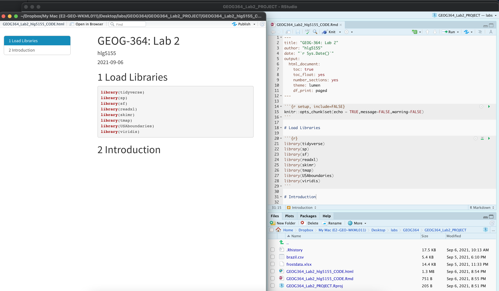

```{r, include=FALSE,echo=FALSE, warning=FALSE, message=FALSE}
knitr::opts_chunk$set(eval = TRUE, 
                      fig.show = "hide", 
                      message = FALSE, 
                      warning = FALSE)

# Libraries
library(tidyverse)
library(AER)
library(broom)
library(ggplot2)
library(kableExtra)
library(openintro)
library(readxl)
library(skimr)
library(sp)
library(sf)
library(plotly)
library(tmap)
library(viridis)

# Data
house  <- read_excel("./index_data/Lab03_house.xlsx")
rubric <- read_excel("./index_data/Table_LabRubric.xlsx")
house_sf <- st_as_sf(house,coords=c("Longitude","Latitude"),crs=4326)

```


------------------------------------------------------------------------

\

# Welcome to Lab 3!

**Aim of the lab**

 - Practice setting up and managing a structured RStudio project using spatial and non-spatial data

 - Use exploratory data analysis (EDA) to summarise and interpret real-world housing data for a non-technical audience

 - Define and explain core data concepts: object of analysis, variables (with units), population, sampling frame, and representativeness

 - Convert tabular data into a spatial format using coordinates, and describe spatial attributes such as data type and spatial fallacy risks

 - Create both quick and professional-quality spatial visualisations using tmap

 - Develop confidence in communicating data insights through clear language, maps, and plots tailored to an end user (your friend)


\

::: {#boxedtext}
\
**Getting help** 
\
 - Kiely (and often Dr G) will be present during your lab sessions. This is the easiest way to get help. \
 - There is a Piazza discussion board. Kiely will explain more in this week’s lab and will check it at least once a day. \
 - Dr G has weekly office hours and genuinely enjoys helping with R, even if you feel stuck or overwhelmed. \
 - If you have posted on Piazza and received no response after 24 hours, you may send a Canvas message to Kiely or Dr G (or if you are completely lost).\
 \
:::

\

------------------------------------------------------------------------

\

# Set-up. DON'T SKIP!

\

### Create a project & get the data

There are two options here depending on whether you are using R-studio on the website (posit cloud) or your own computer (R-Desktop). If you are using a lab computerm choose the R-Desktop route.

#### Option 1. Posit Cloud Website Users

<details>

<summary>Task 1. Get the data from Canvas</summary>

<br>

Go to the Lab 3 Canvas page and download the dataset `Lab03_house.xlsx` <br>

</details>

::: small-gap
:::

<details>

<summary>Task 2. Create a project for Lab 3 (expand for instructions)</summary>

::: collapsible-content
<iframe src="https://psu-spatial.github.io/Stat462-2025/T5_ProjectsPositCloud.html" style="width: 100%; height: 700px; border: none;">
</iframe>
:::

<br>

</details>

::: small-gap
:::

<details>

<summary>Task 3. Upload your dataset to the website. (expand for reminder)</summary>


</details>

::: small-gap
:::

<details>

<summary>Task 4. Install more packages (expand for instructions)</summary>

<br>

Unfortunately on the website you need to install your packages each time.<br>Go to to the packages tab, click install to get to the app-store and download/install these packages:

-   `readxl`
-   `viridis`
-   `ggstatsplot`
-   `terra`
-   `tigris`
-   `tidyverse`
-   `dplyr`
-   `tmap`
-   `elevatr`
-   `osmdata`
-   `ggplot2`
-   `ggthemes`
-   `RColorBrewer`
-   `plotly`
-   `cols4all`
-   `shinyjs`


We will also need a package called sf, which runs a lot of the spatial commands in R. Unfortunately, posit cloud sometimes has a few technical issues with sf, so you will need to run a special command.

IN THE CONSOLE, run these two commands.

```{r,eval=FALSE}
install.packages("remotes")
remotes::install_github(repo = "r-spatial/sf", ref = "93a25fd8e2f5c6af7c080f92141cb2b765a04a84")
```


T6_Packages.html
<br>*Reminder: [Tutorial: Packages
cheatsheet](https://psu-spatial.github.io/Stat462-2025/T6_Packages.html)*.

</details>

#### Option 2. R-Desktop Users

<details>

<summary>Task 1. Create a project for Lab 3</summary>

<br>

::: collapsible-content
<iframe src="https://psu-spatial.github.io/Stat462-2025/T5_ProjectsRDesktop.html" style="width: 100%; height: 700px; border: none;">
</iframe>
:::

</details>

::: small-gap
:::

<details>

<summary>Task 2. Get the data & **put in your Lab 3 folder**</summary>

<br>

Go to the Lab 3 Canvas page and download the dataset `Lab03_house.xlsx`. **Put it in your lab 3 folder.**

</details>

::: small-gap
:::

<details>

<summary>Task 3. Install some packages</summary>

<br>

We need to install some more packages.<br>Go to to the packages tab, click install to get to the app-store and download/install these packages. If your computer says its missing a package later on, install anything it suggests.

-   `elevatr`
-   `osmdata`
-   `cols4all`
-   `shinyjs`

Remember DO NOT put `install.packages()` into your lab-script - copy and paste it into thee console.

<br>*Reminder: [Tutorial: Packages
cheatsheet](https://hgreatrex.github.io/Geog364_2024/pg_Tut3_basics.html#Tutorial_3G:_Packages)*.

</details>

<br>

### Set-up your Lab 3 report

You are welcome to use/edit the template you made in lab 2. If you are unsure what I mean by that, follow these instructions.

<details>

<summary>Task. Create your RMarkdown file - expand & look at Tutorial 4B and 4C</summary>

<br>

::: collapsible-content
<iframe src="https://hgreatrex.github.io/Geog364_2024/pg_Tut4_markdown.html#Tutorial_4B:_Creating_a_markdown_document" style="width: 100%; height: 700px; border: none;">
</iframe>
:::


</details>

::: small-gap
:::


<details>

<summary>Task. Edit your YAML code</summary>

<br>

Lets use similar options to Lab 2, although you could try a different theme.  Remember YAML code is annoying to edit, because here, *spaces really do matter*. Everything has to be perfect or it won't knit.

**Select everything in my code chunk here and replace your YAML with this (remember the --- on line 1 and at the end).**

Now edit the author name to your own.  If you wonder what Sys.Date() is, don't touch it - it automatically gives you the current date.

```{r,eval=FALSE}

---
title: "GEOG-364 - Lab 3"
author: "hlg5155"
date: "`r Sys.Date()`"
output:
  html_document:
    toc: true
    toc_float: yes
    number_sections: yes
    theme: lumen
    df_print: paged
---
  
  
```


</details>

::: small-gap
:::

<details>

<summary>Task. Change the theme and knit</summary>

<br>

In the YAML code, change the theme to any one of your choice that isn't not lumen (see here to view available themes -
<https://bootswatch.com/>.). <br>

**Some might not work**, but these are likely to: “default”, “bootstrap”, “cerulean”, “cosmo”, “darkly”, “flatly”, “journal”, “lumen”, “paper”, “readable”, “sandstone”, “simplex”, “spacelab”, “united”, “yeti”.

</details>

::: small-gap
:::

<details>

<summary>Task. Clean the file and create/run your library code chunk</summary>

<br>

 - Click on your lab script (the Rmd file) and delete all the 'welcome text' after line 11.<br>Press enter a few times and make a new level-1 heading called `Set Up`.<br>

 - We should have all the packages we need installed, but we need to open them. Make a new code chunk containing this code.<br>

```{r,message=FALSE,warning=FALSE, eval=FALSE}
library(readxl)
library(tidyverse)
library(dplyr)
library(terra)
library(sf)
library(tmap)
library(elevatr)
library(osmdata)
library(ggstatsplot)
library(ggplot2)
library(ggthemes)
library(viridis)
library(RColorBrewer)
library(plotly)
```

<br>

 - Press the green arrow on the right of the code chunk to run the code inside it. You will see a load of "loading text" telling your details about the packages you just loaded.<br><br> Press the green arrow AGAIN. The text should disappear unless there is an error.<br>

-   Note, remember to run this code chunk EVERY TIME your start R-Studio (in the same way you need to click on an app on your phone before you can use it). <br>

<br>

</details>

::: small-gap
:::

<details>

<summary>Task. Add warning=FALSE and message=FALSE to your library code chunk.
</summary>


<br>

 - Expand here for a tutorial.

::: collapsible-content
<iframe src="https://psu-spatial.github.io/Stat462-2025/T7_Markdown_4bCodeChunkOptions.html" style="width: 100%; height: 700px; border: none;">

</iframe>
:::

</details>

::: small-gap
:::

### Check your progress

Your lab script should now look similar this, but with your theme and YAML options of choice (you might have a few different libraries than in my screenshot). You should also be able to knit it successfully. If not, go back and do the previous sections!

<br>



<br>


\

------------------------------------------------------------------------

\

# Moving to Taiwan

The aim of EVERY LAB is to get comfortable writing up analyses of a complex dataset for a specific person or user. The modelling steps may be similar across labs, but the topic and context will vary—so you'll need to think carefully about what matters in each case.

<br>

## WEEK 1

Your friend is about to move to Sindian District in New Taipei City, Taiwan. They’re thinking about buying a house—and they’ve asked for your help figuring out what affects house prices in the area. This matters a lot because housing costs have soared in recent years: [Who can afford to live in Taipei?](https://english.cw.com.tw/article/article.action?id=3416)

Luckily, you’ve found a dataset, `Lab03_house.xlsx`, to help. This is real-life data, described in detail here: [UCI Real Estate Valuation Data Set](https://archive.ics.uci.edu/dataset/477/real+estate+valuation+data+set)

<br> 

**Your Goal**

To understand which factors influence house prices in Sindian District, New Taipei City, Taiwan, and communicate your results to a non-technical reader.

**You are writing the rest of this report for your friend!**  
Make sure to explain your findings clearly. Your friend doesn’t study data science or geography, so use language that they can understand and explain any jargon.

<br>

### Summary analysis

\

1. In your report, create a new Level 1 heading called `House Prices`. 

Remember that you can click Visual mode and use the menu to do this, or put a single # at the front.

\

2. Check you are running your project

Before doing anything else, make sure:

 - You are running this lab inside your Lab 3 RStudio project
 - `Lab03_house.xlsx` is saved/uploaded in your *Lab 3 project folder* next to your lab report.

If not, go back to the **setup section** of this lab before continuing. The code below will not work until your project and files are properly set up. Also remmeber that you need to open your lab 3 project every time you reopen R-studio. 


\

2. Read in the data using read_excel() 

Once you’re ready, make a code chunk and write a line of code that uses `read_excel(FILENAME)` to read the Excel file into R, and **assign/save it a variable called house**.

<details>

<summary>Expand here for a tutorial on how to do this - scroll down to section 1.4</summary>

::: collapsible-content
<iframe src="https://psu-spatial.github.io/Stat462-2025/in_T07_ReadingInData.html#14_Reading_in_excel_files" style="width: 95%; height: 600px; border: none;">

</iframe>
:::

</details>

::: small-gap
:::

::: {#boxgreen}
**🔍 Reminder**
This command will only work if you have already run the library code chunk that loads the readxl package - and you need to re-run the library code chunk every time you open R.
:::

\


4. Summarise the data for your friend using code, plots and words

Your goal here is to use R summary commands and plots, along with the background reading, to explore and describe your dataset for your friend. You want to help them understand what yor does (and doesn't) include, and to explain what it can tell them about house prices in New Taipei City.

-   **If you haven't already, start by reading the dataset description here: [Real estate valuation data set – UCI](https://archive.ics.uci.edu/ml/datasets/Real+estate+valuation+data+set)**

-   **In your report, use command like `summary()` OR `skim()` (or others!) to explore the house data. See the tutorials below.**

-   **Underneath the code chunk in your reports, write a short section that describes the dataset in clear language for your friend. This should must include:** <br>

    -   The object of analysis: \
        What does each row in the dataset represent? <br><br>
    -   A list of the variables AND THEIR UNITS: \
        Briefly describe each column in the data, including what it measures and the unit (e.g., meters, years). Remember the dataset description website... <br><br>
    -   The 'strict population' (sampling frame): \
        If you were being really strict, what does this sample cover.<br><br>
    -   A reasonable, justifiable target population: \
        Based on this sample, what group do you think the data can reasonably be used to represent? <br><br>
    -   A clear, professional-looking histogram of house prices in a new code chunk:\
        See the tutorials below <br><br>
    -   Summary statistics of the variables, explained in context for your friend:\
        Choose a few key variables and explain what the numbers in the summary mean for your friend. For example, can they walk to the station from most places? Are most of the homes near shops? What range of prices are there? <br><br>
    -   Note any data limitations:\ For example - spatio-temporal coverage? sample bias? missing variables? other things? 
    -   Overall, summarise if you think the sample is representative of your friend's needs.


<details>

<summary>Expand here for a tutorial on how to summarise data. Click section 2.3</summary>

::: collapsible-content
<iframe src="https://psu-spatial.github.io/Stat462-2025/CH3_EDA.html#23_Summary_Statistics" style="width: 95%; height: 600px; border: none;">
</iframe>
:::

</details>

::: small-gap
:::


<details>

<summary>Expand here for a tutorial on how to make histograms. Click section 2</summary>

::: collapsible-content
<iframe src="https://psu-spatial.github.io/Stat462-2025/in_T11_Plots.html#21_Set-up" style="width: 95%; height: 600px; border: none;">

</iframe>
:::

</details>

::: small-gap
:::


<br>


### Making your data "spatial"


5. Make the data "spatial".

Unlike standard statistics, our data also has spatial characteristics.  At the moment, R doesn't 'understand' that the data is spatial. In this section we force R to view the data as spatial.

 - Make a new heading called spatial analysis in your report <br><br>
 
 - First, we need to know the COLUMN NAMES of the x and y coordinates (case sensitive). The easiest way to get these is to make a new code chunk and run this command. 
 
 
```{r, eval=FALSE}
names(house)
```

<br>

- We can now use the st_as_sf() command to make a spatial version of the data. Because we're using the sf package to do this, I have named the resulting dataset house_sf(). Make a new code chunk, copy in the code below and change "X_COLUMN_NAME" and "Y_COLUMN_NAME" to the appropriate column name from your data.


```{r, eval=FALSE}
# Hint, the y direction is Latitude..
house_sf <- st_as_sf(house,coords=c("X_COLUMN_NAME","Y_COLUMN_NAME"),crs=4326)
```

 - Lets see what you did. In the environment tab, click on the NAME house_sf, or in the console type View(house_sf).  You should open a new tab with the spreadsheet. Note that the longitude and latitude columns have disappared! They have been replaced by a geometry column which understands that we are looking at point data.
 
 - Equally, in a new code chunk, type house_sf (by itself) and run. You will see a summary of the data including its spatial attributes (map projection, bounding box..) 

<br>

6. Explain the spatial attributes

Below this code, answer these questions 

 - Explain if your data is being represented as a vector (and what type) or raster. Discuss if this is true in real life and if this representation is appropriate for the reason you need the data. 

 - Do you need to worry about the locational fallacy in this case? Explain your answer to your friend.


\

7. Make some quick maps.

There is a quick way to check your data was read in correctly.  Make a map!  The quickest way to do this is using the qtm command. 

- Make a new section called maps

- Try each of these commands in a new code chunk for each. They should show you some nice maps over Taiwan.  

- If your data looks weird, you probably mixed up long and lat. Go back to the previous step, change it and rerun - or ask Kiely!


```{r, eval=FALSE}
#Set the mode to "view" for an interactive map
tmap_mode("view")

# Make a "quick thematic map" of the house data
qtm(house_sf)
```

You can also have a look at variables. For example:

```{r,eval=FALSE}
# A map where the colors are linked to house price.
qtm(house_sf,fill="House.Price")
```

If you hate the interactive-ness, change tm_mode to "plot" (but you lose the background map).  

```{r,eval=FALSE}
# Change the mode to "plot" for a static map
tmap_mode("plot")

# Re-run the same qtm() command to produce a static version
qtm(house_sf,fill="House.Price")
```

We will make a better static map below!

\

### Making better maps

QTM is great for quick looks, but in terms of making professional output, it can be hard to get it to look really good.  So here's how to make professional looking maps of your output that you can use in a pdf or printout. 

<br>

#### The tmap package {-}

The first thing to know is that tmap is currently going through a HUGE revamp.  Code that used to work for "version 3" is being switched to "version 4".  I think I have all of it, but if you see warning messages, you can either ignore them or ask chatgpt what the updated code is.

This is a very detailed guide. https://tmap.geocompx.org/nutshell

In tmap, we build maps in LAYERS. We connect each layer with with the + sign
 - First, we choose the dataset we want using tm_shape(), <br>
 - Then we choose how to represent it (e.g. dots for points, raster for grids, polygons for areas)<br>
 - Then we can add overall map layers like legends or basemaps. <br>

<br>

7. Get the basic tmap code running

 - Make a new code chunk and copy and run this code. Although the structure is there, I PURPOSELY chose settings that made the map look terrible!  In the next step, you will fix this. In this step, I want to make sure you can get the code to run.

```{r, eval=FALSE}

# A better static map
# set up a color scale for your variable
distance_color_scale <- tm_scale_intervals(values = "brewer.blues", style = "equal")

# and plot
tmap_mode("plot")
tm_shape(house_sf) +
  tm_dots(
    fill        = "Distance.Station",
    size        = 6,
    fill.scale  = distance_color_scale,
    fill.legend  = tm_legend("Title?? Units??")) +
tm_basemap(server = "CartoDB.VoyagerNoLabels")

```


7. Make a better map in tmap

 - Expand the tutorials below to understand how to modify the code. <br>
 - Then make a BETTR static map than the one above for the DISTANCE TO THE STATION for each house.<br>
 - It should be: <br>
    + Useful for your friend to see the distance to the station for each house.<br>
    + Contain some useful background map to help you assess the pattern/process<br>
    + Colorblind friendly<br>
    + Have your own personal stamp on it! 
   
<br>

<details>
<summary>Expand here for a tutorial on tm_scale_intervals</summary>

<br>

**What `tm_scale_intervals()` does** <br>

`tm_scale_intervals()` tells R how to cut your data into classes and which color palette to use.

For example:

```{r,eval=FALSE}
price_scale <- tm_scale_intervals(values = "viridis", style = "jenks")
```

 - tm_scale_intervals() : the name of the command
 - `values = "viridis"` : use the viridis color palette
 - `style = "jenks"` : use the jenks technique to split the data into intervals

<br><br>

**Choosing a `style`** <br>

Styles listed roughly from most to less common. All create intervals in different ways—try a few to see what looks best. **There’s no single “right” style—experiment and pick the clearest map.**

<br>

- **jenks** – natural clusters (great first try for environmental or socio-economic data)
- **quantile** – same number of features per class (good for highlighting rank)
- **equal** – equal-width ranges (good if data are fairly uniform)
- **pretty** – nicely rounded numbers (simple readable map)
- **fixed** – you set the breakpoints (e.g. policy thresholds)
- **sd** – classes by standard deviation from mean (emphasises difference from average)
- **kmeans**, **hclust**, **bclust** – cluster-based (useful for complex distributions)
- **fisher** – another algorithm for natural breaks
- **dpih**, **headtails**, **log10_pretty**, **cat** – special cases (e.g. heavy tails, log scale, or already-categorical data)

<br><br>

**Colour palettes** <br>

There are MANY palettes; just type the name in `values = "palette_name"`. Good defaults: `"viridis"`, `"plasma"`, `"cividis"`, or any RColorBrewer name like `"brewer.blues"`.  

For more choice and built-in colourblind checking, we can use the new cols4all package.

 - IF YOU DIDN'T ALREADY, go to the Packages tab, click install and install `cols4all` and `shinyjs`.
 - Now go to your library code chunk at the top, add `library(cols4all)` and run the chunk. You don't need to add shinyjs as it runs in the background.
 - IN THE CONSOLE, type `c4a_gui()` and press enter.

This will open an interactive palette browser where you can check out different palettes and assess their color-blindness properties. Pick a palette name and use it in `values`.

Remember to consider if your data is naturally SEQUENTIAL, DIVERGING, or CATEGORICAL and to choose accordingly (https://www.datawrapper.de/blog/diverging-vs-sequential-color-scales)


</details>

::: small-gap
:::


<details>
<summary>Expand here for a tutorial on tm_scale_intervals</summary>

<br>

**`tm_shape(house_sf)`** – tells R which spatial dataset you want to plot. It sets up the base layer (in this case, your points). 


Each `tm_shape()` refers to a different spatial object (points, polygons, etc.), and the command that follows it (like `tm_dots()` or `tm_borders()`) tells R how to visualise that layer. This gives you flexibility to build up your map one piece at a time.

You must always use `tm_shape(DATASET)` before adding any new data.

**Structure tip:** You can stack multiple layers using more than one `tm_shape()` block. For example:

```{r, eval=FALSE}
# Multiple shapes example with fake data. the first is line data, 
# the second points where we want to color them in by a variable
# we will do more of this next week
  tm_shape(DATASET1) + 
     tm_borders() +  
  tm_shape(DATASET2) + 
      tm_dots(fill = "Distance.Station") +
  tm_basemap(server = "CartoDB.Positron")
```


<br>

**`tm_dots(...)`** – This adds point symbols to the map for each feature in `house_sf`. You can customise how these look:

- `fill = "Distance.Station"` – the variable used to colour the points. This must be numeric or categorical.
- `size = 6` – sets the size of the point symbols. Try values between 0.1 and 8 depending on how crowded the map looks.
- `fill.scale = distance_color_scale` – tells R which palette and classification system to use. This object should be created with `tm_scale_intervals()`- see previous tutorial!
- `fill.legend = tm_legend("Distance to station (km)")` – adds a clear legend title. Use something meaningful with units.

There are MANY more options for dots.  Like transparancy, borders, shapes.. ChatGPT, google or the tm_dots help file are all useful here. e.g. in the console type ?tm_dots 


<br>

**`tm_basemap(server = "CartoDB.VoyagerNoLabels")`** – This adds a clean background map for geographic context. This version has no labels, which is useful if your points are dense or you plan to add your own labels. Basemaps come from online tile providers and help you see where your data is located in the world.

**Common basemaps you can try:**

- `"CartoDB.VoyagerNoLabels"` – light grey map, no labels (good for layering your own info)
- `"CartoDB.Positron"` – very light, minimal map (excellent for visual clarity)
- `"CartoDB.DarkMatter"` – dark background for contrast with bright points
- `"Esri.WorldGrayCanvas"` – Esri’s clean grayscale map (useful for presentations)
- `"Esri.WorldImagery"` – satellite imagery (be careful: may be visually overwhelming)

To use any of these, just change the `server` argument:

```{r, eval=FALSE}
tm_basemap(server = "Esri.WorldGrayCanvas")
```

You can leave out the basemap if it distracts from the data or if you're using a local projection.

<br>

**Common extras you can add to the map:**

- `tm_compass(position = c("right", "top"))` – adds a north arrow.
- `tm_scalebar(position = c("left", "bottom"))` – adds a scale bar.
- `tm_layout(frame = FALSE)` – removes the black frame around the map.
- `tm_credits("Your Name or Source", position = c("LEFT", "BOTTOM"))` – adds a small credit or caption.

You just add these as lines to the end, linked with a + e.g.

```{r, eval=FALSE}
# and plot
tmap_mode("plot")
tm_shape(house_sf) +
  tm_dots(
    fill        = "Distance.Station",
    size        = 6,
    fill.scale  = distance_color_scale,
    fill.legend  = tm_legend("Title?? Units??")) +
tm_basemap(server = "CartoDB.VoyagerNoLabels")+
tm_scalebar(position = c("left", "bottom"))

```


<br>

Again, I only know about half of tmaps functionality.  There are more things like better titles, labels, grids.. anything you can do in arcmap.  So use chatGPT, google, any resource you can find and as a class we can build our knowledge of how to easily make beautiful maps.


</details>

::: small-gap
:::

<br>

Here is my current example for house price.. (code hidden but all based on things in the tutorial) 
 
```{r, echo=FALSE,fig.show=TRUE}

price_scale <- tm_scale_intervals(values = "viridis", style = "jenks")

tm_shape(house_sf) +
  tm_dots(
    fill        = "House.Price",
    size        = 0.4,
    fill.scale  = price_scale,
    fill_alpha  = 0.8,
    fill.legend  = tm_legend("House Price per unit area (NT dollar/ping")
  ) +
tm_basemap(server = "CartoDB.Positron")+
  tm_basemap(server = "Esri.WorldGrayCanvas") +
  tm_scale_bar(position = c("left", "bottom"))

```


<br>


## WEEK 2 TO COME......

In week 2, you will focus on downloading other new map layers, like elevation and Open Street Map data, along with some basic statistical analysis.


\

------------------------------------------------------------------------

\

# What to submit?

Nothing yet!  

<br>


\

------------------------------------------------------------------------

\

# Grading rubric

## Overall

Overall, here is what your lab should correspond to:

```{r, echo=FALSE}
knitr::kable(rubric) %>%   
  kable_classic_2() %>%
  kable_styling(bootstrap_options = c("striped", "hover", "responsive"))

```

And..
finished!
