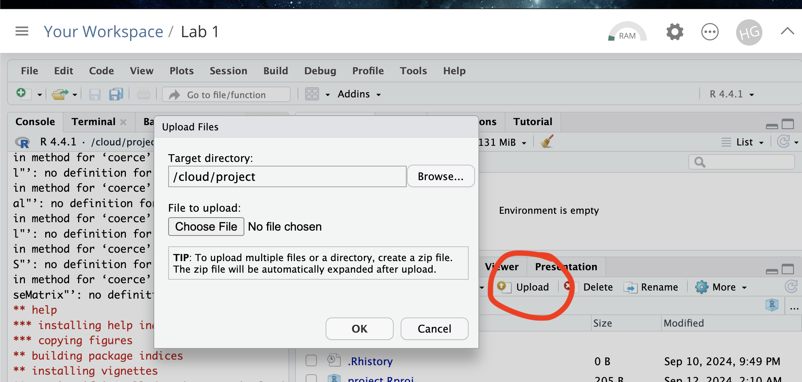

```{r, include=FALSE,echo=FALSE, warning=FALSE, message=FALSE}
# NOTES
```


```{r, include=FALSE,echo=FALSE, warning=FALSE, message=FALSE}

knitr::opts_chunk$set(eval = TRUE, 
                      fig.show = "hide", 
                      message = FALSE, 
                      warning = FALSE)

# Libraries
library(tidyverse)
library(AER)
library(broom)
library(ggplot2)
library(kableExtra)
library(openintro)
library(readxl)
library(skimr)
library(sp)
library(sf)
library(plotly)
library(tmap)
library(viridis)
library(elevatr)
library(osmdata)

# Data
house  <- read_excel("./index_data/Lab03_house.xlsx")
rubric <- read_excel("./index_data/Table_LabRubric.xlsx")
house_sf <- st_as_sf(house,coords=c("Longitude","Latitude"),crs=4326)

```


------------------------------------------------------------------------

\

# Welcome to Lab 4!

**Aim of the lab**

In this guide you will learn how to download, clean and manage data - a process known as Data Wrangling - in R. You will be working with data on California counties. The objectives of this guide are as follows

 - Learn how to read data into R
 - Learn about tidyverse
 - Learn data wrangling functions

This lab guide follows and supplements the material presented in Chapters 4 and 8-13 in the textbook [R for Data Science](http://r4ds.had.co.nz/index.html) (RDS).

<p class="comment">

::: {#boxgreen}
**This is a TWO WEEK LAB** See [here](https://psu.instructure.com/courses/2396422/assignments/17585714) for assignment guidelines. You must submit an `.Rmd` file and its associated `.html` file. 
::: 

\

::: {#boxedtext}
\
**Getting help** 
\
 - Kiely (and often Dr G) will be present during your lab sessions. This is the easiest way to get help. \
 - There is a Piazza discussion board. Kiely will explain more in this week’s lab and will check it at least once a day. \
 - Dr G has weekly office hours and genuinely enjoys helping with R, even if you feel stuck or overwhelmed. \
 - If you have posted on Piazza and received no response after 24 hours, you may send a Canvas message to Kiely or Dr G (or if you are completely lost).\
 \
:::

\

------------------------------------------------------------------------

\

# Set-up. DON'T SKIP!

\

### Create a project & get the data

There are two options here depending on whether you are using R-studio on the website (posit cloud) or your own computer (R-Desktop). If you are using a lab computerm choose the R-Desktop route.

#### Option 1. Posit Cloud Website Users

<details>

<summary>Task 1. Get the data </summary>

<br>
All the data is on the Lab 4 canvas page.  But here's a shortcut. Click each link below to download the data.  

 - CLICK THIS LINK FOR THE MEDICAL DATA: [Medical_data.xlsx](https://psu.instructure.com/files/182917064/download?download_frd=1)


</details>

::: small-gap
:::

<details>

<summary>Task 2. Create a project for Lab 4 (expand for instructions)</summary>

::: collapsible-content
<iframe src="https://psu-spatial.github.io/Stat462-2025/T5_ProjectsPositCloud.html" style="width: 100%; height: 700px; border: none;">
</iframe>
:::

<br>

</details>

::: small-gap
:::

<details>

<summary>Task 3. Upload your dataset to the website. (expand for reminder)</summary>




</details>

::: small-gap
:::

<details>

<summary>Task 4. Install more packages (expand for instructions)</summary>

<br>

Unfortunately on the website you need to install your packages each time.<br>Go to to the packages tab, click install to get to the app-store and download/install these packages:

-   `readxl`
-   `viridis`
-   `ggstatsplot`
-   `terra`
-   `tigris`
-   `tidyverse`
-   `dplyr`
-   `tmap`
-   `elevatr`
-   `osmdata`
-   `ggplot2`
-   `ggthemes`
-   `RColorBrewer`
-   `plotly`
-   `cols4all`
-   `shinyjs`


We will also need a package called sf, which runs a lot of the spatial commands in R. Unfortunately, posit cloud sometimes has a few technical issues with sf, so you will need to run a special command.

IN THE CONSOLE, run these two commands.

```{r,eval=FALSE}
install.packages("remotes")
remotes::install_github(repo = "r-spatial/sf", ref = "93a25fd8e2f5c6af7c080f92141cb2b765a04a84")
```


T6_Packages.html
<br>*Reminder: [Tutorial: Packages
cheatsheet](https://psu-spatial.github.io/Stat462-2025/T6_Packages.html)*.

</details>

#### Option 2. R-Desktop Users

<details>

<summary>Task 1. Create a project for Lab 4</summary>

<br>

::: collapsible-content
<iframe src="https://psu-spatial.github.io/Stat462-2025/T5_ProjectsRDesktop.html" style="width: 100%; height: 700px; border: none;">
</iframe>
:::

</details>

::: small-gap
:::

<details>

<summary>Task 2. Get the data & **put it in your Lab 4 folder**</summary>

<br>

All the data is on the Lab 4 canvas page.  But here's a shortcut. Click each link below to download the data and put it directly into your Lab 4 folder.

 - CLICK THIS LINK FOR THE MEDICAL DATA: [Medical_data.xlsx](https://psu.instructure.com/files/182917064/download?download_frd=1)
</details>

::: small-gap
:::

<details>

<summary>Task 3. Install some packages</summary>

<br>

We need to install some more packages.<br>Go to to the packages tab, click install to get to the app-store and download/install these packages. If your computer says its missing a package later on, install anything it suggests.

-   `elevatr`
-   `osmdata`
-   `cols4all`
-   `shinyjs`

Remember DO NOT put `install.packages()` into your lab-script - copy and paste it into thee console.

<br>*Reminder: [Tutorial: Packages
cheatsheet](https://hgreatrex.github.io/Geog364_2024/pg_Tut3_basics.html#Tutorial_3G:_Packages)*.

</details>

<br>

### Set-up your Lab 4 report

You are welcome to use/edit the template you made in Lab 4. If you are unsure what I mean by that, follow these instructions.

<details>

<summary>Task. Create your RMarkdown file - expand & look at Tutorial 4B and 4C</summary>

<br>

::: collapsible-content
<iframe src="https://hgreatrex.github.io/Geog364_2024/pg_Tut4_markdown.html#Tutorial_4B:_Creating_a_markdown_document" style="width: 100%; height: 700px; border: none;">
</iframe>
:::


</details>

::: small-gap
:::


<details>

<summary>Task. Edit your YAML code</summary>

<br>

Lets use similar options to Lab 4, although you could try a different theme.  Remember YAML code is annoying to edit, because here, *spaces really do matter*. Everything has to be perfect or it won't knit.

**Select everything in my code chunk here and replace your YAML with this (remember the --- on line 1 and at the end).**

Now edit the author name to your own.  If you wonder what Sys.Date() is, don't touch it - it automatically gives you the current date.

```{r,eval=FALSE}

---
title: "GEOG-364 - Lab 4"
author: "hlg5155"
date: "`r Sys.Date()`"
output:
  html_document:
    toc: true
    toc_float: yes
    number_sections: yes
    theme: lumen
    df_print: paged
---
  
  
```


</details>

::: small-gap
:::

<details>

<summary>Task. Change the theme and knit</summary>

<br>

In the YAML code, change the theme to any one of your choice that isn't not lumen (see here to view available themes -
<https://bootswatch.com/>.). <br>

**Some might not work**, but these are likely to: “default”, “bootstrap”, “cerulean”, “cosmo”, “darkly”, “flatly”, “journal”, “lumen”, “paper”, “readable”, “sandstone”, “simplex”, “spacelab”, “united”, “yeti”.

</details>

::: small-gap
:::

<details>

<summary>Task. Clean the file and create/run your library code chunk</summary>

<br>

 - Click on your lab script (the Rmd file) and delete all the 'welcome text' after line 11.<br>Press enter a few times and make a new level-1 heading called `Set Up`.<br>

 - We should have all the packages we need installed, but we need to open them. Make a new code chunk containing this code.<br>

```{r,message=FALSE,warning=FALSE, eval=FALSE}
library(readxl)
library(tidyverse)
library(dplyr)
library(terra)
library(sf)
library(tmap)
library(elevatr)
library(osmdata)
library(ggstatsplot)
library(ggplot2)
library(ggthemes)
library(viridis)
library(RColorBrewer)
library(plotly)
```

<br>

 - Press the green arrow on the right of the code chunk to run the code inside it. You will see a load of "loading text" telling your details about the packages you just loaded.<br><br> Press the green arrow AGAIN. The text should disappear unless there is an error.<br>

-   Note, remember to run this code chunk EVERY TIME your start R-Studio (in the same way you need to click on an app on your phone before you can use it). <br>

<br>

</details>

::: small-gap
:::

<details>

<summary>Task. Add warning=FALSE and message=FALSE to your library code chunk.
</summary>


<br>

 - Expand here for a tutorial.

::: collapsible-content
<iframe src="https://psu-spatial.github.io/Stat462-2025/T7_Markdown_4bCodeChunkOptions.html" style="width: 100%; height: 700px; border: none;">

</iframe>
:::

</details>

::: small-gap
:::

### Check your progress

Your lab script should now look similar this, but with your theme and YAML options of choice (you might have a few different libraries than in my screenshot). You should also be able to knit it successfully. If not, go back and do the previous sections!

<br>


<br>


\

------------------------------------------------------------------------

\

# Spatial Wrangling


## FULLY REFRESH/RELOAD THE PAGE FOR UPDATED INSTRUCTIONS 

\

------------------------------------------------------------------------

\

# Submitting your Lab

Remember to save your work throughout and to spell check your writing (next to the save button). Now, press the knit button again. If you have not made any mistakes in the code then R should create a html file in your lab3 folder, complete with a very recent time-stamp.

<br>

### If you are on posit cloud:

You can download each of your .RmD and html files by:

 - Clicking on the little box next to the Rmd in the Files tab, then going to the little blue cogwheel (might need to make your Rstudio full screen) and clicking export.<br>

```{r, Lab2FigDownload, echo=FALSE,fig.align='center',out.width="90%"}
knitr::include_graphics('./index_images/im_T2_Download.png')
```


 - Repeat the process exactly for the html file underneath it (e,g, just have the html clicked.)<br>
 
 - Now go to Canvas and submit BOTH your html and your .Rmd file in Lab 4.


<br>

### Posit desktop

 - Go to your Lab 4 folder,  In that folder, double click on the html file. This will open it in your browser. CHECK THAT THIS IS WHAT YOU WANT TO SUBMIT <br>

- Now go to Canvas and submit BOTH your html and your .Rmd file in Lab 4.<br>

```{r, echo=FALSE}
knitr::include_graphics("./index_images/pg_364Lab1_Basics_2021_fig1.png")
```

<br>

------------------------------------------------------------------------

\

# Grading rubric

## Lab 4


To come

## Overall

Overall, here is what your lab should correspond to:

```{r, echo=FALSE}
knitr::kable(rubric) %>%   
  kable_classic_2() %>%
  kable_styling(bootstrap_options = c("striped", "hover", "responsive"))

```

And..
finished!