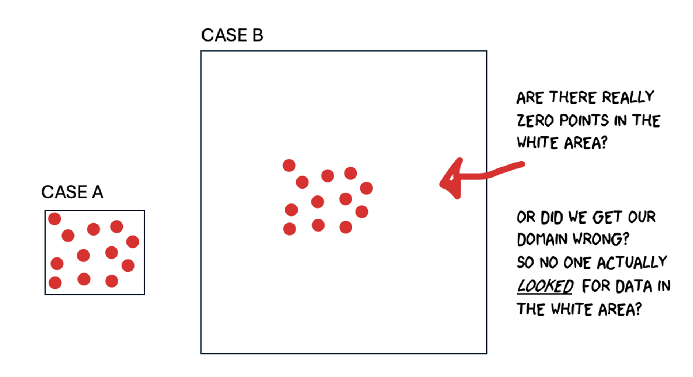
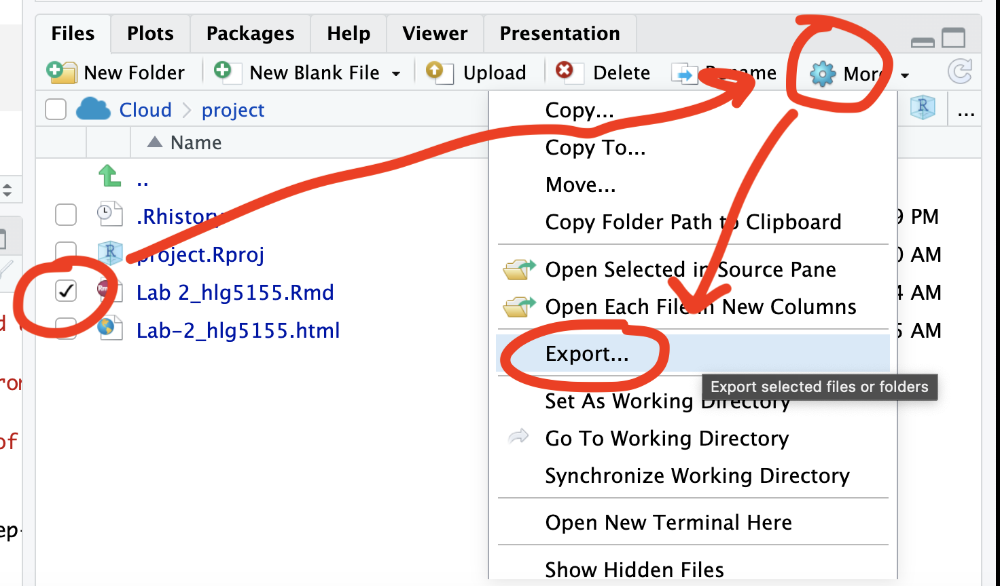

```{r, include=FALSE,echo=FALSE, warning=FALSE, message=FALSE}
# NOTES
```


```{r, include=FALSE,echo=FALSE, warning=FALSE, message=FALSE}

knitr::opts_chunk$set(eval = TRUE, 
                      fig.show = "hide", 
                      message = FALSE, 
                      warning = FALSE)

# Libraries
library(tidyverse)
library(AER)
library(broom)
library(ggplot2)
library(kableExtra)
library(openintro)
library(readxl)
library(skimr)
library(sp)
library(sf)
library(plotly)
library(tmap)
library(viridis)
library(elevatr)
library(osmdata)

# Data
house  <- read_excel("./index_data/Lab03_house.xlsx")
rubric <- read_excel("./index_data/Table_LabRubric.xlsx")
house_sf <- st_as_sf(house,coords=c("Longitude","Latitude"),crs=4326)

```


------------------------------------------------------------------------

\

# Welcome to Lab 4!

**Aim of the lab**

In this guide you will learn how to download, clean and manage data - a process known as Data Wrangling - in R. You will be working with data on California counties. The objectives of this guide are as follows

 - Learn how to read data into R
 - Learn about tidyverse
 - Learn data wrangling functions

This lab guide follows and supplements the material presented in Chapters 4 and 8-13 in the textbook [R for Data Science](http://r4ds.had.co.nz/index.html) (RDS).

<p class="comment">

::: {#boxgreen}
**This is a TWO WEEK LAB** See [here](https://psu.instructure.com/courses/2396422/assignments/17585714) for assignment guidelines. You must submit an `.Rmd` file and its associated `.html` file. 
::: 

\

::: {#boxedtext}
\
**Getting help** 
\
 - Kiely (and often Dr G) will be present during your lab sessions. This is the easiest way to get help. \
 - There is a Piazza discussion board. Kiely will explain more in this week’s lab and will check it at least once a day. \
 - Dr G has weekly office hours and genuinely enjoys helping with R, even if you feel stuck or overwhelmed. \
 - If you have posted on Piazza and received no response after 24 hours, you may send a Canvas message to Kiely or Dr G (or if you are completely lost).\
 \
:::

\

------------------------------------------------------------------------

\

# Set-up. DON'T SKIP!

\

### Create a project & get the data

There are two options here depending on whether you are using R-studio on the website (posit cloud) or your own computer (R-Desktop). If you are using a lab computer choose the R-Desktop route.

#### Option 1. Posit Cloud Website Users

<details>

<summary>Task 1. Get the data </summary>

<br>
All the data is on the Lab 4 canvas page.  But here's a shortcut. Click each link below to download the data.  

 - CLICK THIS LINK for the medical data: [Lab04_Medical_data.xlsx](https://psu.instructure.com/courses/2396422/files/182917064/download?download_frd=1)
</details>
 - CLICK THIS LINK for mystery data 1: [Lab04_MysteryData1.gpkg](https://psu.instructure.com/courses/2396422/files/182920273/download?download_frd=1)
</details>
 - CLICK THIS LINK for mystery data 2: [Lab04_MysteryData2.gpkg](https://psu.instructure.com/courses/2328607/files/168452715/download?download_frd=1)
</details>


</details>

::: small-gap
:::

<details>

<summary>Task 2. Create a project for Lab 4 (expand for instructions)</summary>

::: collapsible-content
<iframe src="https://psu-spatial.github.io/Stat462-2025/T5_ProjectsPositCloud.html" style="width: 100%; height: 700px; border: none;">
</iframe>
:::

<br>

</details>

::: small-gap
:::

<details>

<summary>Task 3. Upload your dataset to the website. (expand for reminder)</summary>


</details>

::: small-gap
:::

<details>

<summary>Task 4. Install more packages (expand for instructions)</summary>

<br>

Unfortunately on the website you need to install your packages each time.<br>Go to to the packages tab, click install to get to the app-store and download/install these packages:

-   `readxl`
-   `viridis`
-   `ggstatsplot`
-   `terra`
-   `tigris`
-   `tidyverse`
-   `dplyr`
-   `tmap`
-   `elevatr`
-   `osmdata`
-   `ggplot2`
-   `ggthemes`
-   `RColorBrewer`
-   `plotly`
-   `cols4all`
-   `shinyjs`


We will also need a package called sf, which runs a lot of the spatial commands in R. Unfortunately, posit cloud sometimes has a few technical issues with sf, so you will need to run a special command.

IN THE CONSOLE, run these two commands.

```{r,eval=FALSE}
install.packages("remotes")
remotes::install_github(repo = "r-spatial/sf", ref = "93a25fd8e2f5c6af7c080f92141cb2b765a04a84")
```


T6_Packages.html
<br>*Reminder: [Tutorial: Packages
cheatsheet](https://psu-spatial.github.io/Stat462-2025/T6_Packages.html)*.

</details>

#### Option 2. R-Desktop Users

<details>

<summary>Task 1. Create a project for Lab 4</summary>

<br>

::: collapsible-content
<iframe src="https://psu-spatial.github.io/Stat462-2025/T5_ProjectsRDesktop.html" style="width: 100%; height: 700px; border: none;">
</iframe>
:::

</details>

::: small-gap
:::

<details>

<summary>Task 2. Get the data & **put it in your Lab 4 folder**</summary>

<br>

All the data is on the Lab 4 canvas page.  But here's a shortcut. Click each link below to download the data and put it directly into your Lab 4 folder.

 - CLICK THIS LINK for the medical data: [Lab04_Medical_data.xlsx](https://psu.instructure.com/courses/2396422/files/182917064/download?download_frd=1)
</details>
 - CLICK THIS LINK for mystery data 1: [Lab04_MysteryData1.gpkg](https://psu.instructure.com/courses/2396422/files/182920273/download?download_frd=1)
</details>
 - CLICK THIS LINK for mystery data 2: [Lab04_MysteryData2.gpkg](https://psu.instructure.com/courses/2328607/files/168452715/download?download_frd=1)
</details>


::: small-gap
:::

<details>

<summary>Task 3. Install some packages</summary>

<br>

We need to install some more packages.<br>Go to to the packages tab, click install to get to the app-store and download/install these packages. If your computer says its missing a package later on, install anything it suggests.

-   `elevatr`
-   `osmdata`
-   `cols4all`
-   `shinyjs`

Remember DO NOT put `install.packages()` into your lab-script - copy and paste it into thee console.

<br>*Reminder: [Tutorial: Packages
cheatsheet](https://hgreatrex.github.io/Geog364_2024/pg_Tut3_basics.html#Tutorial_3G:_Packages)*.

</details>

<br>

### Set-up your Lab 4 report

You are welcome to use/edit the template you made in Lab 4. If you are unsure what I mean by that, follow these instructions.

<details>

<summary>Task. Create your RMarkdown file - expand & look at Tutorial 4B and 4C</summary>

<br>

::: collapsible-content
<iframe src="https://hgreatrex.github.io/Geog364_2024/pg_Tut4_markdown.html#Tutorial_4B:_Creating_a_markdown_document" style="width: 100%; height: 700px; border: none;">
</iframe>
:::


</details>

::: small-gap
:::


<details>

<summary>Task. Edit your YAML code</summary>

<br>

Lets use similar options to Lab 4, although you could try a different theme.  Remember YAML code is annoying to edit, because here, *spaces really do matter*. Everything has to be perfect or it won't knit.

**Select everything in my code chunk here and replace your YAML with this (remember the --- on line 1 and at the end).**

Now edit the author name to your own.  If you wonder what Sys.Date() is, don't touch it - it automatically gives you the current date.

```{r,eval=FALSE}

---
title: "GEOG-364 - Lab 4"
author: "hlg5155"
date: "`r Sys.Date()`"
output:
  html_document:
    toc: true
    toc_float: yes
    number_sections: yes
    theme: lumen
    df_print: paged
---
  
  
```


</details>

::: small-gap
:::

<details>

<summary>Task. Change the theme and knit</summary>

<br>

In the YAML code, change the theme to any one of your choice that isn't not lumen (see here to view available themes -
<https://bootswatch.com/>.). <br>

**Some might not work**, but these are likely to: “default”, “bootstrap”, “cerulean”, “cosmo”, “darkly”, “flatly”, “journal”, “lumen”, “paper”, “readable”, “sandstone”, “simplex”, “spacelab”, “united”, “yeti”.

</details>

::: small-gap
:::

<details>

<summary>Task. Clean the file and create/run your library code chunk</summary>

<br>

 - Click on your lab script (the Rmd file) and delete all the 'welcome text' after line 11.<br>Press enter a few times and make a new level-1 heading called `Set Up`.<br>

 - We should have all the packages we need installed, but we need to open them. Make a new code chunk containing this code.<br>

```{r,message=FALSE,warning=FALSE, eval=FALSE}
library(readxl)
library(tidyverse)
library(dplyr)
library(terra)
library(sf)
library(tmap)
library(elevatr)
library(osmdata)
library(ggstatsplot)
library(ggplot2)
library(ggthemes)
library(viridis)
library(RColorBrewer)
library(plotly)
```

<br>

 - Press the green arrow on the right of the code chunk to run the code inside it. You will see a load of "loading text" telling your details about the packages you just loaded.<br><br> Press the green arrow AGAIN. The text should disappear unless there is an error.<br>

-   Note, remember to run this code chunk EVERY TIME your start R-Studio (in the same way you need to click on an app on your phone before you can use it). <br>

<br>

</details>

::: small-gap
:::

<details>

<summary>Task. Add warning=FALSE and message=FALSE to your library code chunk.
</summary>


<br>

 - Expand here for a tutorial.

::: collapsible-content
<iframe src="https://psu-spatial.github.io/Stat462-2025/T7_Markdown_4bCodeChunkOptions.html" style="width: 100%; height: 700px; border: none;">

</iframe>
:::

</details>

::: small-gap
:::

### Check your progress

Your lab script should now look similar this, but with your theme and YAML options of choice (you might have a few different libraries than in my screenshot). You should also be able to knit it successfully. If not, go back and do the previous sections!

<br>


<br>


\

------------------------------------------------------------------------

\

# Spatial Domain

## Introduction (READ THIS!)

Your spatial domain describes both the environment or area within which your data exists and defines the spatial boundaries of your analysis. If this domain is misrepresented (either by including irrelevant areas, or excluding critical regions) it can distort the results and lead to incorrect inferences about spatial patterns.

There is no perfect domain for three reasons. Expand each button below to find out more details. 

<details>

<summary>**1. It depends on your needs**</summary>

<br>

In part your choice of domain is going to depend on WHY you are looking at the data. As we have seen in class, patterns such as clustering are scale dependent - and so are the processes that cause them. So you might choose a certain domain depending on your needs.

For example, consider the figure below, where I have plotted the same data at two different scales:

-   For example, a CDC representative for Pennsylvania might be interested in considering the entire area as their 'domain' if they want to understand the progression of a disease outbreak. At the moment it's clearly clustered in State College - useful information that can lead directly to action.

-   They might ALSO be interested in analyzing the data across a smaller domain to see if they can identify locations where the disease is being spread (say one hall-of-residence). In this case, it’s clear we don’t see a single easy cluster of cases. In fact they seem to be rather uniformly spread out (maybe the locational fallacy is at play?)

{width="100%"}

<br><br>

</details>

::: small-gap
:::

<details>

<summary>**Your data must have an equal chance of appearing anywhere in your domain, or all your statistical tests won’t work**</summary>

<br>

Your sample is must be representative of your population, so ALL THE STATISTICS TESTS assume that there is an equal chance that any location within your domain could contain data.

If you make your domain too big, your data will appear to be clustered, but in fact it might mean you simply didn’t collect data in part of the domain. For example, if you were asked to assess if the dots in case A and B below were arranged uniformly or were clustered together, you would have very different outcomes, despite the dots themselves being identical.

{width="100%"}

<br><br>

</details>

::: small-gap
:::

<details>

<summary>**Its CRUCIAL to consider the "non-uniformity of space**</summary>

<br>

As we discussed above, there should be an equal chance of seeing your data anywhere in your domain. BUT.. Unlike traditional statistics, where sampling is assumed to be random and uniform, spatial data is more nuanced.  Landscape features, political borders, and human activity vary greatly across space and they can all impact the structure and interpretation of your data. 

This effect is called the **‘non uniformity of space’** – when we know more information about the background map than we can see in our actual data.

For example:

-   Is an area with low population density in a city linked to 'a lack of data collection', 'a lake/park' or some sociopolitical reason? Just looking at population density won't tell you the answer, we also need to look at the background map.

-   Equally, data might look clustered, but in fact there are just areas where it's not possible to have points. For example, without the nuance of the background map you might get very different conclusions from an analysis of bike parking in Helsinki:

{width="100%"}

<br>

**So consider the non uniformity of space when designing your domain**

Your domain doesn’t have to be square! So we are balancing the need for our domain to only contain landscapes that have an 'equal chance' of seeing our data (e.g. we can't get bike parking in the ocean', vs the complexity of making your domain so complex that you can't get anything done. This also links to the spatial fallacy of "fuzzy borders"

<br><br>

</details>

<br>


## Challenge A. Data detective

<br>

I recently found two ‘mystery files’ on my computer that I had forgotten to name correctly.

I know they must be from two out of these four experiments:

* **COVID-19 Clusters in Central Pennsylvania**. <br> The local government has asked for help identifying clusters of COVID-19 cases across central PA. The aim is to prioritize mobile testing units and health messaging in affected towns.

* **Mediterranean Vineyard Clusters**. <br> An international agricultural group is funding a study of vineyard clustering in two Mediterranean islands, aiming to evaluate whether specific micro-climates or land use policies are influencing planting decisions.

* **Smooth-Hound Shark Hot-spots**. <br> You are working with the regional fishing board to identify hot-spots for Smooth-Hound Shark activity. The goal is to define seasonal no-fishing zones to support sustainable stock management. The data represents tagged shark locations in the last month.

* **Polar Bear Cluster Study in the Arctic**. <br> PSU ecologists are investigating polar bear movement patterns across the Arctic. Using GPS collar data, they are analyzing seasonal hot-spots for foraging and denning, particularly in response to changing sea ice patterns.

<br>

1. Check your setup

* If you haven't already, GO AND DO THE SET-UP SECTION. You should now have your project running, your Lab 4 report open, and your library code chunk run.

<br>

2. Read in the data

* Create a heading called **Mystery Data**.
* Create a code chunk and use the `st_read()` command to read each dataset into R.

<details>
<summary>Expand for a tutorial on st_read()</summary>
<br>

::: collapsible-content

<iframe src="https://psu-spatial.github.io/Stat462-2025/in_T07_ReadingInData.html#16_Loading_spatial_data_with_st_read" style="width: 100%; height: 700px; border: none;">
</iframe>
:::

</details>

::: small-gap
:::

<br>

3. Map the data

* In your lab report, explore and map the data. Remember that there are mapping tutorials in Lab 3, or in your Lab 3 report! You can also check this online guide: [https://r-tmap.github.io/tmap-book/layers.html](https://r-tmap.github.io/tmap-book/layers.html)

<br>

4. Match the data to the experiment

* Using your maps, work out which experiment each dataset matches (see the exercise intro).
* Explain your reasoning in your report, providing common-sense evidence to support your explanation of the non-uniformity of space.
  *Hint: this isn't meant to be a trick – it should be fairly straightforward.*
  *Hint 2: if you're stuck, remember you can enter interactive mode with `tm_mode("view")`.*

<br>

5. Choose an appropriate spatial domain

* For **each** of your two chosen scenarios, describe what you think would be a good spatial domain (study area) given the aim of the research project.
* Consider both the geography and the research question: What area makes sense to include? What might be too broad or too narrow? Does the non uniformity of space, locational fallacy or edge effects impact your choice. 
* Then describe in words whether the points in your dataset seem **clustered**, **dispersed**, or **uniformly** distributed.
* Explain your reasoning in your own words.


<br><br>

# Understanding Distance

In this section, we'll explore different ways to assess distance and proximity using OpenStreetMap (OSM) data. We'll focus on fire station locations in Chicago and learn how to map them, extract relevant features, calculate distances, and define neighborhoods.

<br>

## Chicago fire set-up

6.  Get the data

<details>
<summary>**Expand and complete!**</summary>
<br>

-   This code will load the locations of all the Fire-Stations in Chicago into R. Copy carefully into your report and run.

```{r, results='hide', eval=FALSE}
# Get a RECTANGULAR bounding box for Chicago
bbox_city_rectangle <- getbb("Chicago, USA") 

# Now query OpenStreetMap 
fire_stationdata <- opq(bbox = bbox_city_rectangle) %>%
     add_osm_feature(key = "amenity", value = "fire_station") %>%
     osmdata_sf()

# Look at the data
fire_stationdata
```

<br>

-   You should see a list of the data you have just downloaded. This command returns EVERYTHING related to fire stations in the area and you can see that there is space for every type of vector data, in our case 1586 points and 165 polygons. From a quick glance, I think the polygons refer to fire station buildings and the points are ANYTHING fire-service related.

-   Click here to understand what you just did: <https://www.youtube.com/watch?v=kcpiH6dDWLE>

-   To read more about how OSM stores fire-station data, see here - <https://wiki.openstreetmap.org/wiki/Emergency_facilities_and_amenities>

<br><br>
</details>
::: small-gap
:::


## Make a map

7. Extract polygons & map

<details>
<summary>**Expand and complete!**</summary>
<br>

-   The point data is often messy (people adding fire-hoses etc). So we are going to focus on the polygon fire station buildings.
-   Add this command into your lab script and run. This will turn fire-stations into the type of spatial file you are used to.

```{r, results='hide', eval=FALSE}
fire_station_buildings <- fire_stationdata$osm_polygons
```


- Now, Make a map of the fire stations in Chicago, remembering if you are using tmap that you are using tm_polygons() NOT tm_dots().

<br><br>
</details>
::: small-gap
:::


8. Find centroids & map

<details>
<summary>**Expand and complete!**</summary>
<br>

-   It's clear our polygons are VERY small compared to the overall area. And in terms of the topic, I don't really care how big the fire station buildings are, just that they exist. So let's choose the MEAN CENTRE and convert it into points.\
    \
    As we discussed in class, there are a few ways to do this. Given that we don't really care about the shape of our buildings, lets use st_centroid, which will find the "center of mass" of each building.

    \


-   Add this command into your lab script and run. This will convert the fire station data into points. It might give you a warning about geometries, ignore it!

```{r, results='hide', eval=FALSE}
fire_stations <- st_centroid(fire_station_buildings)
```

<br><br>

 - In your report, Make a map of the fire station locations (points e.g. tm_dots) - it will be easier to make out a pattern. Describe the features of the pattern you see and what you think might be causing it.

You should see something like this:

{width="90%"}
<br><br>
</details>
<br><br>

## Closest stations

9.  Closest stations challenge

Now we have the fire station locations, we want to consider "neighborhood".  Which fire-stations are *closest* to one another and what does "closest" even mean?

This is a genuine issue faced by emergency authorities. For example, it is needed when considering which stations deserve new vehicles, or where to put new stations.

Have a look at this report, which explores the issue for Columbus Ohio - and which gets to use several billion pieces of data.. <https://storymaps.arcgis.com/stories/0037b3eb93904ed6aa00cbba424af0da>.  It was completed by one of our MGIS alumni, Rob Ford.

<br>

10. Measuring distance

In your report, come up with AT LEAST three different ways that you could measure the 'closeness' or 'distance' between fire-stations. Use the reading above to justify your answers. We will also talk about this in class.


## Check-in

Your report & R-Studio should look something like the screenshot below (it might not be _identical_ but it should be similar).  


{width="100%"}


<br>


## Subsetting data

<br>

|                                                                                                                                                                                                                   |                                                      |
|------------------------|----------------------------------------|
| <br><br> _Chicago has a set internal neighborhoods, arranged informally into "sides" e.g. "Northside", "SouthSide"... These neighborhood are not federally recognized, but they are used by the city and by local people.  So.. we can access this data via downloading it from Chicago's City Data Portal._ <br><br>Let's subset to a smaller dataset, because I know that the people on POSIT-Cloud have been struggling.  Specifically, we are going to focus on South East Chicago. | [{width="800"}](https://commons.wikimedia.org/wiki/File:Chicago_community_areas_map.svg) |


<br>


13. Get the boundary data & read into R


<details>
<summary>**Expand for instructions**</summary>
<br><br>


 - Go to this website. <https://data.cityofchicago.org/Facilities-Geographic-Boundaries/Boundaries-Community-Areas-current-/cauq-8yn6>

 - On the top right, click Export, then choose the GeoJSON format. Move/upload the file into your project folder.
 
{width="80%"}

<br><br>

 
 - In your lab report, read the data into R using the `st_read()` command - e.g. copy/paste the code-chunk below:
 
```{r, eval=FALSE}
CommunityAreas <- st_read("Boundaries - Community Areas (current).geojson")
CommunityAreas

# make a quick map
qtm(CommunityAreas)
```
 
 - Your map should look like Chicago boundaries.
 
 

<br><br>
</details>

::: small-gap
:::


14. Select our area of interest.

<details>
<summary>**Expand for instructions**</summary>
<br> 
 
 
 - We are going to focus on the following community areas in the far South East of the city:
 
    - "ROSELAND"
    - "PULLMAN"
    - "SOUTH DEERING"
    - "EAST SIDE"
    - "WEST PULLMAN"
    - "RIVERDALE"
    - "HEGEWISCH"
 
 <br>
 
 - In your lab report, make a new code chunk and copy this code across to filter to these communities. If you get a weird error, try re-typing the quote marks.

```{r, eval=FALSE}
CommunityAreas_SE <- CommunityAreas  %>%
   filter(community %in% c("ROSELAND",
                           "PULLMAN",
                           "SOUTH DEERING",
                           "EAST SIDE",
                           "WEST PULLMAN",
                           "RIVERDALE",
                           "HEGEWISCH"))

# make a quick map
qtm(CommunityAreas_SE)

```


<br><br>
</details>
::: small-gap
:::


15. Subset the fire-stations to this area.

<details>
<summary>**Expand for instructions**</summary>
<br> 
 


 - Finally, we're going to use the `st_intersection()` command to select only the fire stations within our chosen communities.
 
  - In your lab report, make a new code chunk and copy/run this code to filter to these communities. 
  
```{r, eval=FALSE}

# Subset the fire stations
 fire_station_local <- st_intersection(fire_stations, 
                                       CommunityAreas_SE)


# Make a quick plot
 tm_shape(CommunityAreas_SE) +
   tm_borders() +
   tm_shape(fire_station_local) +
   tm_dots(col = "red", size = 0.5)+
   tmap_mode("view")
```
 
 
<br><br>
</details>
::: small-gap
:::

16. Questions

<details>
<summary>**Expand for instructions**</summary>
<br>  

I want to check your understanding of what we have just done.  So after the code, please answer the following questions in your lab report.  Remember you can look at the data by clicking its name in the environment tab, or by using summary(), head(), table() etc.

1. How many fire stations are inside CommunityAreas_SE? <br><br>
2. How many unique zip-codes/post-codes are there in the fire_station_local data? <br> _(hint, table command.  <br>hint2. there is a useful column inside fire_station_local called addr.postcode)_ <br><br>
3. Are there any fire-stations in Riverdale?  If so, how many? <br>  _(hint, look at the community column in fire_station_local data...)_ 

<br><br>
</details>
<br><br>


## Measuring distance

As discussed in class, there are several ways we can measure distance using R-Studio.  Here, we are going to explore Cartesian distance (e.g. "as the crow flies" or straight line distance) and driving distance using Open Street map.

<br>

17. Calculating distance code

<details>
<summary>**Expand for instructions**</summary>
<br>  

The code below will calculate the straight-line and driving distance between two locations in our dataset.

 - We can calculate the straight-line distance between two objects using the st_distance() command.  This defaults to calculating distances in meters, so I often change it to km.

 - We can calculate driving distances (and routes) between two objects using the osrmRoute() command. You can also choose walking or cycling.
 
<br> 
 
**YOU NEED A NEW PACKAGE! <br> GO TO THE PACKAGES TAB INSTALL/DOWNLOAD THE `osrm` package. <br>THEN SCROLL UP TO YOUR LIBRARY CODE CHUNK IN YOUR REPORT. ADD `library(osrm)` AND RUN THE CODE CHUNK. THEN SCROLL BACK DOWN TO THE END OF YOUR REPORT**  

 - Copy these code chunks into your report, understand what they are doing and run them. You should see that the Cartesian distance is ~2.19km and the driving distance ~3.04km, alongside a map.
 

```{r, eval=FALSE}
# Choose which locations you want to look at the distance between
# In our case, we are choosing objects/rows from our fire station data.
# They could be row numbers you type manually or some sort of filter
# I am showing you both examples
 
location1 <- fire_station_local[1,]
location2 <- dplyr::filter(fire_station_local,osm_id == "210429692")
```

<br>

```{r, eval=FALSE}
# Calculate the straight line distance
Distance_Cartesian_m  <- st_distance(location1,location2)
Distance_Cartesian_km <- as.numeric(Distance_Cartesian_m/1000)
Distance_Cartesian_km
```

<br>

```{r, eval=FALSE}
# And driving distance 
Distance_Driving <- osrmRoute(src = location1,dst = location2,
                              overview = "full",osrm.profile="car")
Distance_Driving

```

<br>

```{r, eval=FALSE}

# To plot the straight line distance we need to manually
# create a straight line between our locations
line_between <- st_cast(st_union(location1, location2), "LINESTRING")

# Step 4: Plot both lines and annotate them
tm_shape(line_between) +
   tm_lines(col = "red", lwd = 2, title.col = "Euclidean Line") +
   tm_shape(Distance_Driving) +
   tm_lines(col = "blue", lwd = 2, title.col = "Driving Line") +
   tm_shape(fire_station_local) +
   tm_dots() + tm_legend()+
   tmap_mode("view")

```


<br><br>
</details>

<br>

18. Challenge

<details>
<summary>**Expand for instructions**</summary>
<br>

 - Choose two fire-stations that are "close" in terms of straight-line distance, but "far apart" in terms of driving distance.

 - Hint, try running `qtm(fire_station_local) + tm_text("osm_id")` to help you work out which station is which.

 - In your report, edit the code (above) that you just ran to calculate the distance between your chosen stations. Run the code and make a map of the two distances. <br>
 _Hint You ONLY need to edit the row numbers in the first code chunk then run_

 - Justify why you chose those two stations in your lab report. (You don't have to be right, you just have to have some reasoning why you chose those two points).


\

------------------------------------------------------------------------

\

# Submitting your Lab

Remember to save your work throughout and to spell check your writing (next to the save button). Now, press the knit button again. If you have not made any mistakes in the code then R should create a html file in your lab3 folder, complete with a very recent time-stamp.

<br>

### If you are on posit cloud:

You can download each of your .RmD and html files by:

 - Clicking on the little box next to the Rmd in the Files tab, then going to the little blue cogwheel (might need to make your Rstudio full screen) and clicking export.<br>

```{r, Lab2FigDownload, echo=FALSE,fig.align='center',out.width="90%"}

```


 - Repeat the process exactly for the html file underneath it (e,g, just have the html clicked.)<br>
 
 - Now go to Canvas and submit BOTH your html and your .Rmd file in Lab 4.


<br>

### Posit desktop

 - Go to your Lab 4 folder,  In that folder, double click on the html file. This will open it in your browser. CHECK THAT THIS IS WHAT YOU WANT TO SUBMIT <br>

- Now go to Canvas and submit BOTH your html and your .Rmd file in Lab 4.<br>

```{r, echo=FALSE}
knitr::include_graphics("./index_images/pg_364Lab1_Basics_2021_fig1.png")
```

<br>

------------------------------------------------------------------------

\

# Grading rubric

-   **Submitting Rmd & HTML (20 pts)**
    -   20: Both .Rmd and .html submitted
    -   10:Only one file submitted

<br>

-   **General style (10 pts)**
    -   10: Great style: \
        *Easy to find answers; no library-loading printouts; no code warnings; YAML works*
    -   8: Minor issues: \
        *Occasional hard-to-find answers; library-loading text printed; missing table of contents*
    -   6: Major issues: \
        \*Hard to find answers; multiple code issues

<br>

-   **General writing (10 pts)**
    -   10: Great writing: \
        *Full sentences, you have written up what your code does in the report. You have used units where appropriate.*
    -   8: Minor issues: \
        *To complete*
    -   6: Major issues: \
        *To complete*

<br>

-   **Data Detective (20 pts). Sliding scale**
    -   20: Exceptional \
        *Code works. It's clear you understand and can communicate domain & fallacies. You chose the right experiments and your domain choice links with the scenario. I could use this as a detailed worked answer.*
    -   16: Great work: \
        *Code works, it's clear you understand and can communicate domain. You chose the right experiments and your domain choice links with the scenario. Slightly less nuance or less clear communication*
    -   12: Reasonable attempt: \
        *Code works and some attempt at explaining the ideas. Lots missing. It's clear how you worked out which scenario linked with each map.*
    -   10: Minor attempt \
        *Code works and some attempt at explaining the ideas. Lots missing.*
    -   5: Any attempt

<br>

-   **OSM Setup, Mapping & Subsetting (20 pts). Sliding scale**
    -   **20:** Exceptional: <br> *All steps correct, clean, and well-explained with accurate maps, code, answers.*
    -   **15:** Reasonable attempt: <br> *Data loaded and mapped but with partial errors or unclear interpretation.*
    -   10: Minor attempt \
        *Code works and some attempt at explaining the ideas. Lots missing.*
    -   5: Any attempt

<br>

-   **Measuring & Justifying Distance (20 pts) Sliding scale**
    -   **20:** Exceptional: <br> *All steps correct, clean, and well-explained with accurate maps, code, answers.*
    -   **15:** Reasonable attempt: <br> *Data loaded and mapped but with partial errors or unclear interpretation.*
    -   10: Minor attempt \
        *Code works and some attempt at explaining the ideas. Lots missing.*
    -   5: Any attempt


## Overall

Overall, here is what your lab should correspond to:

```{r, echo=FALSE}
knitr::kable(rubric) %>%   
  kable_classic_2() %>%
  kable_styling(bootstrap_options = c("striped", "hover", "responsive"))

```

And..
finished!